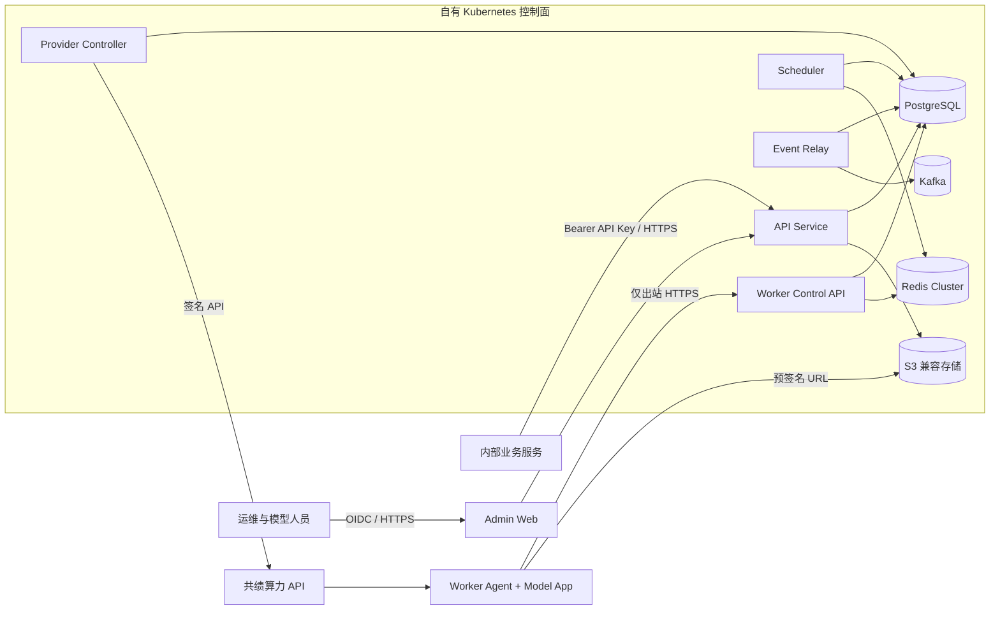
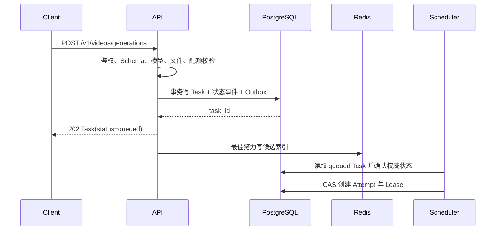
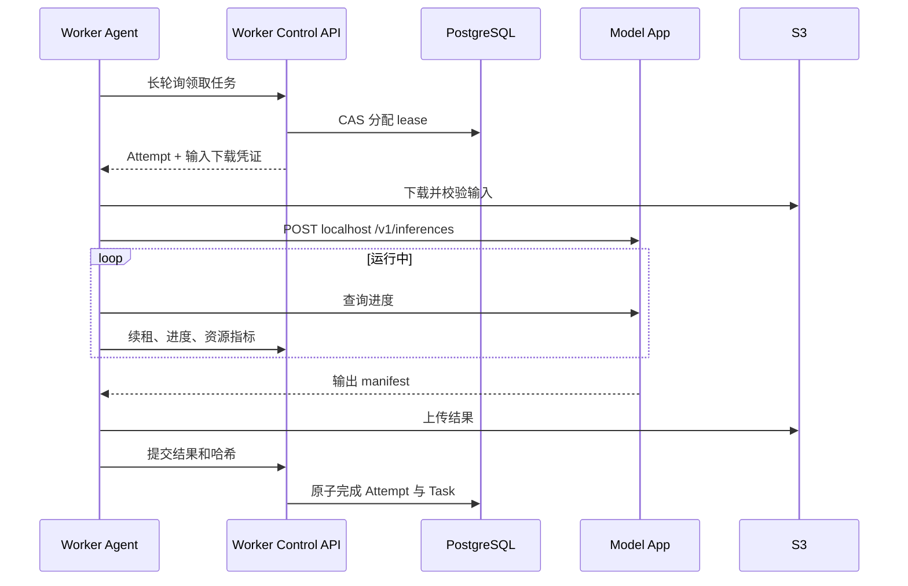

# 系统架构

## 1. 系统上下文

Astra 将内部业务请求转化为可审计、可调度、可重试的异步 Task。控制面常驻自有 Kubernetes；GPU 数据面可以位于共绩的不同区域，未来也可以位于自有 GPU Kubernetes 或其他供应商。



## 2. 控制面服务

### 2.1 API Service

职责：

- Bearer API Key、OIDC Session、RBAC 和项目上下文解析。
- 文件上传、图片生成、视频生成、Task 查询与取消 API。
- 请求 Schema、模型能力、配额、幂等键和素材状态校验。
- 在单个数据库事务内创建 Task、初始状态事件和 Outbox 记录。
- 提供管理 API：模型、发布、池策略、区域、成本、任务排障和审计。

不负责：直接调用模型、直接操作供应商容量、在 HTTP 请求内等待推理完成。

### 2.2 Scheduler

职责：

- 从 PostgreSQL 获取权威 Task 和容量状态，从 Redis 获取可重建的候选索引。
- 执行优先级、项目配额和加权公平调度。
- 为 Task 选择 Model Release、Model Pool 和可用 Replica。
- 计算每个 Model Pool 的期望容量和跨区域 Placement 计划。
- 创建执行租约并生成调度决策记录。

Scheduler 以分片主控方式运行。每个 `model_pool_id` 通过 PostgreSQL advisory lock 或租约表确保同一时刻只有一个决策者；其他副本可以并行负责不同池。

### 2.3 Provider Controller

职责：

- 将期望容量与供应商实际 Deployment、Job、节点和库存进行 Reconcile。
- 处理共绩 API 的 token、timestamp、version、签名、错误码、限流和重试。
- 同步区域、硬件、价格、库存、账单、节点日志和事件。
- 管理创建、扩容、缩容、暂停、恢复、删除、镜像预热和 Batch Job。
- 实现区域级熔断并向 Scheduler 发布可用容量快照。

Provider Controller 采用 Kubernetes Controller 风格：数据库保存 `desired_state`，控制器持续比较供应商 `observed_state`，所有操作具备幂等操作键。

### 2.4 Worker Control API

职责：

- 接受 Worker Agent 注册并签发短期 Worker Token。
- 提供长轮询领取、租约续期、进度、日志摘要、结果和失败上报。
- 在数据库事务中执行租约 CAS，不信任 Worker 自报状态直接覆盖 Task。
- 接收 Worker 能力、模型加载状态、GPU 指标和退出意图。

Worker 永远主动连接该服务；控制面不需要访问供应商提供的公网模型端口。

### 2.5 Event Relay

职责：

- 按 Outbox ID 顺序读取未发布事件并发送到 Kafka。
- 使用确定性事件 ID，允许 Kafka 至少一次交付。
- 发布成功后记录 Kafka topic、partition、offset 和时间。
- 单独处理 Redis 执行索引投递；Redis 投递失败不会回滚 Task。

### 2.6 Admin Web

首期提供完整管理能力：

- 模型、发布包、能力 Schema 和成熟度。
- Model Pool 容量、队列、Replica、GPU、区域与价格。
- 扩缩容策略编辑、影响预估、版本历史和回滚。
- Task 检索、状态时间线、Attempt、错误、成本和审计读取。
- 填写模型镜像地址、自动解析 Release、逐机滚动状态、质量报告、人工批准和紧急禁用。

高风险操作必须二次确认，但按当前决策不要求双人审批。

### 2.7 Image Rollout Controller

模型发布以镜像为交付物。Rollout Controller 可以作为 Provider Controller 的独立工作模式，负责：

- 接收已解析到 OCI digest 的目标模型镜像和目标 Model Pool。
- 从镜像 OCI label 或固定路径读取 Release Manifest，启动探测 Replica 核对 Model App capabilities。
- 为每个旧 Replica 建立独立 Rollout Step，按 `pending -> draining/provisioning -> validating -> ready -> replaced` 推进。
- 遵守 `max_surge`、`max_unavailable`、就绪超时和自动暂停门槛。
- 失败时停止后续机器，不让部分失败扩散；回滚使用上一 Release digest 执行同一滚动算法。

运维只需在后台填写镜像地址、选择目标池并确认滚动参数。镜像 tag 仅作为输入，控制面在创建 Release 时解析一次 digest，此后所有机器使用同一 digest。

## 3. 数据面

每个 Replica 包含两个逻辑进程：

1. 标准 Worker Agent：由平台维护，使用 Bun 实现。
2. Model App：由模型团队维护，语言不限，仅监听 localhost。

```mermaid
flowchart LR
    Control["Worker Control API"] <-->|"注册、长轮询、心跳、结果"| Agent["Worker Agent"]
    Agent -->|"localhost HTTP"| Model["Model App / ComfyUI Adapter"]
    Agent -->|"GET 预签名 URL"| Input[("S3 Input")]
    Agent -->|"PUT 预签名 URL"| Output[("S3 Output")]
    Agent --> Shared["共享工作目录"]
    Model --> Shared
    Metrics["OTel / GPU Metrics"] <-- Agent
```

Model App 不持有平台 API Key，不允许直接读取任意 `file_id`，也不写 S3。Agent 将输入下载到单任务隔离目录，校验哈希与 MIME 后传入本地路径；Model App 返回输出 manifest，Agent 验证后原样上传。这里的“验证”包括路径、大小、SHA-256、声明的 MIME 和媒体可读性检查，不包括转码、裁切、重采样、改 FPS、改变像素格式或重新封装。S3 中的对象字节必须与 Model App 输出文件一致；缩略图、预览或其他派生格式只能由模型镜像内部显式生成，或作为独立的后处理 Task 生成，不能隐藏在上传流程中。

## 4. 任务端到端流程

### 4.1 文件上传

1. 调用方申请上传，API 校验项目配额、MIME、大小和用途。
2. API 创建 `pending_upload` 文件记录并返回短期 S3 PUT URL。
3. 调用方直传 S3，然后调用完成确认。
4. API 读取对象元数据，校验长度、SHA-256 和 MIME，文件进入 `available`。
5. 24 小时生命周期从确认完成时开始计算。

### 4.2 创建与排队



Redis 写失败不影响创建成功。Rebuilder 会扫描 PostgreSQL 中缺少 Redis 索引的排队任务并补写。

### 4.3 执行与结果



Task 只有在所有必需 Artifact 上传并校验完成后才能进入 `completed`。部分输出失败时，默认整个 Task 失败；模型能力 Schema 可以显式声明 `partial_outputs_allowed=true`。

### 4.4 取消

- `queued`、`scheduling`、`provisioning`：CAS 直接转为 `canceled`，删除 Redis 候选索引。
- `running` 或后处理阶段：转为 `canceling`；Worker 在下次心跳响应中收到取消意图并调用 Model App。
- Worker 确认终止后转为 `canceled`；超过取消宽限期则回收租约并标记 Attempt `abandoned`。
- 已完成、失败、取消或过期的 Task 再次取消返回当前对象，不报错。
- 首期不抢占运行中的批量任务；用户主动取消不属于抢占。

Worker 正在运行任务时，控制面不会把下一个 Task 直接写入该 Worker。只有 Release 声明的剩余并发槽位可以领取；单槽 H3 Worker 必须等当前 Attempt 完成、失败或取消后才重新领取。若所有 Worker 均 busy，Task 保持 queued，Scheduler 同时启动容量收益评估和扩容计划。

## 5. 在线与批量执行路径

### 5.1 在线

- 使用常驻 Deployment Model Pool。
- 只分配已经 `ready` 且模型版本完全匹配的 Replica。
- 无空闲容量时任务保持排队，Autoscaler 生成扩容计划。
- 队列持续增长时按服务时间、并发槽位、预计清空时间和边际 GPU 成本计算扩容；不会把排队任务误报为已被 Worker 接受。
- 不为了单个请求临时修改 Model Release。

### 5.2 批量

- 在线队列无压力时可以借用空闲 Deployment 容量。
- 大量批量积压可以创建供应商 Job Queue 或单次 Job，仍运行相同 Worker Agent 与 Model App 镜像。
- Batch Job 完成即退出，不计入热池最小副本。
- Batch Job 失败按照 Task Retry Policy 创建新 Attempt；供应商自身重试次数必须同步进 Attempt 记录，避免双层无限重试。

## 6. Provider 抽象

核心 Provider Contract 包含：

- `listResources`：硬件、区域、显存、价格、库存和唯一资源引用。
- `ensureDeployment`：创建或更新常驻服务。
- `resizeDeployment`：调整节点数。
- `pauseDeployment`、`resumeDeployment`、`deleteDeployment`。
- `submitBatchJob`、`stopBatchJob`、`getBatchJob`。
- `listInstances`、`getLogs`、`getEvents`。
- `prewarmImage`、`ensureStorageMount`。
- `queryUsageAndCost`。

Provider 返回规范化状态 `pending | provisioning | running | degraded | stopping | stopped | failed | unknown`。原始响应和错误被加密保留用于排障，但不得作为 API Task 状态直接返回。

## 7. 可用性与故障边界

| 故障 | 平台行为 |
| --- | --- |
| PostgreSQL 不可用 | 停止创建、调度和状态变更；不以 Redis 状态继续执行。 |
| Redis 不可用 | API 查询正常；暂停新租约，恢复后从 PostgreSQL 重建。 |
| Kafka 不可用 | Outbox 积压，核心任务继续；超过阈值告警并限制非关键审计流量。 |
| S3 不可用 | 拒绝新上传；运行任务延迟提交或失败重试，不宣告 completed。 |
| 供应商 API 不可用 | 已运行 Worker 可继续；冻结容量变更，任务排队并展示原因。 |
| 单区域故障 | 熔断该区域，新容量放置到次优允许区域。 |
| Worker 失联 | 租约到期，Attempt abandoned；依据幂等与重试策略重新排队。 |
| Model App 崩溃 | Agent 上报结构化失败并按退出策略重启；Task 决定是否重试。 |

控制面目标为无单点：API、Scheduler、Provider Controller、Relay 和 Worker Control API 均至少两个副本；PostgreSQL、Redis Cluster、Kafka 和 S3 使用各自生产高可用方案。

## 8. 容量与演进

首期按 10-50 GPU、每分钟 1-20 个新任务设计。控制面服务必须无状态或以数据库租约分片；任务表分区、Redis key 哈希标签和 Kafka topic 分区均不得依赖单实例。扩展到数百 GPU 时优先增加 Scheduler 分片、Worker Control API 副本和区域级 Provider Controller，不改变公共 API 与 Worker Contract。
