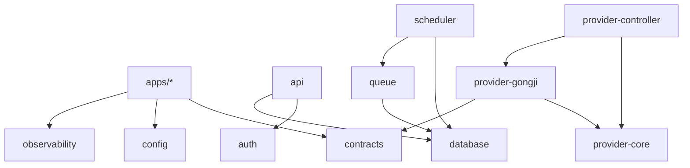

# Monorepo 设计

## 1. 技术基线

- 运行时与包管理器：Bun。
- 后端语言：TypeScript strict mode。
- HTTP 框架：Hono。
- 数据访问：Drizzle ORM；复杂调度查询允许使用参数化 SQL。
- 管理台：React、Vite、TanStack Router、TanStack Query。
- 协议来源：JSON Schema/OpenAPI，由 `packages/contracts` 维护。
- 测试：`bun test`；跨语言 Worker 合同测试以黑盒 HTTP 运行。
- Monorepo 管理：Bun workspaces，不额外引入 Turborepo/Nx。

H3 Model App 不受以上语言和运行时限制。只有平台控制面、Worker Agent 和管理台使用 Bun 技术栈。

## 2. 目标目录

```text
astra/
├── apps/
│   ├── api/                   # 公共 API、管理 API、Worker Control API
│   ├── scheduler/             # 公平队列、任务租约、放置与扩缩容决策
│   ├── provider-controller/   # Provider Reconcile、镜像 Rollout 与共绩 API
│   ├── event-relay/           # PostgreSQL Outbox -> Redis Streams/Redis
│   ├── worker-agent/          # 部署到 GPU 实例的标准出站代理
│   ├── admin-web/             # React 运维管理台
│   └── registry-reference/    # 仅本地 OCI Distribution 合同参考服务
├── packages/
│   ├── contracts/             # 公共、内部、Worker、Provider Schema
│   ├── database/              # Drizzle schema、迁移和事务 helper
│   ├── auth/                  # API Key、平台账号、RBAC、项目上下文
│   ├── queue/                 # Redis 索引、WFQ、租约候选与重建
│   ├── provider-core/         # 供应商无关接口与规范化类型
│   ├── provider-gongji/       # 共绩签名、DTO、错误和 Adapter
│   ├── observability/         # OpenTelemetry、日志和指标约定
│   ├── config/                # 环境配置 Schema 与安全默认值
│   └── testkit/               # 测试工厂、内存 Adapter、可控时钟
├── model-workers/
│   ├── README.md              # 语言无关接入规范
│   ├── h3/                    # H3 Model App，自行选择语言和构建系统
│   └── reference/             # Worker Contract 参考实现，不加载 GPU 权重
├── deploy/
│   ├── compose/               # 本地完整依赖与控制面
│   └── helm/astra/            # 生产 Kubernetes Helm Chart
├── docs/
├── package.json
├── bun.lock
├── bunfig.toml
└── tsconfig.base.json
```

代码骨架已按上述目录建立。当前实现提供协议 Schema、控制面入口、数据库 schema、Worker/Provider 边界、Model App 合同参考实现、Compose 和 Helm 基础模板；真实数据库用例、调度循环、共绩 transport 和 GPU H3 runtime 仍必须按本文档与对应合同逐步实现。

## 3. 应用职责

### `apps/api`

同一代码库生成三类独立 Deployment，按启动参数启用不同路由：

- `public-api`：文件、图片、视频和 Task API。
- `admin-api`：平台账号登录、策略、模型、发布、成本与审计。
- `worker-control-api`：Worker 注册、领取、心跳、状态和结果。

`apps/api` 还生成两个不对调用方开放的独立进程：`media-validator` 只读 S3，执行签名、哈希、完整解码和元数据探测，不访问 PostgreSQL；`file-sweeper` 从 PostgreSQL 领取到期记录，幂等删除 S3 对象并事务性完成 File/Task 状态。它们使用独立 ServiceAccount、资源限制和网络策略，不与三个 API 信任域合并部署。

共享业务用例，但端口、NetworkPolicy、认证中间件和扩缩容策略独立。禁止通过路由参数动态切换信任域。

这里需要区分两个概念：`public-api`、`admin-api`、`worker-control-api` 都属于控制面的逻辑服务，但不合并为一个生产 Deployment。它们可以共享 `contracts`、数据库访问层和用例层，生产则分别使用 Service、ServiceAccount、NetworkPolicy、认证链路、限流桶和 HPA。这样 Worker 出站流量、管理台流量或公共业务流量的突发不会互相拖垮，也不会因为一个入口被攻破而直接获得另外两个信任域的权限。

本地 Docker Compose 可以为了开发便利将三者放在同一个进程或同一组容器中；Kubernetes 生产部署仍保持三个独立 Deployment。逻辑上的“控制面”还包括 `scheduler`、`provider-controller` 和 `event-relay`，它们是内部控制器，不应被并入 HTTP API Pod。

### `apps/scheduler`

- 不暴露公网端口，只提供健康和 Prometheus 指标。
- 读取规范化模型、队列和容量数据。
- 产生不可变 `scheduling_decision` 与 `capacity_plan`。
- 不直接调用供应商；通过数据库期望状态驱动 Provider Controller。
- 所有时间计算依赖注入的 Clock，保证仿真测试可重复。

### `apps/provider-controller`

- 只依赖 `provider-core`，启动时加载显式 Adapter。
- 共绩适配器是首期唯一生产 Adapter。
- 共绩 Token 以密文保存在 PostgreSQL `provider_credentials`，该服务仅通过解密主密钥读取 active 版本。
- 将供应商原始响应保存为加密诊断载荷，并生成规范化资源快照。
- 执行逐 Replica 镜像滚动；可单独扩展为 Rollout Controller，但复用 Provider Operation 与 Reconcile 合同。
- 共绩 67 个接口的本地协议快照、索引和适配边界见 [`docs/providers/gongji/`](./providers/gongji/)。共绩 DTO 不得从 `provider-gongji` 泄漏到核心调度器。

### `apps/event-relay`

- `outbox-redis-streams` 模式发布领域事件。
- `outbox-redis` 模式维护 Redis 执行索引。
- 两类 Relay 使用独立 consumer lease，互不阻塞。
- 支持从事件 ID 断点继续和管理端重放。

### `apps/worker-agent`

- 运行于 GPU 数据面，禁止绑定公网监听地址。
- 与控制面进行出站 HTTPS 长轮询。
- 调用 `127.0.0.1` 上的 Model App。
- 管理单任务目录、素材下载、校验、输出上传、租约和取消。
- 不包含 H3 或图片模型业务逻辑。

### `apps/admin-web`

- 只调用 `admin-api`，不连接数据库或 Redis Streams。
- 所有策略编辑先调用验证/预估 API，再调用发布 API。
- 容量策略编辑支持时长桶、服务时间分位点、并发上限、目标利用率、排队目标、成本收益阈值和预算，提交后展示 4-15 秒样本的预测与影响。
- 模型发布表单以镜像地址为主要输入，展示平台解析后的 digest、Manifest、目标池和逐机进度。
- 高风险操作显示当前版本、目标版本和影响范围。
- Task 原始请求的查看属于敏感操作，必须单独权限并产生审计事件。

### `apps/registry-reference`

- 只在 local/test 环境启动，提供标准 OCI Manifest 与 Config 查询响应，用于验证 tag 到 digest 的固定流程。
- 不提供模型镜像 layer，不包含或下载模型、VAE、LoRA、文本编码器权重，也不执行模型推理。
- 生产环境必须连接受信任的企业 OCI Registry，并验证认证、签名、Manifest 原始字节摘要和固定 digest。

## 4. 包边界与依赖规则



强制规则：

- `packages/contracts` 不依赖数据库、框架或供应商包。
- `provider-core` 不引用共绩 DTO；`provider-gongji` 负责完整转换。
- `queue` 不拥有 Task 状态转换，只返回候选与排序结果。
- `database` 不依赖应用层；事务函数接受明确命令对象。
- 应用之间不以源码导入业务实现，只通过数据库真源、Redis Streams 事件或 HTTP 合同协作。
- 禁止跨包深层导入，只使用每个包的公开入口。

## 5. 配置

所有应用使用 `packages/config` 在启动时校验环境变量。配置按三类管理：

- 非敏感静态配置：ConfigMap/环境变量，如端口、日志级别、Redis Stream key。
- 敏感配置：Secret Manager 经 External Secrets 注入，如数据库、S3、管理员 bootstrap 密码和共绩密钥。
- 动态业务策略：PostgreSQL 版本化记录，如池容量、区域权重、预算和灰度规则。

动态业务策略不得放入环境变量；变更无需重启应用。启动时缺少必需配置必须 fail fast，不允许使用生产隐式默认值。

## 6. 协议生成与兼容

`packages/contracts` 保存：

- 公共 API JSON Schema 与 OpenAPI 3.1。
- 管理 API Schema。
- Worker Control 与 localhost Model App Schema。
- Redis Streams 事件 envelope Schema。
- Provider Contract TypeScript 类型和测试夹具。

Schema 是线协议真源。Hono 路由、客户端、管理台类型和合同测试由它派生。数据库模型不是线协议，不直接导出。

兼容规则：

- `/v1` 只允许增加可选字段或枚举能力协商后的新值。
- 删除、重命名、改变默认值或收紧已接受输入需要 `/v2`。
- Model App Contract 使用 `contract_version`；Agent 至少支持当前版和前一版。
- Redis Streams 事件只增加字段；消费者必须忽略未知字段。

## 7. 工程质量门

每个变更必须通过：

1. 格式、lint、TypeScript strict 和依赖边界检查。
2. 单元测试与数据库迁移测试。
3. OpenAPI/JSON Schema 兼容性检查。
4. Provider 录制响应合同测试，测试夹具不得包含真实密钥。
5. Worker 黑盒合同测试。
6. Docker 镜像 SBOM、漏洞扫描和非 root 检查。
7. Helm render、Docker Compose 启动和最小端到端生成验证。

## 8. 构建与发布

- 每个 `apps/*` 生成独立镜像，镜像以 Git commit 和 digest 标识。
- Bun 安装使用冻结 lockfile；CI 禁止隐式升级依赖。
- Model App 使用各自构建系统，但发布 manifest 必须记录镜像 digest 与 Worker Contract 版本。
- 数据库迁移由独立 Job 执行，应用启动时只校验版本，不自动迁移。
- 本地 Compose 使用兼容生产协议的 PostgreSQL、Redis Cluster/Streams 和 S3，不使用应用内对象替代基础组件。
