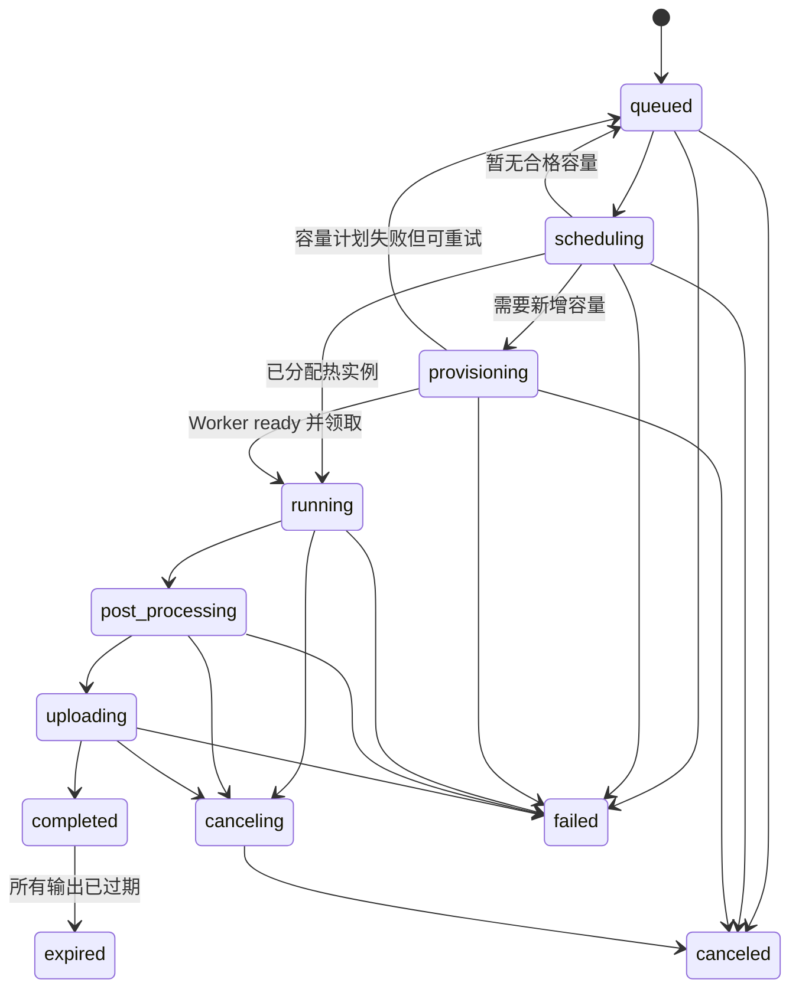

# 公共 API 协议

## 1. 通用约定

- Base URL：`https://astra.internal.example/v1`。
- Content-Type：除 S3 直传和内容下载外均为 `application/json`。
- 鉴权：`Authorization: Bearer <api_key>`。
- 请求追踪：客户端可传 `X-Request-Id`；缺失时服务端生成。响应总是返回该头。
- 创建幂等：建议传 `Idempotency-Key`，长度 8-128 个可打印 ASCII 字符。
- 时间：响应中的 `created_at` 等字段为 Unix 秒。
- ID：资源前缀加 UUIDv7，例如 `task_019...`。
- 未声明字段默认拒绝，返回 `unknown_parameter`；只有 `model_options` 允许模型能力 Schema 声明扩展字段。

成功响应直接返回资源对象，不包装 `code/data`。错误统一为：

```json
{
  "error": {
    "type": "invalid_request_error",
    "code": "invalid_input_role",
    "message": "input_files[0].role is not supported by this model",
    "param": "input_files[0].role",
    "retryable": false,
    "request_id": "req_019...",
    "details": {
      "allowed_roles": ["first_frame", "reference_image"]
    }
  }
}
```

`message` 用于人员排障，不作为程序分支依据。客户端只应依据 HTTP 状态、`type`、`code` 和 `retryable`。

## 2. 鉴权、项目与权限

API Key 绑定组织和默认项目。调用方可以传 `X-Project-Id` 选择已授权项目；未传时使用 Key 的默认项目。Key 只存 Argon2id 哈希，显示时仅返回前缀和末四位。

公共权限：

| Scope | 能力 |
| --- | --- |
| `files:write` | 申请和确认上传 |
| `files:read` | 下载本项目未过期文件 |
| `generations:create` | 创建图片和视频任务 |
| `tasks:read` | 查询本项目 Task |
| `tasks:cancel` | 取消本项目 Task |
| `models:read` | 查询项目可用模型 |

管理台人员通过 OIDC 登录，角色至少包含 `viewer`、`operator`、`model_releaser`、`security_auditor` 和 `admin`。查看永久保存的原始请求需要单独的 `tasks:read_sensitive` 权限并写审计日志。

## 3. File API

### 3.1 申请上传

`POST /v1/files/uploads`

```json
{
  "filename": "first-frame.png",
  "content_type": "image/png",
  "size_bytes": 1843200,
  "sha256": "8b9b4c2f0f6c1c0fda4e0a44b6688fdd87ac1f79d3c8ee8a25aa934537963b21",
  "purpose": "generation_input"
}
```

字段：

| 字段 | 必填 | 规则 |
| --- | --- | --- |
| `filename` | 是 | 1-255 字符，仅用于展示，不参与对象路径 |
| `content_type` | 是 | 首期支持 PNG、JPEG、WebP、MP4、MOV、WAV、MP3、FLAC |
| `size_bytes` | 是 | 正整数，不超过项目和 MIME 限额 |
| `sha256` | 是 | 64 位小写十六进制 |
| `purpose` | 是 | 首期固定为 `generation_input` |

返回 `201`：

```json
{
  "id": "file_019b0...",
  "object": "file.upload",
  "status": "pending_upload",
  "upload": {
    "method": "PUT",
    "url": "https://s3.internal/...",
    "headers": {
      "content-type": "image/png",
      "content-length": "1843200"
    },
    "expires_at": 1787148300
  },
  "created_at": 1787147400
}
```

预签名 URL 有效 15 分钟，只允许单对象 PUT、固定长度和 SHA-256 校验和。AWS SigV4 URL 可以将校验和与对象元数据编码在查询参数中；调用方必须只发送响应 `upload.headers` 明确返回的请求头，不能把 URL 查询参数重复转换成同名请求头。完成确认仍以 S3 HEAD 返回的长度、Content-Type 与 SHA-256 为准。对象 key 由服务端生成，永不采用客户端文件名。

### 3.2 确认上传

`POST /v1/files/{file_id}/complete`

请求体为空对象 `{}`。服务端执行 S3 HEAD，验证对象存在、长度、Content-Type 与 SHA-256。成功返回 `200`：

```json
{
  "id": "file_019b0...",
  "object": "file",
  "status": "available",
  "filename": "first-frame.png",
  "content_type": "image/png",
  "size_bytes": 1843200,
  "sha256": "8b9b4c2f0f6c1c0fda4e0a44b6688fdd87ac1f79d3c8ee8a25aa934537963b21",
  "purpose": "generation_input",
  "created_at": 1787147400,
  "expires_at": 1787233800
}
```

重复确认同一完整对象返回相同 File。对象不匹配时返回 `422 upload_integrity_mismatch` 并删除不可信对象。

确认过程先以原子状态变更进入 `validating`，再由独立 Media Validator 从 S3 读取原始字节，执行文件签名、SHA-256、FFmpeg 完整解码和 FFprobe 元数据检查。确定性的内容错误进入 `rejected` 并删除对象；S3、网络或验证服务暂时故障保留 `validating`，允许调用方用同一完成接口重试，不得把基础设施故障伪装成素材错误。

输入文件固定在 available 后 24 小时过期，不因被 Task 引用而续期。创建 Task 时每个输入必须至少剩余 1 小时有效期，否则返回 `422 input_ttl_too_short`，调用方需要重新上传。若 Task 在输入过期前仍未获得执行租约，则转为 `failed/input_asset_expired`；Worker 已完成下载并处于 running 时允许继续，但输入过期后不能再创建依赖该文件的新 Attempt。

### 3.3 查询文件

`GET /v1/files/{file_id}`

返回 File 当前权威状态与元数据。调用方可以观察 `pending_upload | validating | available | rejected | expiring | expired`，但不能自行推进状态。`media` 只在严格验证成功后存在，包含检测出的媒体类型、容器、尺寸、时长、FPS 和音视频编码等可用字段。

### 3.4 下载内容

`GET /v1/files/{file_id}/content`

- 文件必须属于当前项目且状态为 `available`。
- 返回 `302` 到有效 5 分钟的 S3 GET URL，或在网关不允许重定向时以流式代理返回。
- 过期文件返回 `410 asset_expired`；数据库元数据仍可在 Task 中查看。
- 生成结果也使用同一接口，不在 Task 中暴露长期 S3 URL。

## 4. Video Generation API

### 4.1 创建视频

`POST /v1/videos/generations`

```json
{
  "model": "minimax-h3-krea2-v4",
  "prompt": "电影感的雨夜街道，镜头缓慢向前推进",
  "aspect_ratio": "16:9",
  "resolution": "0.7mp",
  "duration": 15,
  "input_files": [
    {
      "file_id": "file_019b0...",
      "type": "image",
      "role": "reference_image"
    },
    {
      "file_id": "file_019b1...",
      "type": "video",
      "role": "reference_video"
    },
    {
      "file_id": "file_019b2...",
      "type": "audio",
      "role": "reference_audio"
    }
  ],
  "audio": {
    "mode": "native"
  },
  "model_options": {
    "workflow_profile": "turbo8",
    "prompt_enhancer": true
  },
  "priority": "online",
  "metadata": {
    "biz_id": "shot_001",
    "project_scene": "rain-city"
  }
}
```

公共字段：

| 字段 | 必填 | 类型与规则 |
| --- | --- | --- |
| `model` | 是 | 可用 Model Alias 或固定 Release ID；响应固定解析后的 Release |
| `prompt` | 是 | UTF-8，1-20000 字符；加密永久保存 |
| `aspect_ratio` | 是 | `16:9 | 9:16 | 1:1 | 4:3 | 3:4`；还必须命中 Model Release 能力 |
| `resolution` | 是 | Release 声明的分辨率档位，例如当前 H3 的 `0.7mp`；与比例组合后解析成固定宽高 |
| `duration` | 是 | 首期为 4-15 秒整数；还必须命中 Model Release 能力 |
| `input_files` | 否 | 有序参考素材数组，最多 15 个；只允许平台 File API 已确认的图片、视频和音频 |
| `audio` | 否 | 默认 `{ "mode": "native" }`，能力不支持音频时固定 `none` |
| `model_options` | 否 | 仅接受 Model Release 注册的 JSON Schema |
| `priority` | 否 | `online | batch`，默认 `online`；还需项目权限与配额允许 |
| `metadata` | 否 | 最多 16 项，key 最长 64、value 最长 512，仅字符串 |

公共视频请求不接受 `seed`、`fps` 或 `negative_prompt`，出现任一字段均返回 `422 unknown_parameter`：

- `seed` 由 API 使用系统安全随机源生成，和解析后的 Release 一起写入不可变 Task 请求快照，供执行重试保持一致；调用方不能指定或覆盖。
- `fps` 由 Model Release 能力固定，API 将解析值写入 Task 快照；调用方只选择比例和分辨率。
- 当前视频模型协议不提供负面提示词；调用方应只使用正向 `prompt`。

`aspect_ratio + resolution` 是用户意图，不直接等于任意宽高。例如当前工作流的 `16:9 + 0.7mp` 解析为经过 32 倍数约束的 `1152x640`；`9:16 + 0.7mp` 会解析成对应竖屏尺寸。每个允许组合及最终像素尺寸必须由 `/v1/models` 能力返回；未声明组合返回 `422 model_capability_mismatch`。

`input_files[]` 使用严格判别结构：

```json
{
  "file_id": "file_019b0...",
  "type": "image",
  "role": "reference_image"
}
```

- `file_id` 是平台 File API 创建的稳定文件引用。调用方先通过预签名 URL 上传并完成确认，再把 `file_id` 放入数组。
- 不接受 `url`、`file_url` 或任意公网下载地址。查询文件内容时可使用 `GET /v1/files/{id}/content` 获取短期链接，但该链接不能反向作为生成请求输入。
- `type` 只能是 `image | video | audio`，必须和 File 元数据的实际 MIME/严格解码结果一致；不能只相信扩展名或调用方声明。
- 数组顺序必须原样保留，用于稳定映射 `<Picture n>`、`<Video n>` 和 `<Audio n>`。
- 同一个 `file_id` 不能在一次请求中重复出现。

类型与 Role：

| Type | 允许 Role | 平台硬上限 |
| --- | --- | --- |
| `image` | `reference_image`、`first_frame`、`last_frame` | 参考图 9，首帧 1，尾帧 1 |
| `video` | `reference_video`、`source_video` | 参考视频 3，源视频 1 |
| `audio` | `reference_audio`、`reference_video_audio`、`source_audio` | 参考音频 3，配对视频音轨 3，源音频 1 |

Model Release 可以在上述平台硬上限内进一步收紧。例如首个 10Eros candidate 可以只允许 1 张 `reference_image`。类型与 Role 不匹配、数量超限、MIME 不匹配、文件未确认或资产即将过期均在创建阶段拒绝。

`audio.mode`：

- `native`：模型生成音频。
- `none`：只生成视频轨。
- `reference`：使用 `reference_audio` 作为条件。
- `lock_source`：输出旁路使用 `source_audio`，不由模型改写。
- `remix_source`：将模型音频与 `source_audio` 按 `source_mix` 混合。

选择 `reference`、`lock_source` 或 `remix_source` 时必须提供对应角色素材。音频对象可包含 `source_mix`，范围 0-1，仅 `remix_source` 有效。

创建成功返回 `202` Task。Schema 正确但当前无 GPU 不返回错误，Task 保持 `queued` 并在 `status_reason` 中说明容量原因。

### 4.2 编辑视频

`POST /v1/videos/edits`

沿用视频创建结构，但必须提供一个 `source_video`，`prompt` 描述目标修改。响应仍为统一 Task。首期 H3 Release 未声明 `video_edit` 能力时返回 `422 model_capability_mismatch`，接口可存在但不路由到不支持模型。

## 5. Image Generation API

### 5.1 创建图片

`POST /v1/images/generations`

```json
{
  "model": "image-model-v1",
  "prompt": "电影感的雨夜街道，湿润路面反射霓虹灯",
  "size": "1024x1024",
  "quality": "high",
  "n": 4,
  "output_format": "png",
  "input_files": [],
  "model_options": {},
  "priority": "online",
  "metadata": {
    "biz_id": "concept_001"
  }
}
```

图片专属字段：

| 字段 | 必填 | 规则 |
| --- | --- | --- |
| `n` | 否 | 默认 1，范围 1-模型能力上限；所有输出属于同一 Task |
| `output_format` | 否 | `png | jpeg | webp`，默认 `png` |
| `quality` | 否 | `draft | standard | high`，默认 `standard` |
| `input_files` | 否 | Generation 只接受 `reference_image`；编辑接口另支持 `mask` |

图片任务也始终异步。即使模型执行只需数秒，API 不提供同步等待开关。

### 5.2 编辑图片

`POST /v1/images/edits`

与图片创建字段一致，但至少包含一个 `reference_image`。可选一个 `mask`；mask 必须与第一个参考图尺寸一致并符合 Model Release 声明的通道要求。

## 6. Task 对象

创建和查询统一返回：

```json
{
  "id": "task_019b0...",
  "object": "generation.task",
  "type": "video",
  "operation": "generation",
  "status": "running",
  "status_reason": null,
  "estimated_start_at": null,
  "progress": 37,
  "project_id": "project_media",
  "model": "minimax-h3-krea2-v4",
  "model_release": "release_019af...",
  "priority": "online",
  "request": {
    "prompt": "电影感的雨夜街道，镜头缓慢向前推进",
    "aspect_ratio": "16:9",
    "resolution": "0.7mp",
    "duration": 15
  },
  "resolved_parameters": {
    "width": 1152,
    "height": 640,
    "fps": 24
  },
  "output": null,
  "error": null,
  "usage": {
    "queue_time_ms": 1240,
    "provisioning_time_ms": 0,
    "inference_time_ms": null,
    "post_processing_time_ms": null,
    "gpu_seconds": null,
    "estimated_cost": {
      "amount_minor": 1820,
      "currency": "CNY"
    },
    "actual_cost": null
  },
  "metadata": {
    "biz_id": "shot_001"
  },
  "created_at": 1787147400,
  "started_at": 1787147402,
  "completed_at": null,
  "expires_at": null
}
```

规则：

- `request` 是经默认值补全和 Alias 解析后的规范化永久快照；敏感读取受权限控制。
- `resolved_parameters` 是 Release 能力解析后的实际尺寸；视频额外包含 FPS。它不包含系统 seed，也不能由调用方覆盖。
- 系统 seed 保存在内部加密执行快照中，并传给 Worker/Model App；标准 Task 响应不返回 seed。幂等请求哈希只计算调用方公共请求，不包含尚未生成的系统 seed；首次事务生成后，同一 Task 的所有 Attempt 复用该 seed。
- `progress` 为 0-100 整数，仅作展示，不承诺线性时间。未知进度返回 `null`。
- `status_reason` 在资源不足时可为 `capacity_pending`，并由管理 API 额外返回 `estimated_start_at`；该时间是预测，不是 SLA 承诺。
- `output` 只在 `completed` 时存在；`error` 只在 `failed` 时存在。
- `estimated_cost` 创建后可更新；`actual_cost` 仅在账单对账完成后确定。
- `expires_at` 表示输出 Artifact 的最早到期时间，不表示 Task 记录到期。

### 6.1 原始产物保留

Task API 统一的是任务生命周期和 Artifact 元数据，不是媒体编码。Model App 输出的原始文件由 Worker Agent 计算 SHA-256、执行完整性和可读性验证后直接上传到 S3；平台不会在上传、完成或下载路径中转码、裁切、重采样、改 FPS、改变像素格式或重新封装。`content_type`、`size_bytes`、`sha256` 以及 `media` 字段都对应 S3 中保存的原始字节，因此不同 Model Release 可以合法使用不同容器和编码（例如 MP4/H.264、WebM/VP9 或模型声明的图片格式）。

需要缩略图、预览图、统一播放格式或其他派生结果时，必须由 Model App 在镜像内部显式生成并列入该 Release 的 `output_artifacts`，或者提交独立的后处理 Task；调用方不能假设平台会替其转换。

完成示例：

```json
{
  "id": "task_019b0...",
  "object": "generation.task",
  "type": "video",
  "operation": "generation",
  "status": "completed",
  "progress": 100,
  "model": "minimax-h3-krea2-v4",
  "model_release": "release_019af...",
  "output": {
    "artifacts": [
      {
        "file_id": "file_019b1...",
        "role": "result",
        "content_type": "video/webm",
        "size_bytes": 12582912,
        "sha256": "f82d9c6b641f...",
        "width": 1280,
        "height": 720,
        "duration": 8.0,
        "fps": 24.0,
        "media": {
          "container": "webm",
          "video_codec": "vp9",
          "audio_codec": "opus",
          "sample_rate": 32000,
          "channels": 2
        },
        "provenance": {
          "producer": "model_app",
          "transformations": []
        },
        "expires_at": 1787234000
      },
      {
        "file_id": "file_019b2...",
        "role": "thumbnail",
        "content_type": "image/webp",
        "size_bytes": 98304,
        "width": 640,
        "height": 360,
        "expires_at": 1787234000
      }
    ]
  },
  "error": null,
  "created_at": 1787147400,
  "started_at": 1787147402,
  "completed_at": 1787147586,
  "expires_at": 1787234000
}
```

## 7. Task 状态机



`expired` 仅表示输出不可下载，不改变生成曾经成功的事实。Task 历史中保留 `completed` 事件和后续 `expired` 事件。

允许的自动重试：

- 基础设施类且 `retryable=true` 的失败可以创建新 Attempt。
- 输入不合法、模型拒绝、确定性 OOM 和输出验收失败默认不自动重试。
- 最大 Attempt 数由 Model Pool Retry Policy 决定，默认 2 次，不含首次执行。
- 客户端始终查询同一个 Task ID。

## 8. 查询和分页

### 8.1 查询单个 Task

`GET /v1/tasks/{task_id}`

返回最新 Task。读取后不修改状态。调用方建议：

- `queued`/`scheduling`/`provisioning`：5-10 秒轮询，指数退避到 30 秒。
- `running` 及后处理：10-20 秒轮询。
- 终态后停止轮询。
- 遵守 `Retry-After` 和 `429`。

### 8.2 Task 列表

`GET /v1/tasks?limit=50&after=<cursor>&type=video&status=completed&model=minimax-h3-krea2-v4&created_after=1787000000&created_before=1787200000`

支持参数：

- `limit`：默认 50，最大 200。
- `after`：不透明游标，不允许客户端解析或构造。
- `type`：`image | video`。
- `status`：可重复参数或逗号分隔。
- `model`、`priority`、`created_after`、`created_before`。
- `metadata[key]` 不在首期提供通用搜索，避免无界 JSONB 查询；常用业务键应登记为索引字段。

返回：

```json
{
  "object": "list",
  "data": [],
  "has_more": true,
  "next_cursor": "eyJjcmVhdGVkX2F0Ijo..."
}
```

排序固定为 `(created_at DESC, id DESC)`。游标包含过滤器哈希并使用服务端密钥签名；修改过滤条件后复用游标返回 `400 invalid_cursor`。

### 8.3 取消

`POST /v1/tasks/{task_id}/cancel`

请求体为空对象。成功返回最新 Task。取消是幂等操作；终态 Task 返回 `200` 和原状态。

## 9. Models API

`GET /v1/models?type=video`

只列出当前项目有权调用并已启用的 Alias：

```json
{
  "object": "list",
  "data": [
    {
      "id": "minimax-h3-krea2-v4",
      "object": "model",
      "type": "video",
      "release": "release_019af...",
      "maturity": "stable",
      "operations": ["generation"],
      "capabilities": {
        "aspect_ratios": ["16:9", "9:16"],
        "resolutions": ["0.7mp", "0.98mp"],
        "resolution_matrix": {
          "16:9/0.7mp": {"width": 1152, "height": 640},
          "16:9/0.98mp": {"width": 1344, "height": 768}
        },
        "durations": [4, 5, 6, 7, 8, 9, 10, 11, 12, 13, 14, 15],
        "output_fps": 24,
        "input_types": ["image", "video", "audio"],
        "input_roles": ["reference_image", "reference_video", "reference_audio"],
        "audio_modes": ["native", "none", "reference"],
        "max_input_files": 15
      },
      "created_at": 1787000000
    }
  ],
  "has_more": false,
  "next_cursor": null
}
```

Alias 在 Task 创建事务中解析为固定 Release ID。Alias 后续灰度或切换不影响既有 Task。

## 10. 幂等语义

创建请求带 `Idempotency-Key` 时，服务端保存 `(project_id, endpoint, key, canonical_request_hash, task_id)`：

1. 首次请求正常创建。
2. 同 key、相同规范化请求返回原 Task，HTTP 状态仍为 `202`，响应头 `Idempotent-Replayed: true`。
3. 同 key、不同请求返回 `409 idempotency_conflict`。
4. 幂等记录永久保存，与 Task 一致。
5. 请求在网关超时但事务已提交时，重试能取得原 Task。

不带幂等键的重复请求会创建不同 Task。平台不根据 prompt 或文件哈希自动去重生成。

### 10.1 Public API 身份与项目选择

所有 `/v1` 请求使用 `Authorization: Bearer <api_key>`。Key 格式为
`astra_sk_<12 位十六进制前缀>_<43 位 base64url secret>`；前缀只用于数据库候选定位，完整
Key 仍必须通过 Argon2id 校验。禁止通过 query string 传递凭证。

Key 固定绑定一个组织、一个默认项目和显式项目授权集合。未提供 `X-Project-Id` 时使用默认项目；
提供该头时，目标项目必须属于同一组织且位于 Key 的授权集合，否则返回
`403 project_access_denied`。调用方提供的组织标识永远不作为可信身份来源。

Public API v1 scope 为：

| Scope | 允许操作 |
| --- | --- |
| `generations:create` | 创建图片/视频 Task 和编辑 Task |
| `tasks:read` | 查询和列出 Task |
| `tasks:cancel` | 取消 Task |
| `tasks:read_sensitive` | 后续受审计的原始敏感请求读取；不由普通 Task 查询隐式获得 |
| `files:write` | 创建上传、完成确认 |
| `files:read` | 文件元数据与内容下载 |
| `models:read` | 查询项目可用模型 |

认证失败、Key 过期/吊销、scope 拒绝和跨项目访问均写入审计。Key 的
`last_used_at` 使用限频更新，避免每个请求产生数据库热点。

## 11. 错误码

| HTTP | `type` | 典型 `code` | 是否可重试 |
| --- | --- | --- | --- |
| 400 | `invalid_request_error` | `invalid_json`、`invalid_cursor` | 否 |
| 401 | `authentication_error` | `invalid_api_key`、`expired_api_key` | 否 |
| 403 | `permission_error` | `insufficient_scope`、`project_access_denied` | 否 |
| 404 | `not_found_error` | `task_not_found`、`file_not_found`、`model_not_found` | 否 |
| 409 | `conflict_error` | `idempotency_conflict`、`invalid_state_transition` | 视情况 |
| 410 | `not_found_error` | `asset_expired` | 否 |
| 413 | `invalid_request_error` | `file_too_large` | 否 |
| 422 | `invalid_request_error` | `unknown_parameter`、`model_capability_mismatch`、`invalid_input_media`、`upload_integrity_mismatch`、`input_ttl_too_short` | 否 |
| 429 | `rate_limit_error` | `request_rate_exceeded`、`project_concurrency_exceeded` | 是 |
| 500 | `internal_error` | `internal_error` | 是 |
| 503 | `service_unavailable_error` | `database_unavailable`、`storage_unavailable` | 是 |

GPU 暂时不足不会让创建请求返回 `503`；请求合法时仍创建 queued Task。只有平台无法持久化 Task 时才拒绝创建。

当 Pool 达到 `max_replicas`、预算或供应商库存上限时，低优先级新请求可以在 admission control 下返回 `429 project_concurrency_exceeded` 或项目级配额错误；已经创建的 Task 不会被静默删除。

Task 执行失败使用 Task 内部错误：

```json
{
  "error": {
    "code": "insufficient_gpu_memory",
    "message": "The selected release exceeded its declared GPU memory limit",
    "retryable": false,
    "stage": "running",
    "attempt": 1,
    "details": {
      "required_gpu_memory_mb": 24576,
      "observed_peak_gpu_memory_mb": 25140
    }
  }
}
```

供应商原始错误、内部地址、堆栈和密钥不得出现在公共错误中。

## 12. 限流和配额

按组织、项目、API Key、模型分别执行：

- HTTP 请求速率和突发速率。
- 每分钟新建 Task 数。
- queued Task 上限。
- online/batch 并发上限。
- 每日 GPU 秒和金额预算。
- 文件单体、每日上传量和当前未过期字节数。

`429` 返回 `Retry-After`。创建前预算校验只用于防止明显超额；最终账单由实际用量对账。运行中的 Task 不因预算后来降低而中断。

Redis Cluster 使用原子滑动窗口执行请求和创建速率限制；键包含组织、项目和 API Key，TTL
到期后可自然重建。Redis 不保存权威配额或用量。Redis 不可用时，写请求 fail closed 并返回
`503 rate_limiter_unavailable`，读请求按策略允许短时降级但必须告警；生产默认所有 Public API
均 fail closed。

PostgreSQL 在 Task/File 创建事务内执行权威 Admission Control。幂等重放先命中原记录，不重复
占用配额。Task 进入终态、上传被拒绝或过期时，以同一 reservation ID 幂等释放占额；实际 GPU
秒和费用通过只追加用量账本对账，不覆盖原始条目。

## 13. 管理 API 摘要

管理 API 位于 `/admin/v1`，使用 OIDC，不与公共 API Key 混用：

- `/models`、`/model-releases`、`/model-aliases`。
- `/model-pools`、`/scaling-policies`、`/placement-policies`。
- `/model-pools/{id}/capacity-policy`、`/model-pools/{id}/service-time-buckets`、`/model-pools/{id}/capacity-policy/impact-preview`。
- `/providers`、`/regions`、`/resources`、`/replicas`。
- `/tasks`、`/tasks/{id}/attempts`、`/tasks/{id}/audit`。
- `/capacity-plans`、`/scheduling-decisions`、`/cost-reports`。
- `/release-approvals`、`/rollouts`、`/rollbacks`。

策略更新采用 `If-Match: <version>` 乐观锁。发布前必须先调用 `/validate` 与 `/impact-preview`；发布请求引用预览 ID，防止验证后内容被替换。

### 13.1 从镜像创建 Release

`POST /admin/v1/model-releases/from-image`

```json
{
  "model_alias": "minimax-h3-krea2-v4",
  "image": "registry.internal/h3:v4.2.0",
  "registry_credential_id": "regcred_model_registry",
  "target_pool_ids": ["pool_h3_4090_online"],
  "rollout": {
    "max_surge": 1,
    "max_unavailable": 0,
    "readiness_timeout_seconds": 1800,
    "progress_deadline_seconds": 7200,
    "pause_on_failure": true
  }
}
```

服务端必须在返回前解析 OCI manifest，将 tag 固定为 `image_digest`，读取镜像内 Release Manifest 并完成签名、架构和基础 Schema 校验。返回 `201` draft Release：

```json
{
  "id": "release_019c0...",
  "object": "model.release",
  "model_alias": "minimax-h3-krea2-v4",
  "image_source": "registry.internal/h3:v4.2.0",
  "image_digest": "registry.internal/h3@sha256:8f1c...",
  "status": "draft",
  "manifest_status": "verified",
  "rollout_preview_id": "preview_019c0...",
  "created_at": 1787148000
}
```

同一次 Release 和 Rollout 只使用 `image_digest`，即使 tag 后续被覆盖也不重新解析。Registry 凭证由运维预先配置和选择，接口不接收明文用户名/密码。

### 13.2 启动和管理滚动发布

- `POST /admin/v1/model-releases/{release_id}/validate`：启动探测 Replica，核对 capabilities、健康和最小推理。
- `POST /admin/v1/rollouts`：引用通过验证的 Release、预览 ID 和目标池，创建 Rollout。
- `GET /admin/v1/rollouts/{rollout_id}`：返回总进度和每台 Replica 的旧/新 digest、状态、错误与时间。
- `POST /admin/v1/rollouts/{rollout_id}/pause`：停止推进新机器，不中断运行 Task。
- `POST /admin/v1/rollouts/{rollout_id}/resume`：从未完成 Step 继续。
- `POST /admin/v1/rollouts/{rollout_id}/rollback`：以上一稳定 digest 创建反向 Rollout。

Rollout 状态为 `pending | validating | rolling | paused | completed | failed | rolling_back | rolled_back | canceled`。取消只允许尚未替换任何机器的 pending/validating Rollout；已经开始滚动时必须暂停或回滚，不能删除历史。

### 13.3 容量策略接口

`GET /admin/v1/model-pools/{pool_id}/capacity-policy` 返回当前 active policy；`PUT` 使用 `If-Match` 更新草稿，`POST /capacity-policy/impact-preview` 生成影响预估，`POST /capacity-policy/publish` 立即发布已验证版本。

```json
{
  "duration_bucket_boundaries": [4, 8, 12, 15],
  "prediction_quantile": 0.75,
  "min_samples_per_bucket": 30,
  "target_utilization": 0.8,
  "approved_max_concurrency": 1,
  "queue_wait_target_seconds": 120,
  "max_queue_eta_seconds": 900,
  "backlog_drain_seconds": 1800,
  "min_net_benefit_minor": 500,
  "min_net_saving_minor": 300,
  "min_hold_seconds": 1800,
  "min_ready_replicas": 1,
  "scale_down_utilization_threshold": 0.5,
  "scale_down_observation_window": 900,
  "scale_down_forecast_window": 900,
  "scale_down_safety_margin": 0.25,
  "idle_before_scale_down_seconds": 900,
  "scale_down_cooldown_seconds": 1800,
  "max_scale_down_step": 1,
  "max_replicas": 100,
  "daily_budget_minor": 200000,
  "mode": "automatic"
}
```

影响预估至少返回：当前/目标副本数、可用槽位、4-15 秒每桶 P50/P75/P95、预计吞吐、P95 等待、队列清空时间、GPU 成本、SLO 违约变化和受影响项目。发布校验拒绝 `approved_max_concurrency` 大于 Release 证明值、分位点不在 `(0,1]`、时长边界非递增、预算为负、`min_replicas > max_replicas` 和没有可用服务时间基准的生产池。
