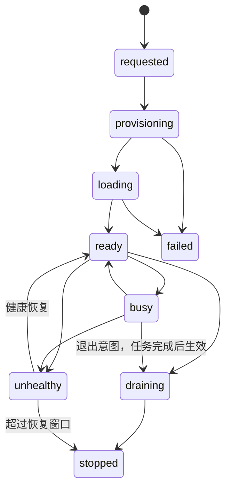

# 任务调度与扩缩容

## 1. 调度目标

调度器同时优化：

1. 请求满足模型能力与硬件约束。
2. 在线任务排队目标。
3. 项目之间的权重公平和并发配额。
4. 批量任务不长期饥饿。
5. 在预算约束内降低预计单任务成本。
6. 故障时保持可解释、可恢复，不重复执行不可幂等副作用。

任务运行后默认不抢占。在线流量上升时只停止向批量队列分配新槽位，并扩充在线容量。

## 2. 调度实体

### 2.1 Model Pool

Model Pool 的身份由以下不可变字段组成：

- Model Release ID。
- Provider 类型。
- 硬件规格或允许的等价规格集合。
- 执行模式：`deployment | batch`。
- Worker Contract 主版本。

一个 Model Release 可以有多个 Pool，例如 4090 在线池、H20 在线池和 4090 批量池。Autoscaler 以 Pool 为单位计算容量；Placement Policy 决定新增副本落在哪个区域。

### 2.1.1 Worker 槽位与真实容量

Replica 的容量不是“机器在线”这一布尔值，而是经过 Release 验证的执行槽位：

```text
free_slots       = max_concurrency - running_slots - reserved_slots
dispatchable     = replica.ready && free_slots > 0 && !draining
pool_free_slots  = sum(free_slots of dispatchable replicas)
effective_slots  = sum(max_concurrency of healthy replicas)
```

`max_concurrency` 只能来自真实基准和 Release Manifest，不能因为 GPU 显存还有余量就临时提高。H3 第一版 `max_concurrency=1`，所以一台正在运行一个 30 分钟任务的 Worker 没有可分配槽位；第二个任务只能留在队列或等待新增 Replica。

调度器可以有一个短期 `reserved_slot` 用于避免多个 Scheduler 同时选择同一槽位，但 reservation 不是吞吐，也不是任务已开始：

- reservation 最长 30 秒，必须在 PostgreSQL 中有 Attempt/Lease 记录。
- Worker 未在保留窗口内接受任务，reservation 自动释放回队列。
- 公共 Task 仍为 `queued`，只有 Model App 返回 `accepted` 后才转 `running`。
- 禁止通过给一个单槽 Worker 预派两个任务来制造“每分钟处理两个任务”的假象。

### 2.2 Replica 状态



只有 `ready` Replica 可以领取新任务。`busy` 是否还能领取由 Release 声明的 `max_concurrency` 决定；H3 第一版固定为 1。

### 2.3 Attempt 与 Lease

Task 可以有多个 Attempt，但同一时刻最多一个有效 Lease：

| 字段 | 含义 |
| --- | --- |
| `attempt_id` | 单次执行身份 |
| `task_id` | 永久 Task |
| `replica_id` | 执行实例 |
| `lease_token_hash` | Worker 所持随机 Token 的哈希 |
| `lease_expires_at` | 租约截止时间 |
| `heartbeat_at` | 最近心跳 |
| `attempt_no` | 从 1 开始 |
| `execution_key` | Model App 幂等执行键，等于 Attempt ID |

Worker 每 10 秒心跳，正常租约 45 秒。心跳间隔和租约时长可配置，但租约必须至少为心跳间隔的 3 倍。控制面暂停或网络抖动时 Worker 不立即启动新任务；已有任务在本地继续最多 `orphan_grace_period`，恢复连接后提交。如果租约已被重新分配，旧 Worker 的结果进入隔离区，不覆盖新 Attempt。

### 2.4 运行中 Worker 的处理

Worker 领取任务后，Agent 先将槽位标记为 `reserved`，Model App 返回 `202 accepted` 后才标记为 `running`。心跳携带每个 execution 的状态，Scheduler 按以下规则处理：

1. `running_slots < max_concurrency` 时，只能给剩余空槽派发任务。
2. `running_slots == max_concurrency` 时，Worker 不再收到新的 Attempt；队列任务保持 `queued`。
3. Model App 返回完成并通过输出验收后释放槽位，Agent 才重新长轮询。
4. Model App 崩溃、心跳超时或租约到期时，槽位先进入 `unknown`，经过 `orphan_grace_period` 后才重新计入容量；旧结果不得覆盖新 Attempt。
5. `draining` Worker 不领取新任务，但允许已有任务完成；用户主动取消才进入取消流程，普通扩容不会抢占运行任务。

Worker 的预取只允许在明确声明 `prefetch_safe=true` 且输入可重复下载时使用。预取任务仍是 queued/reserved，不改变 Task 开始时间、GPU 利用率和吞吐统计。

## 3. PostgreSQL 与 Redis 分工

PostgreSQL 保存 Task 权威状态、Attempt、Lease、调度决策和策略版本。Redis Cluster 保存可重建的候选排序索引。

建议 key 使用 Redis Cluster hash tag，保证单 Pool 原子操作位于同一 slot：

```text
astra:q:{pool_id}:online:{project_id}     # Sorted Set，score=virtual_finish
astra:q:{pool_id}:batch:{project_id}      # Sorted Set
astra:q:{pool_id}:projects:online         # Sorted Set，项目队首 score
astra:q:{pool_id}:projects:batch          # Sorted Set
astra:q:{pool_id}:dedupe                  # Hash，task_id -> task_version
astra:rate:{project_id}:{window}           # 限流计数
```

Redis 只返回候选 `task_id`。每次分配都必须执行 PostgreSQL CAS：

```sql
UPDATE generation_tasks
SET status = 'running', version = version + 1, started_at = COALESCE(started_at, now())
WHERE id = $task_id
  AND status IN ('queued', 'scheduling', 'provisioning')
  AND cancel_requested_at IS NULL
  AND version = $expected_version
RETURNING *;
```

同一事务插入 Attempt、Lease、状态事件和 Outbox。CAS 失败表示候选已过期，Scheduler 删除 Redis 索引并继续，不进行盲重试。

## 4. 优先级与公平队列

### 4.1 两级选择

第一层在 `online` 与 `batch` 队列之间选择，第二层在同一层的项目之间使用加权公平排队。

每个 Pool 策略必须显式包含：

- `online_capacity_target`：在线期望容量占比。
- `batch_min_share`：批量有积压时的最低启动份额。
- `online_burst_slots`：连续分配在线任务后必须重新检查批量份额的最大次数。
- 项目 `weight`、`max_running` 和 `max_queued`。

选择规则：

1. 移除达到并发、预算或暂停状态的项目。
2. 批量有积压且过去滑动窗口实际启动份额低于 `batch_min_share` 时，下一空闲槽位给批量。
3. 否则在线有积压时选择在线。
4. 在线连续分配达到 `online_burst_slots` 后强制重新执行第 2 步。
5. 只有批量有积压时选择批量。

`batch_min_share` 是启动份额，不会中断已运行的在线任务。若 Pool 只有一个槽位且在线持续占用，批量保证只能在该槽位释放后生效。

### 4.2 加权公平排队

变长生成任务不能只按数量公平。每个任务使用预计 GPU 秒作为成本：

```text
virtual_start  = max(project_virtual_finish, lane_virtual_time)
virtual_finish = virtual_start + predicted_gpu_seconds / project_weight
```

任务入队时计算 `virtual_finish`，同项目保持创建顺序。Scheduler 选择各项目队首中 `virtual_finish` 最小者。任务实际完成后使用实际 GPU 秒修正项目未来虚拟时间，但不重排已经运行的 Task。

预测不可用时使用 Model Release 基准的保守 P75；禁止使用 0 或全局常数绕过公平成本。

### 4.3 防饥饿老化

当任务等待时间超过策略的 `aging_after_seconds`，每经过一个老化周期降低有效 virtual finish，但最多提升到当前优先级层的队首，不跨越 `batch` 到 `online`。老化只影响排序，不绕过项目并发和预算。

## 5. 推理耗时预测

统计按以下特征形成桶：

- Release ID 与硬件规格。
- 操作与模态。
- 尺寸或像素区间。
- 视频帧数、时长和 FPS。
- 质量、采样步数或稳定的 workflow profile。
- 输入角色集合与输出数量。

每个桶保存成功样本的 P50、P75、P95 与 EWMA。Autoscaler 使用 P75，成本预估使用 P50/P75 区间，超时使用 P95 加安全余量。

EWMA：

```text
estimate_t = alpha * observed_t + (1 - alpha) * estimate_(t-1)
```

`alpha` 是策略字段，推荐初始值 0.2。只有通过输出验收的 Attempt 进入成功耗时统计；取消、Worker 崩溃和供应商建机时间分别统计。样本少于 `min_samples` 时回退到 Release 基准，绝不跨模型猜测。

### 5.1 服务时间、吞吐和稳定性

视频输出时长不是服务时间。一个 15 秒视频可能需要 30 分钟 GPU 时间，也可能只需数分钟；容量计算使用实际 `service_time`（加载后的推理、编码和必要后处理占用），而不是 `duration=15`。

对一个 Model Pool：

```text
S      = P75 service_time_seconds per task
c      = approved max_concurrency per replica
N      = healthy ready replicas
mu     = N * c / S                  # tasks / second
lambda = arrival_rate               # tasks / second
util   = lambda / mu
```

当 `lambda >= mu * target_utilization` 时，队列长期不会自然排空，必须扩容、降低到达率或启用 admission control。以 `S=1800s`、`c=1` 为例：

- 1 个 Worker 的理论吞吐约为 `1/1800` 个任务/秒，即每分钟 `0.033` 个任务。
- 要在稳定状态下承接每分钟 2 个同类任务，至少需要 `ceil(2 * 30 / target_utilization)` 个并发槽；目标利用率 0.8 时约为 75 个槽，而不是把两个任务同时派给一台单槽 Worker。

短时突发可以暂时超过 `mu`，但必须用积压工作量和排队目标计算新增容量；如果超过 `max_replicas`，系统展示预计等待时间，不宣称任务已被 Worker 接受。

## 6. 扩容算法

### 6.1 策略必填项

生产 Pool 启用前必须填写：

| 字段 | 含义 |
| --- | --- |
| `min_replicas` / `max_replicas` | 容量边界 |
| `queue_wait_target_seconds` | 目标开始执行等待时间 |
| `backlog_drain_seconds` | 希望清空当前积压的时间 |
| `target_utilization` | 0-1，预留抖动余量 |
| `max_queue_eta_seconds` | 超过后进入 admission control |
| `min_net_benefit_minor` / `min_net_saving_minor` | 扩容/缩容最小净收益 |
| `wait_value_rate` / `slo_penalty_rate` | 等待和 SLO 违约的项目价值系数 |
| `min_hold_seconds` | 新增 Replica 的最短计费持有窗口 |
| `scale_up_step` / `scale_down_step` | 单轮最大变化 |
| `scale_up_cooldown_seconds` | 扩容后重新评估间隔 |
| `scale_down_cooldown_seconds` | 缩容后重新评估间隔 |
| `idle_before_scale_down_seconds` | 副本持续空闲门槛 |
| `provisioning_p90_seconds` | 建机、拉镜像和加载模型 P90 |
| `hourly_budget_minor` / `daily_budget_minor` | 硬预算上限 |
| `allowed_regions` | 允许区域；全区域调度仍需明确列表 |
| `allowed_providers` | 可选供应商白名单；未声明时沿用 Model Pool 的供应商，跨 Provider 必须显式配置 |
| `placement_weights` | 成本、完工、失败、冷启和传输权重；调度器按归一化权重评分，全部为 0 时使用稳定排序 |

管理台可以提供模板，但数据库中不存在继承的隐式生产默认值。策略缺项时 Pool 状态为 `configuration_required`。

### 6.2 工作量副本数

定义：

- `Wq`：所有可调度排队任务的预计 GPU 秒总和。
- `Wr`：运行任务预计剩余 GPU 秒总和。
- `A`：未来单位墙钟秒的预计新增 GPU 秒，使用近期到达率的 P75 EWMA。
- `H`：预测窗口，取 `max(backlog_drain_seconds, provisioning_p90_seconds)`。
- `U`：目标利用率。

```text
required_work_per_second = (Wq + Wr + A * H) / H
```

按槽位修正：

```text
required_slots    = ceil(required_work_per_second / U)
workload_replicas = ceil(required_slots / c)
```

其中 `required_work_per_second` 是 GPU 服务工作秒/墙钟秒，`U` 是目标利用率，`c` 是已批准并发。`required_slots` 是需要的并发执行槽位，`workload_replicas` 才是按每 Replica 槽位折算后的副本数。实现必须在结果中记录 `predicted_service_time`、`effective_slots` 和 `throughput_tasks_per_second`。如果硬件每 Replica 声明并发大于 1，容量按经过基准验证的等效并发乘数计算，不能直接用进程线程数。

### 6.3 排队目标副本数

仅用总工作量无法发现队首长任务。Scheduler 对当前运行剩余时间和排队 Task 做确定性离散队列推演：

```text
function replicasForQueueTarget(tasks, running, target, min, max):
  for replicas from max(min, currentReady) to max:
    slots = minHeap(replicas)
    seed slots with remaining time of running attempts
    waitTimes = []

    for task in fairQueueOrder(tasks):
      availableAt = slots.popMin()
      waitTimes.append(availableAt)
      slots.push(availableAt + task.predictedGpuSeconds)

    if percentile(waitTimes, 95) <= target:
      return replicas

  return max
```

队列推演必须使用公平队列顺序和项目并发限制。`currentReady` 不包含 provisioning、unhealthy 或 draining Replica。

### 6.4 最终期望容量

```text
raw_desired = max(min_replicas, workload_replicas, queue_slo_replicas)
bounded     = clamp(raw_desired, min_replicas, max_replicas)
budgeted    = largest affordable replicas <= bounded
desired     = applyStepAndCooldown(current_desired, budgeted)
```

处理顺序：

1. 预算不足以维持 `min_replicas` 时不自动违反最小容量；Pool 进入 `budget_violation` 并告警，等待运维决策。
2. 新增容量受 `scale_up_step` 限制，但预测将严重超出排队目标时可使用显式 `emergency_scale_up_step`。
3. 扩容冷却不阻止更严重的库存故障转移。
4. `desired` 生成不可变 Capacity Plan；Provider Controller 执行后更新 observed capacity。

## 6.5 成本与收益平衡

工作量公式回答“理论上需要多少槽”，但不回答“现在是否值得花钱扩容”。每轮调度还要对候选容量 `N+k` 做边际收益计算。

### 6.5.1 候选计划成本

对新增 `k` 个 Replica，在预测窗口 `H` 内计算：

```text
incremental_cost(k) =
    k * (gpu_price_per_second * billable_seconds(H))
  + k * startup_cost
  + storage_mount_cost(k)
  + network_cost(k)
  + expected_failure_cost(k)
```

`billable_seconds(H)` 遵守供应商最小计费粒度和实际预计持有时间；热池副本使用 `min_hold_seconds`，临时 Batch Job 使用供应商 Job 预计生命周期。成本全部以最小货币单位计算。

### 6.5.2 候选计划收益

使用公平队列和离散排队推演，分别计算当前容量与 `N+k` 的每个任务预计开始时间：

```text
wait_reduction_i(k) = max(0, wait_i(current) - wait_i(N+k))
slo_avoided_i(k)    = max(0, wait_i(current) - target_i)
                         - max(0, wait_i(N+k) - target_i)

benefit(k) =
    sum(wait_reduction_i(k) * wait_value_rate_i)
  + sum(slo_avoided_i(k) * slo_penalty_rate_i)
  + batch_value_avoided(k)
```

`wait_value_rate` 和 `slo_penalty_rate` 由项目/优先级策略提供；没有配置时使用 0，只由硬 SLO 和预算触发，不能擅自猜测业务金额。批量任务的收益可使用截止时间违约罚金或项目配置的延迟价值。

### 6.5.3 扩容决策

```text
for k in 1..max_additional:
  if violates_hard_slo(N+k) or backlog_never_drains(N+k):
    mark k as required_candidate
  else:
    net(k) = benefit(k) - incremental_cost(k)

candidate = argmax(net(k)) among affordable candidates

scale_up if:
  hard_slo_violation and candidate exists
  or net(candidate) >= min_net_benefit
  or queue_eta > max_queue_eta
```

决策边界：

- 硬 SLO 违约优先于收益阈值，但仍受 `max_replicas`、库存和硬预算约束。
- 若 `net(k)` 不足且队列未超过最大 ETA，保持现有容量，避免为短暂小积压创建昂贵 GPU。
- 若队列达到 `max_queue_eta` 或输入/Task TTL 风险，进入 `admission_control`：停止接受低优先级新任务或返回配额错误，不把无限积压转成无限成本。
- 扩容必须满足 `min_hold_seconds`，防止请求抖动导致买 GPU/释放 GPU 的锯齿成本。
- 同一轮最多选择一个 `k`，并记录 current/alternative 的 ETA、成本、收益、净收益和未满足约束。

### 6.5.4 缩容决策

对移除 `k` 个空闲槽位计算：

```text
saving(k)       = avoided_gpu_cost(k)
degradation(k)  = added_wait_cost(k) + added_slo_penalty(k)
scale_down if saving(k) - degradation(k) >= min_net_saving
             and hard_slo_remains_satisfied
```

缩容只选择没有 running/reserved slot 的 Replica，且必须经过空闲窗口和冷却。若降容会令 `lambda >= mu * target_utilization`，即使当前没有排队也不缩容，以免下一分钟的稳定到达流量立即制造积压。

## 6.5.5 与控制面配合的缩容策略

缩容和扩容使用同一份 `capacity_policy`，但阈值必须有迟滞，避免 GPU 在高低负载之间反复创建和释放：

| 缩容参数 | 作用 |
| --- | --- |
| `min_ready_replicas` | 生产模型最低 ready 热池，通常至少为 1 |
| `scale_down_utilization_threshold` | 进入缩容观察区的利用率阈值，例如 0.45 |
| `scale_down_observation_window` | 低负载必须连续保持的观察窗口 |
| `scale_down_forecast_window` | 预测未来到达率和所需槽位的窗口 |
| `scale_down_safety_margin` | 为预测误差保留的槽位比例 |
| `idle_before_scale_down_seconds` | 候选 Replica 必须连续无 running/reserved slot 的时间 |
| `min_hold_seconds` | 新增 Replica 至少保持的计费时间 |
| `scale_down_cooldown_seconds` | 上一次扩缩后禁止再次缩容的时间 |
| `max_scale_down_step` | 单轮最多释放的 Replica 数 |
| `min_net_saving_minor` | 缩容所需的最低净节省 |

候选 Replica 的最早缩容时间取所有时间门槛的最大值：

```text
eligible_at = max(
  idle_since + idle_before_scale_down_seconds,
  low_utilization_since + scale_down_observation_window,
  last_scale_action_at + scale_down_cooldown_seconds,
  replica_ready_at + min_hold_seconds
)
```

达到 `eligible_at` 只代表可以进入本轮安全性、收益和 CAS 校验，不代表一定删除；排队预测、热池下限、预算收益或 Rollout 状态不满足时仍继续保留。

缩容前同时计算当前窗口和预测窗口：

```text
forecast_slots(H) = ceil(
    forecast_gpu_work_seconds(H) / H
    / target_utilization
    * (1 + scale_down_safety_margin)
)

slots_after_remove = effective_slots - removed_replicas * approved_max_concurrency

safe_to_remove if:
    online_queued_tasks == 0
    and slots_after_remove >= max(min_ready_slots, forecast_slots(H))
    and forecast_p95_wait_after_remove <= queue_wait_target_seconds
    and (
        batch_queued_tasks == 0
        or batch_drain_eta_after_remove <= backlog_drain_seconds
           and batch_share_after_remove >= batch_min_share
    )
    and low_utilization_duration >= scale_down_observation_window
```

在线队列和批量队列必须分开判断：存在在线积压时禁止普通缩容；存在批量积压时，只要缩容后的排空 ETA 和 `batch_min_share` 仍满足策略，仍可释放过剩容量。服务时间预测使用 4-15 秒时长桶的 P75/P95，不使用当前瞬时空闲作为唯一依据。

缩容顺序：

1. 先排除有 running/reserved slot、draining、健康异常、Rollout 中或承担旧 Release 排空任务的 Replica。
2. 选择边际成本最高且缓存价值最低的候选。
3. 发送 `drain`，停止领取新 Attempt，但允许当前 Task 完成。
4. 等待槽位归零并完成最小稳定窗口，再调用 Provider 删除/暂停。
5. 如果观察期内队列、预测到达率或 SLO 恢复，取消 drain，不删除机器。
6. 单轮最多释放 `max_scale_down_step`，下一轮必须重新计算收益和风险。

推荐迟滞：扩容触发线为目标利用率 0.8，缩容观察线为 0.45-0.55，并要求连续多个观察窗口；具体值由 Model Pool 配置。这样 4 秒短视频突发不会因为一小段空闲立即缩容，15 秒长视频也不会因为一个任务完成就误判容量过剩。

缩容决策必须在管理台展示：释放的 GPU 成本、未来窗口预测槽位、缩容后 P95 排队、热池剩余、风险余量和净节省。运维可以选择自动、保护或手动容量模式，但手动模式仍不能删除运行中或有效租约的 Replica。

## 6.6 队列持续增长和无空机

当所有健康 Replica 都没有 free slot 且队列持续增长时，Scheduler 每个决策周期执行：

1. 重新计算 `Wq`、`Wr`、`lambda`、`mu`、预计清空时间和输入 TTL 风险。
2. 立即生成 Capacity Plan；不等待某个 Worker 自然空闲。
3. 按成本收益算法选择扩容数量和区域。
4. 扩容期间，任务保持 `queued`，`status_reason=capacity_pending`，并返回预计开始时间（管理 API 可见，公共 Task 可选）。
5. 达到 `max_replicas`、预算或供应商库存上限时，按优先级执行 admission control：保留在线与临近截止的任务，暂停低优先级批量接收；已有 Task 不被静默删除。
6. 当 Worker 完成任务释放槽位，优先回填已存在的有效 reservation/公平队首，而不是新到达任务。

## 6.7 “一分钟排两个任务”的准确语义

平台区分三件事：

- **排队两个任务**：可以，一分钟内把两个 Task 写入 queued 队列。
- **预留两个任务**：只有 Worker 声明至少两个经过验证的 `max_concurrency` 槽位才可以；单槽 Worker 最多保留一个短期 reservation。
- **一分钟完成两个任务**：由吞吐公式决定。若单任务服务时间为 30 分钟，单槽 Worker 不可能达到每分钟两个完成；需要足够多的并发槽，或提供不同的更快 Model Release。

因此调度器不会根据请求到达速度强行“给 Worker 排两个”，而是根据 `service_time × concurrency × replica_count` 计算可持续吞吐，并用成本收益决定购买多少槽位。

## 6.8 控制面可配置的容量策略

上述公式不把 4-15 秒视频写死为一个平均值。每个 Model Pool 在控制面维护一份可版本化的 `capacity_policy`，按以下维度建立服务时间桶：

```text
(model_release, workflow_profile, gpu_class,
 width, height, fps, duration_bucket, quality,
 input_roles, audio_mode, output_count)
```

控制面默认提供视频时长桶 `[4, 8, 12, 15]`，但运维可以按真实数据调整边界。桶内至少保存 `sample_count`、P50/P75/P95、EWMA、最近更新时间和预测置信度：

| 控制面参数 | 作用 |
| --- | --- |
| `duration_bucket_boundaries` | 4-15 秒等时长桶边界，不代表模型一定线性增长 |
| `min_samples_per_bucket` | 样本不足时回退到更宽桶或 Release 基准 |
| `prediction_quantile` | 扩容通常使用 P75，安全/超时可使用 P95 |
| `target_utilization` | GPU 槽位目标利用率，抑制满载抖动 |
| `approved_max_concurrency` | 每 Replica 最大并发，必须低于或等于 Release 证明值 |
| `queue_wait_target_seconds` | 在线任务等待目标 |
| `max_queue_eta_seconds` | 超过后触发 admission control |
| `backlog_drain_seconds` | 目标积压清空窗口 |
| `min_net_benefit_minor` | 新增 GPU 的最小净收益 |
| `wait_value_rate` / `slo_penalty_rate` | 等待和违约的业务价值系数 |
| `min_hold_seconds` | 新增 GPU 最短持有时间，避免买卖抖动 |
| `max_replicas` / `daily_budget_minor` | 容量和成本硬上限 |
| `online_capacity_target` / `batch_min_share` | 在线与批量容量分配 |

控制面提供三种策略动作：

1. **自动**：每个决策周期读取指标并按成本收益公式扩缩容。
2. **保护**：固定最小热池，只允许在硬 SLO/TTL 风险下扩容，适用于昂贵 GPU。
3. **手动容量**：运维指定目标副本数；调度仍执行槽位、公平队列和预算校验，不允许超出池上限。

运维修改策略必须经过 `validate -> impact_preview -> publish`，记录旧/新版本、预测服务时间、预计吞吐、月度成本变化和受影响项目。发布后立即生效，但已有 Task、Attempt 和 Lease 不被重排。

### 6.8.1 4-15 秒视频的示例策略

```json
{
  "duration_bucket_boundaries": [4, 8, 12, 15],
  "prediction_quantile": 0.75,
  "min_samples_per_bucket": 30,
  "target_utilization": 0.8,
  "approved_max_concurrency": 1,
  "queue_wait_target_seconds": 120,
  "max_queue_eta_seconds": 900,
  "backlog_drain_seconds": 1800,
  "min_net_benefit_minor": 500,
  "min_net_saving_minor": 300,
  "min_hold_seconds": 1800,
  "min_ready_replicas": 1,
  "scale_down_utilization_threshold": 0.5,
  "scale_down_observation_window": 900,
  "scale_down_forecast_window": 900,
  "scale_down_safety_margin": 0.25,
  "idle_before_scale_down_seconds": 900,
  "scale_down_cooldown_seconds": 1800,
  "max_scale_down_step": 1,
  "max_replicas": 100,
  "daily_budget_minor": 200000
}
```

该策略只是一份可解释的起点，不是平台全局默认值。比如 4 秒视频 P75 为 8 分钟、15 秒视频 P75 为 30 分钟时，Scheduler 会分别计算两类任务占用的 GPU 工作秒；短任务不会因为数量多就把长任务的 30 分钟服务时间当成 4 秒，也不会把长任务平均摊平为一个错误的“每分钟吞吐”。

### 6.8.2 预测失真保护

- 预测误差超过策略阈值时提高量化分位点或扩大安全余量，而不是立即提高并发。
- 新 Release 样本不足时使用该 Release 的保守基准，禁止复用不同模型或不同 GPU 的耗时。
- 真实服务时间连续高于预测时触发 `capacity_prediction_degraded`，暂时按观测 P95 扩容。
- 服务时间明显降低时仍遵守 `min_hold_seconds` 和缩容冷却，避免短期样本造成反复释放。

## 7. 缩容执行与竞态处理

缩容仅在以下全部成立时发生：

- `desired < observed_ready` 连续满足 `scale_down_cooldown_seconds`。
- 候选 Replica 处于 `ready` 且空闲超过 `idle_before_scale_down_seconds`。
- 缩容后仍满足 `min_replicas`、批量最低份额和运行租约。
- 当前不存在同 Pool 的未完成扩容操作。
- 过去迟滞窗口内没有排队目标违约。

候选排序优先释放：

1. 边际价格最高。
2. 故障率较高或处于熔断观察区的区域。
3. 模型缓存命中价值最低。
4. 最近最久未使用。

Replica 先进入 `draining`。若其状态在 CAS 前变为 busy，则本轮跳过。首期不向 Model App 发送抢占信号。

调度器必须在同一轮内重新校验候选 Replica，避免“判断空闲”和“发送删除”之间产生竞态：

```text
function scaleDown(pool, policy, now):
  if pool.rollout_in_progress or pool.pending_scale_up:
    return suppressed("capacity_transition")

  forecast = forecastCapacity(pool, policy, now)
  candidates = replicas
    .filter(r => r.ready && r.running_slots == 0 && r.reserved_slots == 0)
    .filter(r => !r.draining && !r.unhealthy && !r.rollout_owned)
    .filter(r => r.idle_for >= policy.idle_before_scale_down_seconds)
    .sort(byMarginalCostThenCacheValue)

  for replica in take(candidates, policy.max_scale_down_step):
    if readyCountAfterDrain(pool) <= policy.min_ready_replicas:
      break
    if !safeToRemove(pool, replica, forecast, policy):
      continue
    if !casState(replica, from="ready", to="draining"):
      continue
    recheck = readReplicaSlots(replica)
    if recheck.running_slots > 0 or recheck.reserved_slots > 0:
      casState(replica, from="draining", to="ready")
      continue
    createScaleDownPlan(pool, replica, forecast, policy)
    providerController.deleteAfterDrain(replica.id)
```

`deleteAfterDrain` 只在槽位归零、最后一次心跳和租约状态已确认后执行；删除失败则将 Replica 标记为 `drain_failed` 并在冷却后重试。若观察窗口内在线队列、预测到达率或 SLO 恢复，协调器应先取消 `draining`，再重新纳入候选容量；已经发出供应商删除请求的实例不承诺可恢复，必须按新 Replica 处理。

## 8. 跨区域 Placement

### 8.1 硬过滤

候选资源必须同时满足：

- Provider 与区域在策略允许列表。
- GPU 型号、数量和显存满足 Release 要求。
- CPU、内存、磁盘、共享内存和网络满足要求。
- 实时库存大于计划数量，资源快照未过期。
- 容器镜像和模型存储可访问；需要时可以先镜像预热。
- 预计小时/日成本不超预算与单价上限。
- 区域未熔断，数据合规标签匹配项目。

硬过滤无候选时，不降低模型声明的显存或质量要求。Capacity Plan 记为 `blocked` 并记录每个候选被过滤的原因。

### 8.2 评分

对剩余候选的每个指标在本轮候选集做 0-1 归一化，越低越好：

```text
score = w_cost      * normalized_estimated_cost_per_task
      + w_finish    * normalized_estimated_completion_time
      + w_failure   * normalized_region_failure_rate
      + w_cold      * normalized_cold_start_time
      + w_transfer  * normalized_data_transfer_cost
```

所有权重非负且总和必须为 1。估算完工时间包含当前区域待建容量、P90 冷启动、该 Pool 区域队列和推理 P75。成本包含 GPU、存储挂载、流量和最小计费粒度。

评分相同时选择：已有同 Release 热缓存的区域、供应商操作更少的方案、区域 ID 字典序，保证决策可重复。每次决策保存候选快照、归一化值、权重和胜出原因。

### 8.3 容量分散

全区域成本调度不等于每次只选最低价区域。策略可配置 `max_region_share` 和 `min_healthy_regions`。只有在容量大于等于最小区域数时才强制分散；小规模单副本 Pool 不制造无法满足的多区约束。

## 9. 常驻池与供应商 Batch Job

调度路径：

```text
if task.priority == online:
  use ready deployment replica
  else queue and request deployment capacity
else:
  if idle deployment capacity exists and batch share permits:
    use deployment replica
  else if batch backlog reaches configured threshold:
    submit provider batch job/queue group
  else:
    remain queued
```

Batch Job 使用相同 Model Release、Worker Agent 和 Model App。供应商 Job 的 `timeout_sec`、`parallelism`、`backoff_limit` 和 `restart_policy` 从 Pool Policy 显式生成。供应商内部重启使用相同 Attempt；平台重新提交新 Job 才创建新 Attempt。

## 10. 熔断与供应商保护

每个 `provider + region + operation` 独立熔断：

- 连续错误和滑动窗口错误率超过策略阈值时 `open`。
- `open` 期间不创建新容量，但继续观察已有资源和接收 Worker 心跳。
- 冷却后进入 `half_open`，只允许一个探测操作。
- 探测成功关闭；失败重新打开并指数增加冷却，上限由策略控制。

鉴权/签名错误立即打开 Provider 全局写操作熔断并触发高优先级告警，禁止用重试放大。查询限流遵循 `Retry-After` 并使用带抖动指数退避。

## 11. 策略版本、预估与回滚

策略保存为不可变版本：

1. 运维提交草稿。
2. 服务校验字段、预算、权重和危险组合。
3. 使用最近 24 小时任务与当前容量回放，输出副本、成本和排队影响预估。
4. 运维引用预估 ID 发布。
5. 新版本立即成为 `active`，Scheduler 下一轮读取。
6. 回滚创建一个内容等于历史版本的新版本，不修改历史记录。

安全校验至少拒绝：`min > max`、权重和不为 1、负预算、缩容空闲时间短于心跳租约、无允许区域、目标利用率不在 `(0,1]`、H3 并发超过发布证明值。

## 12. 可观测性和验收指标

关键指标：

- 按 Pool/优先级的 queue depth、queued GPU seconds、P50/P95 wait。
- desired、requested、provisioning、ready、busy、draining Replica。
- 预测误差 P50/P95、实际/预计成本偏差。
- 项目实际启动份额与目标公平份额。
- Placement 候选过滤原因与区域得分。
- 扩缩容操作耗时、失败、抑制原因和冷却状态。
- 租约过期、重复结果、Redis 重建和供应商熔断。

调度验收必须通过确定时钟仿真：突发在线流量、长短任务混合、批量防饥饿、项目超配额、库存耗尽、跨区涨价、预算封顶、Worker 失联、扩容中再次突发、缩容迟滞、单槽 30 分钟任务拒绝第二个同时执行、以及“扩容节省的等待罚成本小于 GPU 成本”时保持排队不扩容。

## 13. 与模型镜像 Rollout 协作

- Rollout 期间暂停目标 Pool 的普通缩容，避免 Autoscaler 与逐机替换同时删除 Replica。
- Autoscaler 仍可扩容，但新副本一律使用目标 Release digest；旧 digest 只保留完成已固定旧 Release 的 Task 所需容量。
- 共绩 Provider Adapter 先申请临时预热实例并完成 readiness、capabilities 和 smoke 校验；预热未通过前不接收公共 Task。
- 控制面切换 `accept_new_tasks` 后，旧 digest 不再接收新建 Task；发布前已创建但尚未领取 Attempt 的旧 Task 仍可由旧 Worker 排空。旧队列清零后再关闭 `accept_existing_tasks` 并下发 `drain`。
- 旧 Worker 槽位归零后通过 Worker Contract 回报 `drained`，控制面确认租约归零，再通知 Provider Controller 回收机器。
- `max_surge` 形成的临时副本不计入正常 `max_replicas`，但必须计入独立 Rollout 预算和供应商库存；预算不允许时 Rollout 不启动。
- 混合版本期间 Scheduler 只将 Task 分配给完全匹配其 `model_release` 的 Replica，禁止跨版本复用。
- 旧 Release 仍有 queued/running Task 时至少保留所需旧副本。Rollout 完成机器替换不等于可以删除最后一个旧池；旧任务排空后再清理。
- Rollout paused/failed 时 Autoscaler 分别维持两个 Release 的已确认容量，不继续扩大目标版本。
