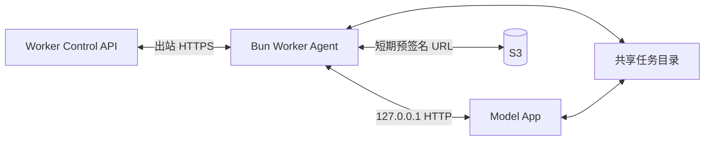

# 模型 Worker 合同

## 1. 目标

模型应用可以使用任何语言、框架和推理引擎。平台通过标准 Bun Worker Agent 隔离以下复杂度：

- 平台身份、任务租约和心跳。
- Redis/PostgreSQL/Kafka 与供应商差异。
- S3 预签名下载和上传。
- 输入校验、临时目录、输出验收和审计。
- 重试、取消、进度和 Worker 生命周期。

Model App 只需实现 localhost HTTP 合同。它不得直接消费平台队列、更新 Task、访问供应商 API 或持有平台/S3 长期凭证。

## 2. 进程与网络模型



- Agent 和 Model App 共享 loopback 与受限工作卷。
- Model App 默认监听 `127.0.0.1:9000`，不可监听 `0.0.0.0`。
- Agent 不开放供应商公网推理端口。
- 每个 Task 使用独立目录 `/work/tasks/{attempt_id}`。
- 容器以非 root 用户运行；目录配额和 inode 限额由部署定义。

可以使用同 Pod 双容器，也可以在供应商只支持单镜像时由 init/supervisor 启动两个进程。无论物理形式如何，协议边界保持不变。

模型发布在运维界面表现为一个模型镜像地址。多容器环境只替换 Model App 镜像，稳定 Worker Agent sidecar 不随模型滚动；供应商仅支持单镜像时，由构建流水线生成包含 Agent 与 Model App 的 bundle image。两种布局都必须暴露相同 localhost 合同，后台和 Rollout Controller 不区分模型实现语言。

## 3. 版本协商

Agent 启动后调用：

`GET http://127.0.0.1:9000/v1/capabilities`

响应：

```json
{
  "contract_version": "1.0",
  "app": {
    "name": "minimax-h3-comfyui",
    "version": "2026.08.19",
    "build": "sha256:71a9..."
  },
  "model_release": "release_019af...",
  "modalities": ["video"],
  "operations": ["generation"],
  "max_concurrency": 1,
  "capabilities": {
    "aspect_ratios": ["16:9", "9:16"],
    "resolutions": ["0.7mp", "0.9mp"],
    "resolution_matrix": {
      "16:9/0.7mp": {"width": 1152, "height": 640},
      "16:9/0.9mp": {"width": 1280, "height": 736}
    },
    "durations": [4, 5, 6, 7, 8, 9, 10, 11, 12, 13, 14, 15],
    "fps": [24],
    "input_types": ["image", "video", "audio"],
    "input_roles": ["first_frame", "last_frame", "reference_image", "reference_audio"],
    "audio_modes": ["native", "none", "reference"],
    "supports_cancel": true,
    "supports_progress": true,
    "supports_resume": false
  },
  "artifacts": {
    "output_artifacts": [
      {
        "role": "result",
        "content_types": ["video/webm"],
        "containers": ["webm"],
        "video_codecs": ["vp9"],
        "audio_codecs": ["opus"],
        "audio": true
      }
    ],
    "max_outputs": 2,
    "sidecar_manifest_allowed": true,
    "post_processing": "model_app_only"
  }
}
```

Agent 将响应与部署注入的 Release Manifest 比较。Release ID、Contract 主版本、能力或并发不一致时 Replica 保持 `loading_failed`，不能领取任务。Model App 不能在运行时扩大已批准能力。

Agent 支持当前 Contract 版本和前一兼容版本。主版本不兼容直接拒绝；次版本新增字段按能力协商。

## 4. 健康接口

### 4.1 存活

`GET /health/live`

进程事件循环可响应即返回 `200 {"status":"ok"}`。不得执行 GPU 推理或外部依赖检查。连续失败由容器运行时重启 Model App。

### 4.2 就绪

`GET /health/ready`

```json
{
  "status": "ready",
  "model_loaded": true,
  "release": "release_019af...",
  "gpu": {
    "count": 1,
    "memory_total_mb": 24576,
    "memory_free_mb": 21740
  }
}
```

只有权重、VAE、LoRA、ComfyUI 节点和工作流全部加载并完成最小自检后才返回 200。加载中返回 503 与 `status=loading`；不可恢复错误返回 503 与稳定错误码。

## 5. 推理接口

### 5.1 启动执行

`POST /v1/inferences`

Agent 传递已规范化请求和本地文件路径：

```json
{
  "execution_id": "attempt_019b0...",
  "task_id": "task_019b0...",
  "type": "video",
  "operation": "generation",
  "model_release": "release_019af...",
  "request": {
    "prompt": "电影感的雨夜街道，镜头缓慢向前推进",
    "aspect_ratio": "16:9",
    "resolution": "0.7mp",
    "width": 1152,
    "height": 640,
    "duration": 15,
    "fps": 24,
    "seed": 6238411753901234,
    "audio": {
      "mode": "native"
    },
    "model_options": {
      "workflow_profile": "turbo8",
      "prompt_enhancer": true
    }
  },
  "inputs": [
    {
      "file_id": "file_019b1...",
      "type": "image",
      "role": "reference_image",
      "path": "/work/tasks/attempt_019b0/inputs/000-reference-image.png",
      "content_type": "image/png",
      "size_bytes": 1843200,
      "sha256": "8b9b4c2f0f6c1c0fda4e0a44b6688fdd87ac1f79d3c8ee8a25aa934537963b21"
    }
  ],
  "output_dir": "/work/tasks/attempt_019b0/outputs",
  "deadline_at": 1787151000
}
```

响应 `202`：

```json
{
  "execution_id": "attempt_019b0...",
  "status": "accepted",
  "accepted_at": 1787147402
}
```

规则：

- `execution_id` 是幂等键。相同 ID 与相同请求重复调用返回当前执行；内容不同返回 `409 execution_conflict`。
- 公共 API 不接收 `seed` 和 `fps`；这里的 `seed` 是 API 创建 Task 时生成并固定的系统随机值，`fps`、`width`、`height` 是 Model Release 根据 `aspect_ratio + resolution` 解析的内部执行参数。Attempt 重试必须沿用同一组解析值。
- `inputs[].type` 只能是 `image | video | audio`，必须与 File 元数据、MIME 和严格解码结果一致；Model App 只接收 Agent 下载后的本地路径，不接收外部 URL。
- Model App 返回 `202 accepted` 只表示已接受一个实际并发槽位；Agent 随后将 Task 的 Attempt 标记为 `running`。排队或预取任务不得通过该接口伪装成 running。
- Model App 不得读取 `inputs[].path` 和 `output_dir` 之外的任务文件。
- Model App 必须在响应 accepted 前持久化本地执行身份，避免 Agent 超时重试造成重复执行。
- `deadline_at` 是硬截止时间；Model App 应在此前主动结束并返回 timeout。
- 未声明并发能力时一次只接受一个 execution，额外请求返回 `429 worker_busy`。即使 HTTP 服务本身还能接收请求，也不能绕过 `max_concurrency`。

### 5.2 查询执行

`GET /v1/inferences/{execution_id}`

```json
{
  "execution_id": "attempt_019b0...",
  "status": "running",
  "stage": "sampling",
  "progress": 37,
  "message": "Sampling step 3/8",
  "metrics": {
    "elapsed_ms": 72450,
    "gpu_memory_used_mb": 21680,
    "gpu_memory_peak_mb": 22840
  },
  "started_at": 1787147403,
  "updated_at": 1787147475
}
```

本地状态枚举：`accepted | running | post_processing | completed | failed | canceling | canceled`。`progress` 可以为 null，不能倒退；重试 Attempt 从新 execution 的 0 开始。

Agent 默认每 5 秒查询本地进度，并每 10 秒向控制面续租。Model App 可以提供 Server-Sent Events 作为可选优化，但轮询接口始终必需。

### 5.4 多槽位与预取边界

Model App 只有在 Release Manifest 声明 `max_concurrency > 1`、通过相同 GPU/显存/质量矩阵并支持任务隔离时，Agent 才会并发调用多个 execution。以下情况固定按单槽处理：

- H3 第一版联合音画生成。
- 共享全局 ComfyUI state、缓存、随机流或 VAE 状态不能被隔离的应用。
- 压测显示并发导致显存安全门、A/V 质量或尾延迟不通过的应用。

Agent 可以为下一个任务做最多一个短期 reservation，但 reservation 不下载完整输入、不占用 GPU、不产生 running 计费；Reservation 过期、Worker 进入 draining 或当前任务异常时必须释放。

### 5.3 取消执行

`POST /v1/inferences/{execution_id}/cancel`

```json
{
  "reason": "task_canceled",
  "grace_period_seconds": 30
}
```

返回当前执行状态。取消必须幂等：

- accepted/running/post_processing 转为 canceling。
- completed/failed/canceled 返回原终态。
- Model App 应停止采样、释放 GPU 状态、终止其自身启动的 FFmpeg/编码子进程并清理未完成输出；Agent 不负责替模型做媒体转换。
- 超过宽限期 Agent 可发送 SIGTERM，之后按容器 `terminationGracePeriodSeconds` 发送 SIGKILL。

首期 `supports_resume=false` 的 H3 任务取消后不能继续。

## 6. 输出 Manifest

### 6.1 原始产物保真原则

Model App 是产物的唯一生产者，负责决定并声明容器、编码、像素格式、FPS、音频采样率/声道和其他媒体元数据。Agent 是代理和验证边界：它检查输出路径、大小、SHA-256、声明的 MIME、完整解码和 Release Schema，然后把同一文件字节上传到 S3。Agent 严禁为了“统一格式”执行 H.264/AAC 转码、重新封装、裁切、重采样、改 FPS 或改变像素格式。

如果某种交付格式、缩略图或预览确实需要转换，必须由 Model App 在镜像内部显式生成并出现在 `outputs` 中，且作为该 Release 的能力和验收项；也可以提交独立后处理 Task。平台不得在成功上传前后偷偷产生派生文件。Manifest 中的 `sha256` 和 `size_bytes` 永远指向模型输出的原始字节。

完成状态包含：

```json
{
  "execution_id": "attempt_019b0...",
  "status": "completed",
  "progress": 100,
  "outputs": [
    {
      "role": "result",
      "path": "/work/tasks/attempt_019b0/outputs/result.webm",
      "content_type": "video/webm",
      "sha256": "f82d9c6b641f97c840f19e00b835a3...",
      "size_bytes": 12582912,
      "media": {
        "width": 1280,
        "height": 720,
        "duration": 8.0,
        "fps": 24.0,
        "container": "webm",
        "video_codec": "vp9",
        "audio_codec": "opus",
        "audio_sample_rate": 32000,
        "audio_channels": 2
      },
      "provenance": {
        "producer": "model_app",
        "transformations": []
      }
    },
    {
      "role": "thumbnail",
      "path": "/work/tasks/attempt_019b0/outputs/thumbnail.webp",
      "content_type": "image/webp",
      "sha256": "5c8d...",
      "size_bytes": 98304,
      "media": {
        "width": 640,
        "height": 360
      }
    }
  ],
  "usage": {
    "inference_time_ms": 182000,
    "post_processing_time_ms": 4300,
    "gpu_seconds": 182.0,
    "peak_gpu_memory_mb": 22840
  },
  "completed_at": 1787147586
}
```

输出规则：

- 所有路径必须位于本 execution 的 `output_dir`，Agent 解析 realpath 防止符号链接逃逸。
- SHA-256 和大小由 Model App 提供，Agent 必须重新计算。
- Agent 根据 Release 输出 Schema 检查数量、role、MIME 和媒体参数。
- 视频必须经过 FFmpeg `-xerror -err_detect explode` 完整解码验证，不只检查容器头；FFmpeg 在此处是 probe/decoder，不是转码器。
- H3 联合音画输出必须验证视频帧数、FPS、音频有限值、声道、采样率和 A/V 时差；实际值必须与 Release 声明一致，不得由 Agent 改写。
- 验收通过后 Agent 才申请上传 URL。Model App 不能直接返回公网 URL 或 base64 大对象。
- 上传完成且控制面确认对象 HEAD 后，Task 才能 completed。

图片输出验证尺寸、格式、完整解码、色彩通道和文件上限。透明背景等能力由 Release 输出 Schema 决定。

## 7. 失败合同

失败响应：

```json
{
  "execution_id": "attempt_019b0...",
  "status": "failed",
  "error": {
    "code": "gpu_out_of_memory",
    "message": "CUDA out of memory during sampling",
    "retryable": false,
    "stage": "sampling",
    "details": {
      "peak_gpu_memory_mb": 24490
    }
  },
  "failed_at": 1787147480
}
```

标准错误：

| Code | 默认可重试 | 含义 |
| --- | --- | --- |
| `invalid_request` | 否 | Agent/Model App 合同不一致，应阻止 Replica 接单 |
| `unsupported_capability` | 否 | Release 能力声明错误 |
| `input_decode_failed` | 否 | 输入已过平台校验但模型无法解码 |
| `model_load_failed` | 视错误 | 权重、节点或 GPU 初始化失败 |
| `gpu_out_of_memory` | 否 | 确定性资源不足，需要新 Release/硬件配置 |
| `inference_timeout` | 视策略 | 超过执行截止时间 |
| `inference_failed` | 视策略 | 模型内部失败 |
| `output_manifest_invalid` | 否 | 输出 Manifest 缺字段、越权路径或不符合 Release 声明 |
| `output_integrity_check_failed` | 否 | SHA-256、大小或完整解码校验失败 |
| `output_generation_failed` | 视策略 | Model App 自身生成、编码或显式内部后处理失败 |
| `output_validation_failed` | 否 | 输出不符合发布合同 |
| `canceled` | 否 | 用户或控制面取消 |

Model App 日志可以包含堆栈，但公共 Task 错误只返回脱敏摘要。Agent 上传有限长度的诊断日志到受限日志系统，禁止将输入素材、API Key 或完整预签名 URL写入日志。

## 8. Agent 与控制面协议

以下接口位于 `/internal/v1/workers`，只对 Agent 开放。

### 8.1 注册

`POST /internal/v1/workers/register`

Agent 使用部署时注入的一次性 bootstrap token，提交 Provider、区域、实例、Release、能力和硬件指纹。控制面核对期望 Replica 后返回短期 Worker Token、`worker_id`、心跳间隔和租约配置。Bootstrap token 使用一次即失效。

Worker Token 默认有效 30 分钟，Agent 在到期前轮换。Token 绑定 Worker、Replica、Release 与实例指纹，不能领取其他 Pool 的任务。

### 8.2 领取

`POST /internal/v1/workers/{worker_id}/lease`

Agent 最多长轮询 25 秒。请求携带 `max_concurrency`、`running_slots`、`reserved_slots`、当前空闲槽位和能力摘要；响应为 `204` 或一个 Attempt。控制面只有在 PostgreSQL CAS 创建 reservation/Lease 后才返回任务。

### 8.3 心跳

`POST /internal/v1/workers/{worker_id}/heartbeat`

携带当前 execution、进度、GPU/CPU/磁盘指标和 Model App 健康。响应包含：

- 新 `lease_expires_at`。
- `desired_state: run | cancel | drain | shutdown`。
- 需要刷新的短期下载/上传凭证。

心跳请求使用单调递增 `sequence`；重复序列幂等，倒退序列拒绝。

### 8.4 提交结果

Agent 分三步提交：

1. `prepare-outputs`：提交 manifest，控制面创建 File 记录和 PUT URL。
2. Agent 上传并调用 `complete-outputs`，控制面验证 S3。
3. `complete-attempt`：原子结束 Attempt、Lease 和 Task。

任何步骤重试都使用 Attempt ID 幂等。旧租约 Token 不得提交结果。

### 8.5 排空完成回报

当控制面通过心跳下发 `desired_state=drain` 后，Agent 停止领取新 Attempt，但继续维持已有任务的心跳和结果提交。所有执行和 reservation 均归零后，Agent 调用：

`POST /internal/v1/workers/{worker_id}/drained`

```json
{
  "sequence": 1842,
  "release_id": "release_019af...",
  "running_slots": 0,
  "reserved_slots": 0,
  "active_attempt_ids": [],
  "drain_reason": "rollout_old_release",
  "observed_at": "2026-08-20T10:30:00Z"
}
```

控制面按 `(worker_id, sequence)` 幂等处理，并在 PostgreSQL 中再次确认没有有效 Lease、Attempt 或 reservation。确认成功后返回 `200 {"accepted":true,"reclaim_token":"..."}`，Provider Controller 才能使用该回报执行旧 Replica 回收。若仍有租约，返回 `409 worker_not_drained`；Agent 不得自行删除实例。

## 9. 临时文件生命周期

Agent 流程：

1. 创建权限 0700 的任务目录。
2. 下载到 `.partial`，校验后原子重命名。
3. Model App 只访问准备完成的输入。
4. 输出先写临时文件，编码完成后原子重命名。
5. 上传和控制面确认后清理目录。
6. 崩溃恢复时扫描目录；没有有效租约的目录隔离后删除。

本地磁盘不足时 Replica 进入 draining，不领取新任务。清理程序不得删除仍有有效 Lease 的目录。

## 10. H3 适配要求

H3 Model App 将公共参数编译为固定 ComfyUI API workflow，调用方不能上传任意工作流 JSON。每个 workflow profile 必须属于 Release Manifest。

首期至少声明并分别测试：

- T2VA 文本到音画。
- I2VA 首帧到音画。
- 首尾帧约束。
- 参考图片、参考视频和参考音频。
- 支持时的 Hybrid 组合。
- `native`、`none`、`reference` 等实际批准的音频模式。

实验节点、Block Cache、SPEED、STG、Restart、Face Refine 等不能由自由 `model_options` 任意组合。每个获批组合必须成为独立 workflow profile，并记录质量和显存证明。

H3 第一版：

- `max_concurrency=1`。
- 不支持恢复与平台抢占。
- 输出格式由每个 Model Release 的 Manifest 声明；H3 当前工作流可以保留其原始 H.264 MP4，但这不是平台通用要求。若模型镜像内部选择其他容器或编码，必须在 capabilities、Output Schema 和发布验收中明确记录。
- 运行前执行显存预检；不能通过动态降尺寸或减帧偷偷绕过请求合同。

## 11. 合同测试

语言无关测试工具启动 Model App 镜像并执行：

- capabilities、live、ready 和版本不匹配。
- 相同 execution 幂等、不同请求冲突、并发上限。
- 所有支持输入 role 的有效和无效组合。
- 进度单调、心跳延迟、deadline 和取消。
- 成功输出、路径逃逸、符号链接、错误哈希、损坏媒体和超限文件。
- Model App 崩溃、Agent 重启、控制面短暂断连与旧租约结果。
- 日志敏感信息扫描。

通过合同测试只证明接入正确，不替代模型质量、显存和媒体发布门。
