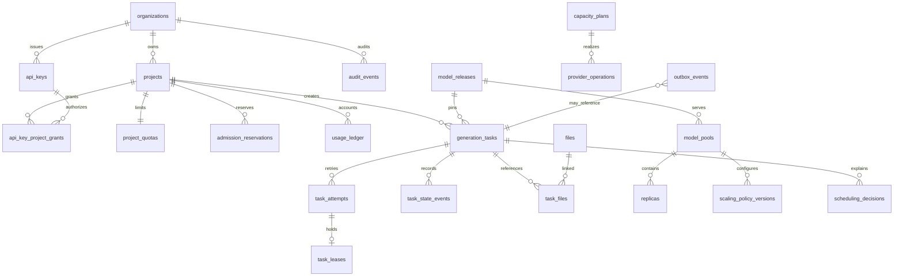
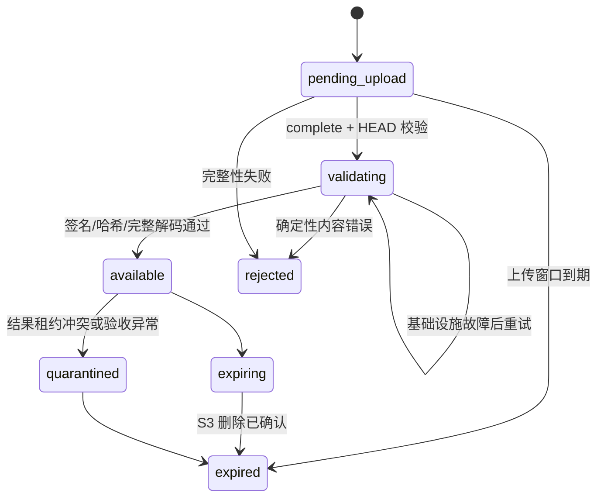

# 数据与事件架构

## 1. 组件职责

| 组件 | 权威数据 | 非职责 |
| --- | --- | --- |
| PostgreSQL | Task、Attempt、Lease、模型、策略、容量期望、幂等、审计、Outbox | 大文件、实时 GPU 时序指标 |
| Redis Cluster | 可重建队列排序、候选索引、短期限流与缓存 | 最终 Task 状态、永久租约、审计 |
| Redis Streams | 领域事件分发、异步分析、成本和审计订阅 | 执行队列、同步事务真源 |
| S3 兼容存储 | 输入与输出二进制的 24 小时权威存储 | 永久任务记录、任务状态 |
| 指标/日志后端 | 时序指标、结构化日志与 Trace | 业务状态判断 |

## 2. PostgreSQL 领域模型

### 2.1 核心实体



主要表：

| 表 | 关键内容 |
| --- | --- |
| `organizations` / `projects` | Public、Admin 和 Worker 信任域共享的租户边界与启停状态 |
| `api_keys` / `api_key_project_grants` | Argon2id Key、scope、默认项目、显式项目授权、过期与吊销 |
| `project_quotas` | 版本化速率、队列、并发 reservation、GPU/费用、上传和存储上限 |
| `admission_reservations` | Task/File 创建事务中的预计 GPU 秒、费用和字节占额；终态幂等释放 |
| `usage_ledger` | GPU 秒、费用、上传字节和存储用量的只追加权威账本 |
| `generation_tasks` | 类型、操作、状态、加密请求、Release、优先级、进度、错误、费用、时间和版本 |
| `task_attempts` | 每次执行、Replica、阶段、错误、使用量、开始/结束时间 |
| `task_leases` | 有效租约 Token 哈希、过期、心跳和序列 |
| `task_state_events` | 追加式状态时间线、操作者和原因 |
| `files` | 对象 key、MIME、大小、哈希、状态、过期和媒体元数据 |
| `task_files` | Task 与输入/输出文件的 role、顺序和 Attempt 来源 |
| `idempotency_records` | 项目、端点、Key、规范化请求哈希和 Task |
| `model_releases` | 不可变发布 manifest、能力和成熟度 |
| `model_alias_versions` | Alias 灰度规则与 Release 权重 |
| `model_pools` | Release、Provider、硬件、执行模式和状态 |
| `scaling_policy_versions` | 不可变策略、预估、发布和回滚信息 |
| `model_rollouts` | source/target Release、镜像 digest、滚动参数、状态、进度和暂停原因 |
| `model_rollout_steps` | 每个 Replica 的排空、替换、验证、失败和回滚时间线 |
| `replicas` | 期望/观测状态、区域、供应商资源、Worker 和健康 |
| `capacity_plans` | Autoscaler 输入、输出、约束和解释 |
| `provider_operations` | 幂等供应商操作、请求摘要、状态和原始诊断引用 |
| `scheduling_decisions` | 候选、排序、过滤、Placement 得分和最终选择 |
| `outbox_events` | 待发布领域事件 |
| `audit_events` | 人员/API Key 行为、资源、差异、请求与结果 |

`usage_ledger` 与 `audit_events` 在数据库层使用 `BEFORE UPDATE OR DELETE` 触发器拒绝历史修改。
修正必须追加冲正或更正事件，不能覆盖原记录。Admission 先锁定项目 `project_quotas` 行，再读取
当前 Task、reservation 和当日账本，因此并发创建不会越过同一项目限额。

### 2.2 Task 表关键约束

- `id` 为 UUIDv7 存储，API 表现添加 `task_` 前缀。
- `status` 使用受约束文本枚举；状态变更只通过事务函数完成。
- `version` 每次状态或可见字段更新递增，用于 CAS。
- `request_ciphertext` 保存完整规范化请求的信封加密结果。
- 另存非敏感可查询列：项目、类型、操作、Release、优先级、状态和时间。
- 错误保存规范化 code/stage/retryable；内部诊断单独加密。
- `completed_at` 不因资产过期改变；`assets_expired_at` 单独记录。

数据库禁止直接 `UPDATE status`。应用只能调用共享事务用例，事务同时写 `task_state_events` 和 `outbox_events`。

### 2.3 永久记录与分区

`generation_tasks`、`task_state_events`、`task_attempts`、`audit_events` 和 `outbox_events` 按 `created_at` 月分区。永久记录不意味着所有历史索引都常驻高速盘：

- 最近 6 个月分区保留业务常用 B-tree 索引。
- 更早分区保留主键、项目加时间和 BRIN 时间索引，迁移到低成本 tablespace。
- Task 单条查询始终通过主键路由。
- 列表只使用 `(project_id, created_at DESC, id DESC)` 游标，不允许 OFFSET 深分页。
- 管理台跨多年搜索必须带组织/项目和时间范围；无限制全文扫描拒绝。

每月提前创建未来 3 个月分区。缺少目标分区是发布阻断告警，不回退到无界 default partition。

### 2.4 游标

游标载荷：

```json
{
  "v": 1,
  "created_at": "2026-08-19T14:30:00.123Z",
  "id": "019b...",
  "filter_hash": "sha256:..."
}
```

载荷使用服务端密钥 HMAC 签名并 base64url 编码。不包含敏感请求。查询使用严格小于 `(created_at, id)`，保证稳定排序；并发插入只出现在第一页之前，不导致旧页重复。

## 3. 状态事务与 Outbox

### 3.1 原子写入

创建 Task 的事务：

```text
BEGIN
  validate idempotency record under row/key lock
  INSERT generation_task(status=queued)
  INSERT task_state_event(to=queued)
  INSERT outbox_event(type=task.queued)
  INSERT idempotency_record when key exists
COMMIT
```

状态迁移事务：

```text
BEGIN
  SELECT task FOR UPDATE
  verify expected version and allowed transition
  UPDATE task
  INSERT task_state_event
  INSERT outbox_event
  update/close attempt and lease when applicable
COMMIT
```

外部调用绝不放在事务内。供应商操作和 S3 上传采用“记录意图 -> 提交事务 -> 执行外部调用 -> 回写结果”的 Saga/Reconcile 模式。

### 3.2 Outbox Relay

每个 Outbox 事件在数据库触发器中建立 `redis_streams` 和 `redis` 两条独立 delivery。每条 delivery 拥有
`pending -> leased -> retry_wait -> delivered/dead_letter` 状态、短租约、尝试次数、下一次重试时间和
目标元数据；任一 sink 故障都不会伪造另一 sink 已完成。`outbox_events.published_at` 只保留为历史
兼容观察字段，不能表示全部 sink 已完成。

Relay 使用 `FOR UPDATE SKIP LOCKED` 批量领取。Redis Streams 领取 SQL 会阻止同一 `aggregate_id` 的后继事件
越过未 delivered 的前序事件，Stream entry 保留 `aggregate_id`，因此多 Relay 实例仍保持
单聚合顺序。Redis index sink 不相信事件 payload 中的状态，而是重新读取 PostgreSQL Task 当前版本后幂等
收敛候选索引。

```text
for sink in [redis_streams, redis]:
  rows = claim due delivery rows with short lease
  for row in rows:
    publish or converge sink
    CAS leased -> delivered and record destination metadata
    on retryable failure: leased -> retry_wait with bounded exponential backoff
    on deterministic failure or attempts exhausted: leased -> dead_letter
```

数据库提交后 Relay 崩溃可能重复发送，Redis Streams 消费者必须在业务事务内写
`event_consumer_receipts(consumer_name,event_id,payload_hash)`；相同 ID、相同 payload 返回 duplicate，
相同 ID、不同 payload 进入冲突告警。死信可显式 replay，replay 只重置对应 sink 的 delivery。禁止先标
发布再发 Redis Streams，也禁止 Redis/Streams 故障回滚已提交业务事务。

## 4. Redis Cluster 与 Streams

### 4.1 使用范围

- 公平队列排序和 Pool/项目队首索引。
- 调度候选去重版本。
- API Key/项目滑动窗口限流。
- 短期模型、能力和策略缓存。
- Scheduler leader hint；最终所有权仍由 PostgreSQL 锁决定。
- Redis Streams 事件流：`astra:{events}:task:v1`、`capacity:v1`、`usage:v1`、`audit:v1`、`control:v1`。
  Event Relay 通过 `XADD` 写入并设置最大长度和时间保留；消费者使用 Consumer Group、Pending Entries
  与 ACK，消费幂等仍由 `event_consumer_receipts` 保证。Redis 丢失后由 PostgreSQL Outbox 重放。

Redis 不保存唯一副本的请求、状态、Lease Token 或审计。

### 4.2 入队

Task 创建事务产生 `task.queued` Outbox。Redis Relay 根据事件将 Task 加入正确 Pool/lane/project 索引。API 可以最佳努力提前写 Redis 以降低延迟，但 Relay 最终补齐。

每个 Redis 候选记录 Task 数据库 `version`。Scheduler 取得候选后读取/锁定 PostgreSQL；版本不一致即删除旧候选。

### 4.3 全量重建

Redis Cluster 数据丢失或 Schema 版本升级时：

1. 将 Scheduler 切换为 `queue_rebuilding`，暂停新 Lease，不停止运行任务。
2. 清理目标前缀或切换到带新 generation 的 key namespace。
3. 按 `(created_at, id)` 游标扫描 PostgreSQL 中可调度状态。
4. 重新解析 Release/Pool 并批量写新 namespace；阶段 5 使用稳定创建时间分数，阶段 11 发布 WFQ
   策略后再使用版本化公平分数。
5. 扫描期间记录 Task 变更 Outbox 水位。
6. 回放水位后的队列事件。
7. 抽样比对 PostgreSQL 数量/版本，原子切换 active generation。
8. 恢复 Scheduler。

重建由 PostgreSQL 短租约保证单执行者，进程失联后允许其他 Relay 接管。运行期周期核对数据库/Redis
active generation 指针；指针丢失立即重建，候选数量在无 Redis delivery 积压时连续两次不一致才重建，
避免正常事件传播延迟触发抖动。重建期间 Redis delivery 保持 retry，不会错误确认到旧 generation。
重建过程可重复。旧 namespace 延迟删除，便于回滚。首期 10-50 GPU 下目标恢复时间小于 10 分钟。

### 4.4 Cluster 约束

- 单 Pool 相关 key 使用 `{pool_id}` hash tag。
- Lua 脚本只能访问相同 slot 的 key。
- 禁止生产使用 `KEYS`；重建基于数据库，不扫描 Redis 作为真源。
- 大 key 告警：单项目队列超过阈值时分桶，但公平队首索引保持稳定。
- 本地 Compose 使用真实 Cluster 模式验证 MOVED/ASK 和节点故障。
- 生产和默认本地 Compose 固定使用 `REDIS_MODE=cluster`。仅外部集成测试环境可以显式设置
  `REDIS_MODE=standalone`，连接由托管平台提供稳定主节点地址的单机或 Sentinel 服务；该模式不改变
  PostgreSQL 真源、Outbox、幂等和全量重建合同，也不得用于生产。

## 5. Redis Streams 事件

### 5.1 Envelope

```json
{
  "event_id": "evt_019b...",
  "event_type": "task.completed",
  "event_version": 1,
  "occurred_at": "2026-08-19T14:33:06.123Z",
  "producer": "astra-api",
  "aggregate_type": "generation_task",
  "aggregate_id": "task_019b...",
  "aggregate_version": 8,
  "organization_id": "org_media",
  "project_id": "project_media",
  "trace_id": "4bf92f3577b34da6a3ce929d0e0e4736",
  "payload": {}
}
```

事件不包含完整 prompt、预签名 URL、API Key 或供应商密钥。需要敏感内容的授权系统通过管理 API 按审计流程读取。

### 5.2 Stream

| Stream | Key 字段 | 事件 |
| --- | --- | --- |
| `astra:{events}:task:v1` | `aggregate_id` | queued、started、completed、failed、canceled、expired |
| `astra:{events}:capacity:v1` | `aggregate_id` | plan、replica、provider operation、circuit breaker |
| `astra:{events}:usage:v1` | `aggregate_id` | GPU 秒、估算和实际费用、存储用量 |
| `astra:{events}:audit:v1` | `aggregate_id` | API Key 与人员高风险操作 |
| `astra:{events}:control:v1` | `aggregate_id` | approved、rollout、rollback、disabled、rebuild |

Stream 通过 Consumer Group 扩展消费者，业务顺序只保证同 aggregate。长度和时间保留不替代 PostgreSQL 永久记录。

### 5.3 消费语义

- 至少一次交付。
- 消费者保存 `event_id` 去重，或使用幂等 upsert。
- `aggregate_version` 小于等于已处理版本时可以跳过；出现版本间隙时从 API/数据库投影恢复，不能假设 Streams 全局有序。
- Pending Entries 和应用层死信只用于隔离持续失败事件，原事件仍可从 Outbox/源表重放。

## 6. S3 对象存储

### 6.1 Bucket 与 key

建议逻辑隔离：

```text
astra-inputs/{organization_id}/{project_id}/{yyyy}/{mm}/{dd}/{file_uuid}
astra-outputs/{organization_id}/{project_id}/{yyyy}/{mm}/{dd}/{file_uuid}
astra-quarantine/{attempt_id}/{file_uuid}
```

对象 key 不含原文件名、prompt、模型名或人员信息。数据库保存原显示名。

### 6.2 状态



输入与输出按 File 记录的 `expires_at` 过期。上传预留窗口首期为 15 分钟；严格验证成功进入 `available` 时，输入保留期重置为 24 小时。S3 Lifecycle 是兜底，数据库 Sweeper 是权威状态协调和主动删除机制：

1. 到期前 File 标记 `expiring`，停止签发新下载 URL。
2. Sweeper 幂等删除对象；暂时失败时保持 `expiring`，在领取冷却后重试。
3. 删除请求成功后在数据库事务中标记 `expired`。
4. S3 Lifecycle 独立清理遗漏对象；其执行结果不能直接改变数据库状态。
5. 数据库永久保留 key 的不可逆哈希、MIME、大小、SHA-256、媒体元数据和过期时间；不保留可下载 URL。

Task 的完整请求永久保留 `file_id`、role 和当时元数据，但文件过期后不能复现二进制内容。

输入引用不暂停生命周期：创建 Task 时要求至少 1 小时剩余 TTL；到期前尚未获得 Lease 的 Task 失败为 `input_asset_expired`。Worker 已经下载并处于有效运行 Lease 时可以完成当前 Attempt，但输入到期后禁止基础设施重试创建新 Attempt，避免重试得到不同输入条件。

### 6.3 上传安全

- URL 最长 15 分钟，下载 URL 最长 5 分钟。
- 固定方法、key、大小、Content-Type 与 checksum。
- 服务端加密，生产使用 KMS 管理的 bucket key。
- 禁止公共 bucket、ACL 和目录列表。
- S3 访问日志进入独立安全日志存储。
- Worker 只获得具体对象的短期 URL，不获得通用 S3 凭证。

### 6.4 媒体验证隔离

- Public API 拥有 File 状态机和 CAS；Media Validator 不访问 PostgreSQL。
- Validator 只接受短期可轮换 Bearer 服务凭证，只读取配置 bucket 中请求指定的对象 key。
- API 先用 HEAD 核对上传声明，Validator 再流式计算 SHA-256、检查魔数并执行严格完整解码。验证过程不改变对象字节。
- 内容损坏、MIME 不匹配和哈希不匹配是确定性拒绝；S3 超时、验证服务不可用和工具进程异常是基础设施故障，两者使用不同错误码和重试策略。
- Validator 临时目录在请求结束时清理，不作为二进制或状态真源。

## 7. 加密与敏感数据

完整请求永久保存，必须使用字段级信封加密：

1. 每条或每项目生成 Data Encryption Key。
2. 使用 AEAD 加密 request JSON 和内部诊断，AAD 绑定 organization/project/task/schema version。
3. DEK 由 KMS Key Encryption Key 包装。
4. 数据库保存 ciphertext、nonce、wrapped DEK 和 key version。
5. 读取敏感内容需要权限、用途说明和审计事件。

索引只建立在非敏感派生字段。禁止为 prompt 建明文全文索引。密钥轮换通过重新包装 DEK 完成，不必批量解密请求。

## 8. 一致性场景

### 8.1 API 提交成功但 Redis 未写

Task 已在 PostgreSQL queued，对调用方返回成功。Outbox Relay 或 Rebuilder 补写 Redis；不会丢任务。

### 8.2 Redis 有候选但 Task 已取消

Scheduler PostgreSQL CAS 失败，删除候选。取消状态不被覆盖。

### 8.3 Worker 完成但控制面不可用

Worker 保留本地输出和有效 Lease，在 orphan grace 内重试。租约失效后输出只能上传隔离区，不能直接完成 Task。

### 8.4 输出上传成功但完成事务失败

File 状态仍为 pending/available，Attempt 未完成。Agent 使用相同 Attempt 重试；Sweeper 根据 Attempt 与对象标记清理孤儿，不重复生成。

### 8.5 Task completed 事件重复

Redis Streams 消费者按 `event_id` 去重；Task 聚合版本保证投影不倒退。

### 8.6 供应商创建成功但响应超时

Provider Operation 预先保存幂等 operation key。Controller 先按标签/任务名查询供应商实际资源，确认不存在才重试创建，避免重复计费实例。

## 9. 备份与恢复

- PostgreSQL：持续 WAL 归档和每日全量备份，目标 RPO 5 分钟、RTO 30 分钟；季度做恢复演练。
- Redis：不承担业务 RPO；可启用 AOF 加速恢复，但正式恢复路径是 PostgreSQL 重建。
- Redis Streams：Cluster 多副本与 AOF；事件可由 PostgreSQL Outbox 在保留窗口内重放。
- S3：资产仅保留 24 小时，使用存储系统自身冗余；不做跨区域长期归档。
- KMS/Secret：密钥元数据与恢复权限纳入独立灾难恢复流程，否则数据库备份不可解密。

恢复后先启动 PostgreSQL 与 KMS，再启动 API 只读查询、Redis 重建、Scheduler、Provider Controller、Relay，最后开放创建流量。Provider Controller 必须先观察既有供应商资源，禁止恢复时盲建新容量。

## 10. 数据验收

- 状态机数据库属性测试：任何并发序列不能产生两个有效 Lease 或终态倒退。
- Outbox 故障注入：提交前/后崩溃、Redis Streams 超时和重复发布。
- Redis 全量删除并从 PostgreSQL 恢复，恢复前后候选集合一致。
- 月分区、游标跨分区、同时间戳 UUIDv7 排序与大数据量查询计划。
- S3 上传篡改、过期、孤儿、重复完成和 Lifecycle 延迟。
- 信封加密轮换、无权限读取、敏感读取审计和备份恢复解密。
- 任务永久、文件 24 小时过期后，Task 查询仍完整且内容下载稳定返回 410。
