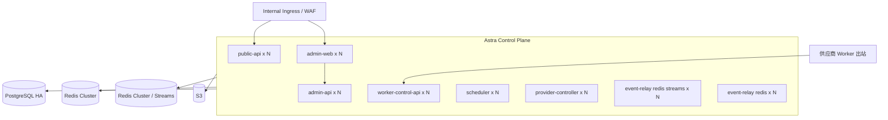

# 部署、安全与可观测性

## 1. 环境拓扑

### 1.1 生产 Kubernetes

控制面运行于现有 Kubernetes，建议独立 namespace：

```text
astra-system       # API、Scheduler、Controller、Relay、Admin Web
astra-data         # 若基础组件由本集群托管
astra-observability
```

生产推荐将 PostgreSQL、Redis Cluster（包含 Streams）和 S3 使用成熟托管服务或独立高可用集群，不与 GPU 数据面共故障域。



Deployment 基线：

- API、Admin Web、Worker Control API 至少 2 副本，跨节点反亲和。
- Scheduler、Provider Controller 和 Relay 至少 2 副本，通过数据库分片租约保证单分片主控。
- PodDisruptionBudget 保证维护时至少 1 个副本可用。
- 使用 topology spread constraints 跨可用区；控制面不依赖单节点本地盘。
- Readiness 只有数据库和必需依赖可用时通过；Liveness 不因短暂外部依赖失败重启。
- 所有容器配置 CPU/内存 request/limit，禁止无限制 BestEffort。

### 1.2 本地 Docker Compose

本地 Compose 包含：

- PostgreSQL 单实例。
- 3 主节点 Redis Cluster，用于验证 slot、MOVED/ASK 和 hash tag。
- Redis Streams 使用 Consumer Group、Pending Entries 和 ACK；事件可由 PostgreSQL Outbox 重放。
- MinIO 作为 S3。
- 独立 Media Validator 与 File Sweeper，用于验证实际媒体字节和执行到期补偿。
- 平台管理的本地管理员账号（仅首次初始化读取 bootstrap 密码）。
- public/admin/worker API、Scheduler、Provider Controller、Relay、Admin Web。
- Provider Adapter 与 Model App 合同参考实现；真实 H3 可按需单独接入。

本地凭证只使用仓库外 `.env.local`，提供 `.env.example` 字段说明。Compose 不承诺高可用，但协议、Topic、Bucket、Redis Cluster 和数据库版本与生产一致。

本地 Compose 必须使用显式项目隔离：

```text
COMPOSE_PROJECT_NAME=astra-local
network: astra-local-net
volumes: astra-local-postgres, astra-local-redis-*, astra-local-minio
```

端口由 `.env.local` 配置并在启动前检查。只有端口和容器确认属于 `astra-local` 时，才可以执行本项目范围的 `docker compose -p astra-local down` 后重启；不得停止未知项目、连接其他项目数据库或使用全局 volume 清理命令。默认开发流程启用 Model App 和 Provider Adapter 合同参考实现，不向共绩或其他真实 Provider 发请求。Model App 的 `/work` 使用限定 UID/GID 的临时文件系统；任务中间文件在容器重建后丢失是预期行为，PostgreSQL 与 S3 才是本地权威持久层。

## 2. 网络边界

### 2.1 入口

- public-api 只允许内部业务网段或服务网格访问。
- admin-web/admin-api 只允许公司身份网络，使用平台本地账号、Session Cookie、CSRF 和 RBAC。
- worker-control-api 对供应商数据面可达，但只接受 TLS、短期 Worker Token 和注册实例绑定。
- Prometheus、健康和调试端口不通过公共 Ingress 暴露。

### 2.2 出口

- Provider Controller 只允许访问共绩 API 域名、DNS、KMS 和必要依赖。
- Worker Agent 只允许访问 Worker Control API、指定 S3 域名、DNS、时间同步和日志/指标入口。
- Model App 默认无外网出口，只能访问 localhost Agent 和工作卷。
- API 不允许任意抓取用户 URL；输入只接受平台 File ID，消除 SSRF 下载面。

### 2.3 Kubernetes NetworkPolicy

默认拒绝所有入站/出站，逐服务放行。Admin、Public、Worker 三个 API 即使来自同一代码，也使用不同 ServiceAccount 和 NetworkPolicy。任何临时调试放行必须有过期时间和审计。

## 3. 身份与密钥

### 3.1 API Key

- 创建时只显示一次明文，数据库保存 Argon2id 哈希、前缀、末四位、Scope、项目和过期时间。
- 支持两个 Key 并行的无中断轮换窗口。
- Key 可以立即吊销；Redis 认证缓存最长 60 秒并订阅吊销事件失效。
- 禁止 URL query 传 Key，日志和 Trace 自动脱敏 Authorization。

### 3.2 平台账号与 RBAC

- 管理台使用平台自管理的用户名/密码；密码只以 Argon2id 哈希保存，不接受 OIDC token 或外部身份交换。
- `ADMIN_BOOTSTRAP_PASSWORD` 只在首次初始化不存在的管理员时使用，启动后不会覆盖已有密码，生产初始化完成后应从运行环境移除。
- Session 使用短期 HttpOnly、Secure、SameSite Cookie；管理 API 校验 CSRF。Web 与 Admin API 分域部署时，Admin API 只允许 `ADMIN_WEB_ORIGIN` 指定的单一 Origin 携带凭证，不允许通配符，并使用 `ADMIN_COOKIE_SAME_SITE=none`。
- 用户的组织、项目和角色均保存在 Astra，权限取组织角色与项目角色交集。
- 登录失败按账号累计，达到阈值后短期锁定；成功登录清零失败计数。
- 敏感 Task 请求、API Key、策略发布、模型批准和回滚均单独授权。

### 3.3 Worker 身份

- Provider Controller 创建 Replica 时注入一次性 bootstrap token，数据库只存哈希。
- Agent 注册时提交 Provider 资源 ID、Release、镜像 digest 和硬件指纹。
- 控制面核对期望 Replica 后签发 30 分钟短期 JWT；Token 绑定 `worker_id`、`replica_id`、`pool_id` 与 Release。
- Token 轮换通过现有有效身份完成；实例停止或 Release 改变立即吊销。
- 未来支持 SPIFFE 时可替换为 mTLS SVID，不改变 Worker 业务合同。

### 3.4 Secret 管理

- 生产通过 External Secrets 从公司 Secret Manager/KMS 注入。
- 共绩 Token 密文位于 PostgreSQL，只有 Provider Controller 读取 `PROVIDER_CREDENTIAL_ENCRYPTION_KEY` 并解密 active 凭证。
- 数据库、Redis、S3 使用独立最小权限账户。
- Secret 不进入镜像、Git、日志、异常详情或管理台前端。
- 轮换和 break-glass 操作写不可篡改审计。

## 4. 数据保护与审计

- 完整请求永久保存并进行字段级信封加密，参考 [数据与事件架构](./06-data-and-event-architecture.md)。
- 输入和输出对象 24 小时后删除；管理人员不能延长单个对象，若未来允许项目覆盖需新增 ADR。
- S3 使用服务端 KMS 加密、私有访问、短期预签名和访问日志。
- 日志禁止记录 prompt、完整请求、文件 URL、Token 和供应商原始鉴权头。
- 内容治理首期不自动拦截；仍记录调用方、项目、模型、工作流、输入/输出哈希和所有状态。

审计事件至少包含：

- `actor_type`、`actor_id`、平台管理员 Session/API Key ID。
- organization/project、动作、资源类型和 ID。
- 成功/失败、来源 IP、User-Agent、request/trace ID。
- 策略和发布变更的 before/after 差异或差异哈希。
- 敏感内容读取的用途说明。
- UTC 时间和服务签名。

审计写入 PostgreSQL 与 Redis Streams；安全日志后端使用不可变保留策略。审计失败时，高风险管理写操作 fail closed；普通 Task 查询可继续但产生高优先级告警。

## 5. 应用安全

- 所有外部 JSON 使用共享 Schema 严格校验和大小限制。
- Drizzle/SQL 只使用参数化查询。
- Cursor、预签名请求和 Worker Token 使用不同用途密钥。
- 管理台设置 CSP、禁止内联脚本、启用 frame-ancestors deny。
- 文件名只作展示；本地路径由 Agent 生成并验证 realpath。
- 文件完整解码在隔离 Worker 中进行，不在 API Pod 处理不可信媒体。
- 容器只读根文件系统、非 root、drop Linux capabilities、seccomp RuntimeDefault。
- 镜像生成 SBOM、签名并在准入层验证 digest 和漏洞门。
- Model App 自定义节点按固定 commit 和 allowlist 构建，生产禁止运行时 `git clone` 或自动下载依赖/权重。

## 6. OpenTelemetry 与关联

所有服务使用 OpenTelemetry：

- HTTP 接入提取/生成 W3C Trace Context。
- `request_id`、`trace_id`、`task_id`、`attempt_id`、`pool_id` 和 `provider_operation_id` 贯穿日志。
- Redis Streams event envelope 携带 trace ID，消费者创建 linked span。
- Worker 心跳不为每次请求生成完整长 Trace；使用采样 span 和 Metrics，Task 阶段产生关键 span。
- prompt、请求密文和预签名 URL 不作为 span attribute。

推荐后端：Prometheus、Grafana、Loki 和 Tempo；可以替换为公司等价平台，指标名和属性合同保持稳定。

## 7. 指标

### 7.1 API

- 请求量、状态码、P50/P95/P99 延迟。
- 鉴权失败、限流、幂等重放/冲突。
- 文件上传申请、确认失败和完整性错误。
- 按项目/模型的新建 Task 数，但项目 ID 控制 cardinality。

### 7.2 Task 与调度

- `astra_tasks{type,status,priority,model_alias}`。
- queue depth、queued GPU seconds、wait P50/P95。
- Attempt 成功率、重试、取消和各阶段耗时。
- WFQ 实际份额、批量最低份额违约、项目并发拒绝。
- Capacity desired/observed/ready/busy 和计划受阻原因。

### 7.3 Provider 与 GPU

- 共绩 API 延迟、状态码、限流、签名错误和熔断状态。
- 区域库存快照年龄、价格、建机/加载时间。
- GPU 利用率、显存、温度、功耗、ECC/Xid 错误。
- Model App 冷启动、模型加载失败、OOM 和输出验收失败。

### 7.4 数据组件

- PostgreSQL 连接、事务、锁等待、复制延迟、分区和备份年龄。
- Redis Cluster slot、节点、内存、命令延迟、重建进度。
- Redis Streams consumer pending、Outbox 未发布年龄、重复和 DLQ。
- S3 PUT/GET/HEAD 失败、孤儿、到期未删除字节。

## 8. SLO 与告警

平台级初始 SLO 需要在上线评审中填入具体值；模型池排队目标由各策略显式配置。建议控制面起始目标：

- 公共 API 月可用性 99.9%。
- Task 查询 P95 小于 300 ms，不含 S3 下载。
- 已提交 Task 持久化丢失为 0。
- Task 状态事件发布到 Redis Streams P95 小于 60 秒。
- 有效 Worker 心跳状态传播小于 30 秒。

高优先级告警：

- PostgreSQL 不可用或复制/RPO 风险。
- 共绩鉴权/签名错误导致全局写熔断。
- 同一 Task 出现两个有效 Lease 的不变量违规。
- S3 对象可公开访问或 KMS 失败。
- 管理员账号/RBAC/审计写入失败。
- 运行任务大量失联、GPU Xid/OOM 激增。

中优先级告警：排队目标违约、预算接近上限、Outbox/Redis Streams pending、Redis 重建、区域库存快照过期、资产到期清理延迟和预测误差扩大。

## 9. 日志与诊断保留

- 控制面结构化日志按公司默认生产保留期，安全审计永久或按合规要求。
- Model App stdout/stderr 设置大小和速率上限，超限截断并计数。
- Worker 只上传错误上下文附近日志，不自动上传完整 ComfyUI 日志。
- 供应商原始响应加密保留在数据库诊断字段或受限对象存储，不进入普通日志。
- Task 排障页展示规范化状态时间线；原始诊断需要额外权限。

## 10. 发布与变更

- GitOps/Helm 发布控制面，生产镜像固定 digest。
- 模型发布不走控制面 GitOps：运维在 Admin Web 填写模型镜像地址，平台解析 digest、验证镜像并通过 Rollout Controller 逐机更换。
- Registry tag 可以作为人员输入，但每个 Release 立即固定为 OCI digest；所有 Rollout Step 和审计同时记录 source tag 与 resolved digest。
- 默认模型滚动参数为 `max_surge=1`、`max_unavailable=0`；GPU 预算不允许 surge 时可显式使用 `0/1`，管理台必须展示容量下降风险。
- 每台新镜像 Replica 必须通过镜像拉取、Agent 注册、Release/capabilities 匹配、Model App ready 和最小探测后，才允许排空一个旧 Replica。
- 滚动失败、就绪超时、合同不匹配、OOM 或错误率超过门槛时自动暂停；恢复和回滚均由运维确认并完整审计。
- 数据库迁移先执行兼容性扩展，再发布应用，最后清理旧字段；禁止破坏性一步迁移。
- API 和 Worker Contract 先向后兼容发布 Agent/服务端，再升级 Model App。
- Provider Adapter 使用录制合同测试和生产只读探测后再开放写操作。
- Scheduler 算法变更先 shadow 计算，只记录新旧决策差异，不实际扩缩容；验证后按 Pool 灰度。

## 11. 灾难恢复

目标：PostgreSQL RPO 5 分钟、RTO 30 分钟；控制面应用自身 RPO 0。恢复顺序：

1. 恢复 KMS/Secret 和 PostgreSQL，验证时间线与分区。
2. 以查询只读模式启动 API。
3. Provider Controller 只观察供应商既有资源并完成资源归属核对。
4. 重建 Redis Queue generation。
5. 启动 Worker Control API，接受原 Worker 重新注册但不立即发新 Lease。
6. 启动 Scheduler、Redis Streams Relay，检查 Outbox 水位。
7. 开放新 Task 和容量写操作。

灾难恢复绝不能先扩容，否则可能因供应商中已有未同步实例而重复计费。每季度演练数据库恢复、Redis 全量重建、供应商资源接管和 Worker 旧租约拒绝。

## 12. 验收清单

- Helm 在目标 Kubernetes 版本 render 和部署通过。
- NetworkPolicy 验证 Model App 无外网、Worker 仅能访问许可目标。
- API Key/管理员账号/RBAC、吊销、轮换和敏感读取审计通过。
- Compose 一条命令启动并运行 Video/Image 端到端任务。
- OTel Trace 可以从 API 请求关联到 Task、Attempt、Worker 和 Provider Operation。
- Redis Streams、S3、Provider、Worker、单区故障演练符合架构降级行为。
- 备份恢复达到 RPO/RTO，恢复过程不创建重复供应商资源。
