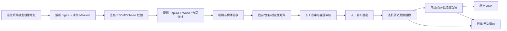
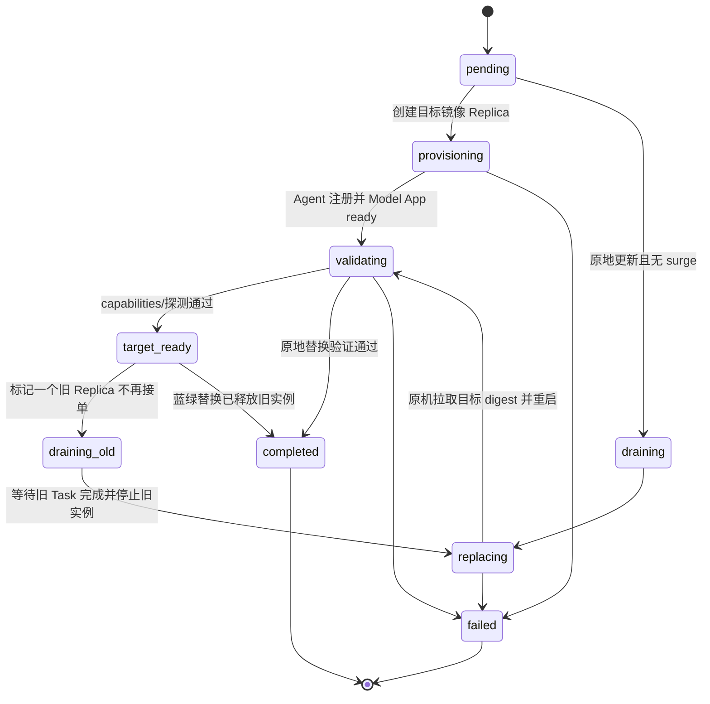

# 模型发布与实施路线

## 1. 发布对象

Model Release 是不可变、可复现的推理单元，不等于一个可变模型名称。Release Manifest 至少固定：

```json
{
  "id": "release_019af...",
  "model_alias": "minimax-h3-krea2-v4",
  "type": "video",
  "container_image": "registry.internal/h3@sha256:...",
  "worker_contract_version": "1.0",
  "runtime": {
    "comfyui_commit": "a464ac335...",
    "python": "3.10",
    "cuda": "12.x"
  },
  "components": [
    {"name": "minimax-h3-audio-t8", "commit": "e90ad9d..."},
    {"name": "minimax-h3-blockcache-t8", "commit": "91a57ed..."}
  ],
  "workflows": [
    {
      "profile": "stock20",
      "sha256": "...",
      "maturity": "stable"
    }
  ],
  "weights": [
    {"name": "h3", "sha256": "...", "license": "...", "source_endpoint": "https://hf-mirror.com", "source_revision": "..."},
    {"name": "vae", "sha256": "...", "license": "..."},
    {"name": "lora", "sha256": "...", "license": "..."}
  ],
  "capability_schema_sha256": "...",
  "output_schema_sha256": "...",
  "resources": {
    "gpu_count": 1,
    "gpu_memory_min_mb": 24576,
    "system_memory_min_mb": 65536,
    "shared_memory_min_mb": 32768,
    "max_concurrency": 1
  }
}
```

`source_endpoint` 只记录 Weight Import Job 实际使用的传输入口，不能作为权重身份或运行时下载地址。镜像下载、官方回退、哈希和许可证核验规则见 [14-huggingface-mirror-and-weight-supply-chain.md](./14-huggingface-mirror-and-weight-supply-chain.md)。

运维人员不需要手工填写上述 Manifest。后台以模型和模型镜像地址为发布入口；平台从 OCI annotation `io.astra.release-manifest.v1` 读取 Manifest，从 `io.astra.workflow-sha256` 读取工作流哈希，并用探测 Replica 的 `/v1/capabilities` 交叉验证。镜像内可以同时保留 `/opt/astra/release-manifest.json` 供模型团队和探测 Replica 核对，但管理 API 不接收人工粘贴的 JSON。镜像不包含有效 Manifest、工作流哈希缺失或能力不一致时拒绝发布。

容器 tag 可以作为运维输入，但不能成为最终发布身份。平台在创建 Release 时将它解析为 OCI digest 并冻结；Git branch、在线 URL、网盘路径或 ComfyUI 当前画布都不能成为生产身份。

### 1.0 创建 Model

管理台的“模型”页面用于创建 Model 基础记录。Model 只是公共 API 的模型路由和能力归属标识，不在这里配置价格、计费规则、GPU 参数或镜像内容。创建时只填写模型名称（API 使用的 alias）、图片/视频类型、可选描述和原因；创建完成后，在“模型发布”页面为它登记镜像和环境变量。

一个 Model 可以拥有多个不可变 Release，用于版本发布、灰度和回滚。模型镜像、运行参数和模型特有能力属于 Release，不应直接写入 Model 基础记录。

### 1.1 后台发布表单

常规发布表单只有：

- 已有模型；以下拉框选择，不要求复制 Model ID。
- 模型镜像地址，例如 `registry.internal/h3:v4.2.0` 或完整 digest。
- 可选的模型环境变量；界面使用每行一个 `KEY=VALUE` 的文本编辑器，不暴露 JSON。`WORKER_*` 和 `MODEL_APP_RELEASE` 由平台注入，Token、密码和密钥必须使用平台凭证管理，不能写入 Release 环境变量。
- 发布原因。

镜像解析并批准后，发布人员选择目标 Model Pool。滚动参数使用普通输入控件，界面预填 `max_surge=1`、`max_unavailable=0`；低频的超时、失败率和回滚保留参数放在高级设置中，不要求编辑策略 JSON。

Registry 凭证从平台已配置凭证中选择，不在发布表单输入明文密码。提交后后台展示 source image、resolved digest、镜像签名、Manifest 摘要、目标机器数、预计额外 GPU 成本和回滚 digest。

运行时环境变量随 Release 固定，并在创建 Provider operation 时与短期 Worker bootstrap 变量一起加密；Provider operation、Outbox、审计和 API 响应只记录变量名，不记录变量值。环境变量变化会产生新的 Release，不能修改已存在 Release。

## 2. 成熟度

| 状态 | 能力 |
| --- | --- |
| `draft` | 只可在开发环境手动运行 |
| `experimental` | 可在隔离项目测试，不进入生产 Alias |
| `candidate` | 通过机械门，等待资源/质量批准和灰度 |
| `stable` | 可由生产 Alias 路由 |
| `deprecated` | 不接收新项目，已有流量等待迁移 |
| `disabled` | 立即停止新 Task，运行中任务按事故决策处理 |

成熟度按 workflow profile 评估。一个 Release 中实验 profile 的存在不能让调用方通过自由参数启用；公共 Model Alias 只暴露批准 profile。

## 3. 发布流水线



每一步产生签名报告并引用 Release ID。后续修改任何镜像、节点、工作流或权重都会产生新 Release，从构建门重新开始。

## 4. 通用发布门

### 4.1 构建与供应链

- 冻结依赖、源码 commit、容器 digest 和权重 SHA-256。
- 生成 SBOM、许可证清单和漏洞报告。
- 非 root、只读根文件系统、无生产运行时下载。
- 自定义节点只来自 allowlist；许可证允许内部目标用途。
- 镜像签名通过 Kubernetes/Provider 部署前验证。

### 4.2 Worker 合同

- capabilities 与 Manifest 完全一致。
- 执行幂等、并发、心跳、超时、取消和失败码通过。
- 路径逃逸、损坏输入、损坏输出和日志敏感信息测试通过。
- Agent/Model App 当前与前一兼容 Contract 组合通过。

### 4.3 媒体机械门

视频：

- 使用 FFmpeg `-xerror -err_detect explode` 完整解码，返回码为 0 且无错误。
- 宽高、帧数、FPS、duration、codec 符合 Output Schema。
- 有音频时检查采样率、声道、有限值、实际时长和 A/V 时差不超过一帧。
- 无意外黑帧、空音轨、零字节、截断和容器 metadata 欺骗。
- 不设平台统一容器或编码；机械门按 Release Manifest 声明的 `content_types`、容器、视频/音频编码和元数据校验原始文件。H.264/AAC MP4 只在某个 Release 自己声明时成立，其他格式不得被 Agent 隐式转换。

图片：完整解码、宽高、format、色彩通道、透明度和数量符合合同。

### 4.4 资源与稳定性门

- 每个支持尺寸、时长、质量和输入模态组合至少做边界样本。
- 冷启动、暖启动、连续任务、取消后重跑和 Worker 重启。
- 记录 GPU 显存峰值、最低余量、系统内存、磁盘、加载与推理时间。
- 发布声明的最低 GPU 必须保留明确安全余量；不能以一次幸运运行作为门槛。
- OOM、GPU Xid、内存泄漏、缓存污染和同 seed 非预期漂移均阻断。
- `max_concurrency` 只按真实并发测试批准；H3 第一版为 1。

### 4.5 质量门

- 使用固定但不公开给审核人的 A/B 样本集。
- 覆盖主体、运动、镜头、光照、文字、人物一致性和失败边界。
- 联合音画检查声音内容、节奏、爆音、静音、口型/事件同步和 A/V 连续性。
- 加速方案必须与对应全质量基线同 prompt、seed、输入、尺寸、帧数和输出设置比较。
- 机器指标仅作诊断，不能替代人工完整观看和试听。
- 质量报告记录接受、拒绝和适用边界，不使用“通用倍速”宣传值。

## 5. H3 首期矩阵

至少对每个拟公开 profile 覆盖：

| 路线 | 输入 | 必检 |
| --- | --- | --- |
| T2VA | 文本 | 画面、原生音频、seed、长提示词 |
| I2VA | 首帧 | 首帧一致性、运动、音频 |
| FL2VA | 首尾帧 | 两端锚点、转场、帧完整性 |
| Ref2VA Image | 参考图 | 主体/风格遵循与漂移 |
| Ref2VA Video/Audio | 参考视频/音频 | 参考遵循、耗时、音画 |
| Hybrid | 多类参考 | 组合冲突、显存和身份一致性 |

当前关联节点仓库中部分 SPEED、Block Cache、Face Refine、长视频和 Hybrid 路线明确标为实验，或者存在速度提升但质量盲审失败/显存余量不足的记录。这些能力默认保持 experimental，只有独立 profile 完成上述门后才能提升。

16GB GPU 只能在相应 Release 通过完整矩阵并满足安全余量时加入硬件规格；首期 H3 生产资格测试从 24GB 或更高显存开始。不得在调度时自动降低分辨率、帧数、步数或音频质量以适应低显存。

## 6. 灰度

Model Alias 支持两种灰度：

- 项目 allowlist：指定测试项目固定进入 Candidate Release。
- 确定性百分比：对 `hash(project_id, task_id, alias_version)` 分桶，保证一次 Task 只解析一次 Release。

灰度步骤建议为内部测试项目、5%、25%、50%、100%，每一步设置最小 Task 数和观察时间。发布人员可以调整，但不得跳过人工批准。

比较指标：成功率、错误分布、P95 排队、推理耗时、显存、成本、输出验收、取消和人工反馈。灰度 Task 在创建时固定 Release；权重变化不迁移排队或运行任务。

## 7. 逐机滚动发布

### 7.1 启动条件

- 镜像地址已解析并固定 digest。
- 镜像签名、Manifest、Worker Contract 和最小探测通过。
- 新 digest 已获得目标环境所需批准；已有批准 Release 可以从后台一键直接进入 Rollout。
- 目标池、旧 Release、回滚 digest、最大额外 GPU 成本和滚动参数已经生成预览并由运维确认。
- 当前没有目标池的其他 Rollout，且 Provider 资源快照有效。

### 7.2 共绩算力预热与版本切换

共绩 Provider Adapter 负责为 Rollout 申请临时预热算力。预热实例属于该 Rollout 的临时容量，不接受公共 Task，直到完成镜像、Manifest、能力和 smoke 校验。预热流程如下：

```mermaid
sequenceDiagram
    participant C as Rollout Controller
    participant P as 共绩 Provider Adapter
    participant W as 新镜像 Worker
    participant DB as Control Plane
    participant O as 旧镜像 Worker

    C->>P: 申请预热实例(target digest, region, GPU)
    P-->>C: provider_job/replica_id
    P->>W: 拉取并启动固定 OCI digest
    W->>DB: register + heartbeat
    C->>W: readiness/capability/smoke 校验
    W-->>C: prewarm_ready
    C->>DB: old accept_new_tasks=false; existing queue remains eligible
    C->>DB: new digest accepts new Task and Attempt
    DB->>O: queued_old=0 后 desired_state=drain
    O-->>DB: drained(running=0,reserved=0)
    DB->>P: 回收旧 Replica
    P-->>C: old_replica_deleted
```

切换规则：

1. 新 digest 的预热实例在校验通过前只能是 `rollout_reserved`，不计入可调度热池。
2. 新实例通过校验后，控制面原子地设置两类接单门：新 Release `accept_new_tasks=true`，旧 Release `accept_new_tasks=false`。发布切换前已经创建但尚未领取 Attempt 的旧 Task，仍受旧 Release 的 `accept_existing_tasks=true` 保护，可以在旧 Worker 上排空；它们不属于新任务。
3. 已经在旧 Worker 上运行的 Attempt 默认继续执行，Task 在创建时固定的旧 `model_release` 不迁移；只有用户取消或事故策略明确要求时才取消。
4. 旧 Release 的 queued Task 清零后，控制面将 `accept_existing_tasks` 置为 `false` 并下发 `desired_state=drain`。旧 Worker 继续心跳和提交结果；槽位归零后调用 Worker Contract 的 `drained` 回报，控制面通过 CAS 确认没有有效 Lease，再通知 Provider Controller 删除旧 Replica。
5. 回收失败不影响任务状态；Replica 标记为 `reclaim_pending`，由 Provider Controller 幂等重试。Rollout 预算必须覆盖预热实例和旧实例的重叠计费。

同一 Pool 如果同时存在多个落后 Release，以上门控和排空按 `release_id` 分开执行；任何仍有固定旧 Task 的 Release 都必须保留满足其排空所需的最小容量，不能因为新 Release 已 ready 就直接删除。

旧 digest 必须保留在受信任 Registry 和 Release 记录中，直到该 Pool 的旧任务全部终结且回滚保留窗口结束；不能因为机器回收而删除回滚所需镜像。

### 7.3 默认策略

```json
{
  "max_surge": 1,
  "max_unavailable": 0,
  "readiness_timeout_seconds": 1800,
  "progress_deadline_seconds": 7200,
  "pause_on_failure": true,
  "batch_size": 1
}
```

默认先增加一台新镜像机器，验证 ready 后再排空和释放一台旧机器，因此正常推理容量不下降。若 GPU 预算不允许额外一台，运维可显式使用 `max_surge=0/max_unavailable=1`；平台必须提示滚动期间容量下降和排队风险。

### 7.4 单台步骤



Provider 支持单 Replica 改镜像时，可以排空后原地更新。供应商 API 只能更新整个 Deployment 时，Adapter 必须采用逐台蓝绿替换：创建一个目标 digest Replica、验证、排空一个旧 Replica、删除旧 Replica。对运维和调度而言，两者都表现为逐机 Rollout Step。

每台目标 Replica 必须依次通过：

1. 供应商状态 Running。
2. Worker Agent 使用目标 Release 注册。
3. `/health/ready` 成功且 digest/capabilities 与 Release 一致。
4. 最小无副作用探测或指定 smoke generation 通过。
5. 连续就绪稳定窗口通过。

只有完成以上步骤后才推进下一台。Model Alias 的目标 Release 流量权重不得高于目标 ready 容量占比；旧 Task 固定旧 Release，并由保留的旧 Replica 排空。

### 7.5 自动暂停

以下任一条件自动暂停，不继续更换机器：

- 镜像拉取、Agent 注册或 readiness 超时。
- 实际 digest、Manifest 或 capabilities 不匹配。
- smoke generation、媒体校验、OOM 或 GPU 健康失败。
- 新 Release 的失败率、P95 耗时或输出验收超过 Rollout 门槛。
- `progress_deadline_seconds` 超时、预算或供应商库存不足。

暂停不终止运行任务，也不自动删除已经健康的新 Replica。后台展示失败 Step、剩余旧/新机器、容量和成本；运维可以修复后继续或执行回滚。

Batch Job 不做运行中换镜像：已启动 Job 使用旧 digest 完成，新提交 Job 使用目标 digest。

## 8. 回滚与紧急禁用

触发器：

- 机械输出验收失败率超过门槛。
- OOM/Xid/Worker 崩溃显著上升。
- 任务成功率或 P95 耗时相对基线退化。
- 人工发现严重质量、许可或安全问题。

回滚先把 Alias 新流量恢复到上一稳定 Release，再使用上一稳定 digest 创建反向逐机 Rollout，不删除 Candidate Release：

1. 新 Task 立即解析到上一稳定 Release。
2. Candidate Release 立即设置 `accept_new_tasks=false`，但保持 `accept_existing_tasks=true`。已经创建并固定到 Candidate Release 的 queued Task 不改写 Release，由 Candidate Worker 继续排空；如果事故等级禁止 Candidate 继续执行，运维必须显式批量取消并审计，平台不静默迁移请求。
3. running Task 默认完成，不抢占；事故级问题可显式取消。
4. 如果稳定 digest 没有热实例，先通过共绩 Provider Adapter 预热并完成相同的 readiness、capability 和 smoke 校验。
5. Candidate Replica 逐台进入 draining；收到 `drained` 且租约归零后回收，并按同一容量规则补充稳定 digest。
6. 保存触发指标、操作者和版本差异。

紧急 `disabled` 阻止新 Task。是否取消运行任务必须由事故指挥明确选择，平台不隐式决定。

## 9. 实施阶段

实施顺序、阶段依赖、当前状态和逐阶段退出条件统一维护在
[`17-continuous-delivery-plan.md`](./17-continuous-delivery-plan.md)。该计划把正确性优先的最小调度与高级公平/扩缩容算法拆开，并把真实 H3 推理固定在控制面、Provider、发布和生产容量全部验收之后。任何阶段未通过质量门，不得启用依赖它的生产路径。

## 10. 上线总验收

- API：创建、查询、分页、幂等、取消、错误和过期语义与文档一致。
- 数据：永久 Task、加密请求、24 小时对象删除、Outbox 和 Redis 重建通过。
- 调度：公平、批量防饥饿、非抢占、预算、跨区域和扩缩容仿真通过。
- Provider：共绩签名、限流、熔断、幂等 Reconcile、账单对账通过。
- Worker：任意语言合同、失联、取消、输出上传和旧租约保护通过。
- H3：批准能力矩阵、严格解码、显存安全和人工质量通过。
- 运维：镜像一键导入、逐机滚动、失败暂停、反向滚动、数据库恢复、Redis 重建和单区故障演练通过。
- 安全：API Key/管理员账号/RBAC、NetworkPolicy、Secret、镜像和敏感读取审计通过。
