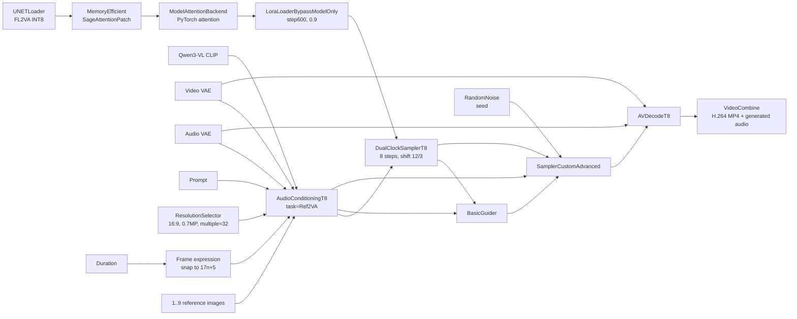
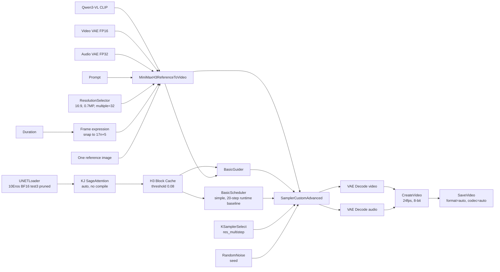

# MiniMax H3 10Eros-Max V3 Ref2VA 工作流研究

## 1. 范围与结论

当前唯一研究对象是 RunningHub 工作流 [`2090130282333691905`](https://www.runninghub.cn/workflow/2090130282333691905) “（10Eros-Max V3）Minimax参考生视频BF16高质量加速版V3”，并使用用户提供的本地 [ComfyUI API JSON](<./workflows/(10Eros-Max V3)Minimax参考生视频BF16高质量加速版V3.json>) 做连线和实际 widget 值复核。

研究证据包括该 JSON、ComfyUI H3 核心节点、Block Cache 节点、KJ SageAttention 节点及其源码。其他 H3 工作流、INT8/Turbo LoRA 路线和 A/B 对比不属于当前研究、性能基准、调度池或发布路线；本文早期保留的相关段落仅作历史记录，不能作为实施依据。

当前结论：10Eros 工作流只能标记为 `experimental`，不能直接成为生产 Release。生产接入必须围绕固定的 BF16 test3 镜像、20 步运行质量基线、15 秒标准任务、单参考图能力、Block Cache/SageAttention 实际后端和真实 GPU 基准建立唯一 profile。

基础模型溯源已确认：TenStrip 模型卡将 [MiniMaxAI/MiniMax-H3](https://huggingface.co/MiniMaxAI/MiniMax-H3) 标为 `base_model`，官方仓库同时提供 `FL2VA` 与 `Ref2VA` 变体。该地址用于架构、配置、许可证和来源审计；当前 10Eros Replica 的实际 UNET 仍是 TenStrip 的 `test3_pruned`，不能用官方 Ref2VA INT8 文件替换。

## 2. 证据与可复现边界

### 2.1 页面与本地 JSON 事实

10Eros 工作流的本地 ComfyUI API JSON 足以确定节点类型、连接和控件值，但不包含以下生产身份：

- ComfyUI commit、Python/CUDA/PyTorch 版本。
- 自定义节点的来源、commit 和依赖锁。
- UNET、CLIP、VAE、LoRA 的 SHA-256。
- 容器镜像 digest、启动命令和健康检查。
- `ResolutionSelector` 运行后实际输出的宽高。
- 真实显存、耗时、输出文件和质量报告。

因此 API JSON 不是 Release，也不能单独用于复现部署。

### 2.2 已检查源码版本

| 组件 | 来源 | 检查版本 |
| --- | --- | --- |
| H3 音画节点 | `T8mars/comfyui-minimax-h3-audio-T8` | `dc4b6b25e5db9f7d45fe16453ffd042245579e6c` |
| H3 Block Cache 节点 | `T8mars/comfyui-minimax-h3-blockcache-T8` | `91a57ed7b89509742101189f82eb723a86e0a313` |
| ComfyUI H3 核心参考节点 | `Comfy-Org/ComfyUI` | `c67885b14556cf3e4e061862925282d403d09862` |
| KJ SageAttention 节点 | `kijai/ComfyUI-KJNodes` | `3f20054214fec9f9234fd3841ae6f1e4287948f6` |

源码确认的是节点合同和仓库自己的验证结论，不代表 RunningHub 当前运行环境恰好使用相同 commit。正式镜像必须自行固定并报告实际 commit。

> **历史附录（不纳入当前方案）**：下方第 3-12 节来自早期双时钟/INT8/Turbo LoRA 路线的研究记录。它们不参与 10Eros 的模型注册、性能基准、容量规划、调度、发布或验收。当前实施只读第 13-16 节中与 10Eros 直接相关的内容；其中第 14-15 节的跨路线文字同样以 10Eros 单路线规则为准。

## 3. 历史附录：未采用的工作流 A

### 3.1 模型资产

| 用途 | 工作流中的文件 | 当前判断 |
| --- | --- | --- |
| UNET | `minimax_h3_fl2va_int8_convrot.safetensors` | 完整 FL2VA INT8；不是仓库 Ref2VA 基线所用文件 |
| Turbo LoRA | `minimax_h3_turbo_v4_step600_comfyui_T8-convert.safetensors` | 强度 `0.9`；兼容性和缩放待验证 |
| 文本/多模态编码器 | `qwen3vl_32b_minimax_h3_nvfp4_awq.safetensors` | MiniMax 类型 Qwen3-VL CLIP |
| Video VAE | `minimax_h3_video_vae_int8_convrot.safetensors` | 视频 latent 编解码 |
| Audio VAE | `minimax_h3_audio_vae_fp32.safetensors` | 音频 latent 编解码 |

以上文件名只能用于识别，生产 Manifest 必须记录每个文件的 SHA-256、字节数、许可证和镜像内绝对逻辑路径。不得在容器启动时从公网下载或按模糊文件名选择资产。

### 3.2 固定工作流参数

以下参数属于 Release profile，不能由公共调用方任意覆盖：

```yaml
task_type: Ref2VA
audio_mode: native
audio_denoise_strength: 1.0
add_source_as_reference: false
prompt_primary_audio_ordinal: 0
strict_prompt_tags: true
ref_image_size: match
reference_video_policy: official_2_to_15s

steps: 8
shift_video: 12
shift_audio: 3
sampler_name: dual_clock_euler
scheduler: native_flow

lora_strength_model: 0.9
attention_patch: MiniMaxH3MemoryEfficientSageAttentionPatch
attention_backend: pytorch attention

# 以下是当前工作流在 Model App 内部的原始产物配置，不是 Astra 平台统一格式。
output_format: video/h264-mp4
pixel_format: yuv420p
crf: 19
frame_rate: 24
trim_to_audio: false
```

`audio_denoise_strength=1` 在 `audio_mode=native` 且没有 `drive_audio` 时不参与源音频 latent 替换，不应误解为“音频去噪强度已生效”。

## 4. 节点 DAG



`DualClockSamplerT8` 同时输出 patched model、sampler 和 sigmas；Conditioning 的同一个联合音画 latent 同时参与采样配置和 `SamplerCustomAdvanced.latent_image`。实现工作流编译器时必须保持这些端口连接，不能只复制控件值。

## 5. Ref2VA 输入语义

### 5.1 真实节点限制

源码中的 `MiniMaxH3AudioConditioningT8` 支持：

- 最多 9 张参考图。
- 最多 3 个参考视频。
- 最多 3 个独立参考音频。
- 参考视频在 `official_2_to_15s` 策略下必须为 24fps 的 48-360 帧。
- 参考视频音轨必须和相同序号的视频配对，孤立音轨直接报错。

当前 RunningHub 图只连接参考图，未连接参考视频、参考视频音轨、独立参考音频、首帧、尾帧或源音频。Astra 首次上线该 profile 时能力声明必须收窄为：

```json
{
  "input_roles": ["reference_image"],
  "min_reference_images": 1,
  "max_reference_images": 1,
  "audio_modes": ["native"]
}
```

节点允许最多 9 张图，但当前样例只是同一文件重复 9 次，不构成多图能力验证。首个 candidate 只批准 1 张唯一参考图；完成 2、3、9 张不同参考图的顺序和质量矩阵后，再用新 Release 扩大上限。节点未来支持其他参考媒体，也不代表当前 profile 已批准这些输入。参考视频/音频应作为另一个 profile 单独验收。

### 5.2 顺序和标签

Autogrow 输入按键名末尾数字排序，`ref_image_0` 到 `ref_image_8` 随后被映射为提示词中的 `<Picture 1>` 到 `<Picture 9>`。公共 API 的 `input_files` 数组顺序必须稳定保留：

```text
input_files[0] role=reference_image -> ref_image_0 -> <Picture 1>
input_files[1] role=reference_image -> ref_image_1 -> <Picture 2>
...
input_files[8] role=reference_image -> ref_image_8 -> <Picture 9>
```

提示词解析器能把 `Image 1`、`Picture #1`、`<Image 1>` 等英文形式规范为 `<Picture 1>`，并在 `strict_prompt_tags=true` 时拒绝越界序号。它不识别中文“图片1”。调用方需要明确绑定时应使用官方标签；平台不应静默改写任意中文自然语言。

导出样例的 9 个 `LoadImage` 全部引用同一个 JPG。生产编译器不得自动把一张图复制到 9 个槽位。默认拒绝重复 `file_id` 更容易暴露调用错误；若将来证明重复参考是有意的权重技巧，应通过新 profile 和质量门显式批准。

### 5.3 参考图预处理

`ref_image_size=match` 会保留长宽比，并且只缩小、不放大；目标像素面积不超过生成画布，宽高再对齐到节点要求的倍数。参考图不是首帧锚点，也不保证逐像素复制、固定构图或未引用区域不变。

## 6. 时长、帧数和输出合同

内部帧数公式为：

```text
requested_frames = max(5, round(duration_seconds * 24))
inference_frames = requested_frames + (5 - requested_frames mod 17) mod 17
```

它把推理长度向上对齐到 `17n+5`。当前图直接把所有解码帧交给 `VHS_VideoCombine`，且 `trim_to_audio=false`，没有精确时长裁切节点。

| 请求秒数 | 请求帧数 | 推理帧数 | 未裁切输出时长 |
| ---: | ---: | ---: | ---: |
| 4 | 96 | 107 | 4.458s |
| 5 | 120 | 124 | 5.167s |
| 8 | 192 | 192 | 8.000s |
| 10 | 240 | 243 | 10.125s |
| 12 | 288 | 294 | 12.250s |
| 15 | 360 | 362 | 15.083s |

Astra 的工作流编译器必须区分 `inference_frames` 与请求的 `delivery_frames`。当前图没有精确裁切节点，因此平台 Worker 不得在输出后代替模型裁切或重新封装。若产品必须严格满足请求时长，应在 Model App/工作流 profile 内增加显式裁切和封装步骤，并把它作为新镜像、新 hash 和新 Release 的验收内容；否则该 profile 必须把实际输出时长范围声明为能力边界，不能虚报精确时长。

当前工作流节点配置为 H.264 MP4、`yuv420p`、CRF 19 和 24fps；这些是该 Model App 的原始产物设置，不是 Astra 平台统一交付格式。音频来自 `AVDecodeT8.generated_audio`；仓库基准常见 32kHz 双声道，但当前镜像必须通过实际 probe 后才能把采样率、声道和实际编码写入 Output Schema。Agent 只做完整解码和完整性校验，原样保存这些字节。

## 7. Astra 协议映射

### 7.1 公共请求

调用方继续使用标准视频创建路径，不接触 ComfyUI 节点：

```http
POST /v1/videos/generations
Idempotency-Key: <opaque-key>
```

```json
{
  "model": "minimax-h3-10eros-ref2va-v3",
  "prompt": "以 <Picture 1> 为人物和发型参考，一镜到底完成连续变化",
  "aspect_ratio": "16:9",
  "resolution": "<release-approved-resolution>",
  "duration": 15,
  "audio": {"mode": "native"},
  "input_files": [
    {"file_id": "file_019...", "type": "image", "role": "reference_image"}
  ]
}
```

公共可变项仅包括 `prompt`、已批准的 `aspect_ratio + resolution`、4-15 秒范围内的时长，以及 Release 批准数量的有序参考素材；首个 candidate 上限为 1 张参考图。`seed` 由系统随机生成，FPS 和最终宽高由 Release 解析。`steps`、LoRA、shift、sampler、scheduler、attention、VAE/CLIP/UNET 文件及 CRF 都由 Release 固定。

`aspect_ratio + resolution` 的组合矩阵和解析后的确切宽高必须在 GPU 验收后写入 capabilities。页面控件的“16:9、0.7MP”不是稳定的公共分辨率，尤其导出 JSON 没有序列化运行时解析后的确切宽高。

### 7.2 Worker 输入

Worker Agent 下载素材并保持数组顺序，Model App 的 workflow compiler 执行：

```text
validate release/profile and request
validate 1 <= reference_image count <= release.max_reference_images
validate unique file_id and decoded image properties
map ordered images to ref_images.ref_image_0..N-1
compute delivery_frames = round(duration * 24)
compute inference_frames = snap_up_17n_plus_5(delivery_frames)
inject prompt, Release-resolved width/height, inference_frames and system-generated seed
inject immutable asset names and sampler settings from Release Manifest
execute ComfyUI graph
decode AV, trim to delivery_frames and matching audio duration
strictly validate and emit output manifest
```

Model App 必须按 `execution_id` 幂等。工作流 JSON 只是镜像内的只读模板；每次执行先深拷贝，再只修改 allowlist 中的节点输入，禁止接受调用方上传的任意工作流或节点 ID。

## 8. 模型与 LoRA 兼容性判断

### 8.1 为什么 FL2VA 图能接 Ref2VA 条件

`task_type=Ref2VA` 属于 Conditioning 层：节点编码参考媒体，写入 `minimax_refs`，并生成联合音画 latent。UNET 由另一个节点独立加载，代码没有按文件名阻止 FL2VA 权重接收这些条件。因此图在结构上可以执行。

但“协议能接”不等于“权重学会正确使用参考”。所检查仓库的 Ref2VA Stock20 示例使用 `minimax_h3_ref2va_int8_convrot.safetensors`；专用 Ref2VA 单图基准也只报告机械通过和“参考质量未盲评”。当前 V2 改为 FL2VA 权重后，必须重新验证参考遵循、身份稳定和与专用 Ref2VA 基线的差异。

### 8.2 `step600` LoRA 风险

仓库记录过两类相关失败：

- pruned Ref2VA INT8 不能完整应用仓库转换的 Turbo LoRA，因此对应示例固定 20 步且不加载 LoRA。
- 另一份缺少 PEFT alpha 处理的普通 LoRA 转换曾造成约 16 倍更新和整幅融化；正确 loader 名称也不能替代资产级缩放验证。

当前底模是非 pruned FL2VA，不能直接套用“pruned 一定不兼容”的结论；但 `minimax_h3_turbo_v4_step600_comfyui_T8-convert` 也不是已检查仓库的已验证文件。发布前至少输出：

- LoRA 源文件 SHA-256、转换脚本 commit 与参数。
- tensor key 总数、成功匹配数、缺失/多余 key 和 rank/alpha 分布。
- loader 实际应用缩放与 `strength_model=0.9` 后的统计。
- 相同输入下 LoRA off、LoRA on 以及专用 Ref2VA Stock20 的对照结果。
- 8 步实际联合 AV forward 次数和 sigma 序列。

任一 key 覆盖异常、NaN/Inf、明显融化、参考能力下降或声音非劣失败都阻断发布，不能自动回退到另一个权重组合。

## 9. 性能、显存与调度分桶

源码仓库在 RTX 4060 Ti 16GB、1024x576、124 帧、Stock20 条件下记录：

| 路线 | 耗时 | 峰值显存 | 结论边界 |
| --- | ---: | ---: | --- |
| Ref2VA 单图 | 269.344s | 16043.0MiB | 机械通过；参考质量未盲评 |
| Ref2VA 2 秒视频+音轨 | 416.797s | 15990.4MiB | 固定 reference token 明显增加耗时 |

两条都没有达到该仓库 512MiB 的 16GB 显存余量门。它们也不是当前 8 步、0.7MP、最长 362 帧、FL2VA+step600 LoRA 图的性能数据，禁止直接写入生产 SLO。

该 profile 的服务时间模型至少按以下维度分桶：

```text
(release_digest, gpu_sku, width_bucket, height_bucket,
 inference_frame_bucket, reference_image_count_bucket,
 total_reference_pixels_bucket, warm_or_cold)
```

首批桶建议覆盖 4、8、12、15 秒，1、3、9 张参考图以及所有批准尺寸。样本不足时使用更保守的父桶 P95，不得只按输出秒数线性外推。`max_concurrency` 首期固定为 1；Worker 可 reservation 下一个任务，但不能把它标记为 running 或同时执行。

## 10. 镜像与发布要求

运维后台仍只填写模型镜像地址。该镜像内的 Release Manifest 必须额外固定：

```json
{
  "profile": "h3-ref2va-v2-turbo8",
  "maturity": "experimental",
  "workflow_sha256": "<sha256>",
  "components": [
    {"name": "comfyui", "commit": "<commit>"},
    {"name": "comfyui-minimax-h3-audio-T8", "commit": "<commit>"},
    {"name": "video-helper-suite", "commit": "<commit>"}
  ],
  "assets": [
    {"role": "unet", "name": "minimax_h3_fl2va_int8_convrot.safetensors", "sha256": "<sha256>"},
    {"role": "lora", "name": "minimax_h3_turbo_v4_step600_comfyui_T8-convert.safetensors", "sha256": "<sha256>"},
    {"role": "clip", "name": "qwen3vl_32b_minimax_h3_nvfp4_awq.safetensors", "sha256": "<sha256>"},
    {"role": "video_vae", "name": "minimax_h3_video_vae_int8_convrot.safetensors", "sha256": "<sha256>"},
    {"role": "audio_vae", "name": "minimax_h3_audio_vae_fp32.safetensors", "sha256": "<sha256>"}
  ]
}
```

共绩预热 Replica 必须完成资产哈希、节点注册、`/v1/capabilities`、工作流静态编译和一条受控 smoke generation。只有候选镜像通过后才开启新任务；旧镜像停止接新任务并排空 running Attempt，之后再回收。回滚切回上一稳定 digest，不在故障机器上临时修改工作流或 LoRA。

## 11. 验收矩阵

| 门 | 用例 | 通过条件 |
| --- | --- | --- |
| 静态合同 | 模板节点、端口、固定参数和资产 allowlist | 与签名 profile 完全一致 |
| 输入 | 0、1、9、10 张图；重复 file；坏图；超大图 | 边界正确，错误码稳定，无路径逃逸 |
| 顺序 | 3 张可区分参考图及 `<Picture 1..3>` | 顺序映射可审计且结果遵循 |
| 标签 | 英文官方标签、英文别名、中文“图片1”、越界标签 | 规范化边界与 strict 拒绝符合文档 |
| 时长 | 4、5、8、10、12、15 秒 | 推理按 `17n+5`；若 profile 未在 Model App 内显式裁切，则报告实际输出时长并阻断“精确时长”能力声明 |
| 尺寸 | 每个批准横竖比与最大尺寸 | 32 对齐、无隐式降级、输出尺寸准确 |
| 确定性 | 同镜像、输入、seed 重复执行 | 符合 Release 定义的确定性容差 |
| LoRA | off/on、0.9 缩放、tensor 覆盖报告 | 无 key/alpha 异常、无崩坏 |
| 基线 | 当前 V2 对专用 Ref2VA Stock20 | 完整盲审参考遵循、画质和音频非劣 |
| 媒体 | 全部输出完整解码 | FFmpeg 仅作严格解码/probe；容器、编码、像素格式、帧数、FPS 和音频字段按该 Release 原始 Output Schema 通过，平台不转码 |
| 音频 | 静音、音乐、对白/事件提示 | 无 NaN/Inf、爆音、空轨；同步和声道/采样率通过 |
| 资源 | 冷/暖启动、连续任务、取消后重跑 | 显存安全余量、无泄漏/Xid/OOM、清理幂等 |
| 容量 | 每个调度分桶至少 30 条有效样本 | P75/P95/EWMA 可用，估时误差满足策略门 |

至少使用 3 个 seed、单主体/多主体/风格参考/复杂运动四类素材。参考质量必须人工完整观看，SSIM、CLIP 相似度等机器指标只能定位差异，不能代替放行。

## 12. 工作流 A 当前发布判定

| 项目 | 状态 |
| --- | --- |
| RunningHub 页面和工作流 ID | 已确认 |
| 27 节点 API 图与参数 | 已提取 |
| Conditioning、排序、标签、双时钟和 AV Decode 代码语义 | 已确认 |
| 当前 RunningHub 自定义节点精确 commit | 未知 |
| `ResolutionSelector` 的确切运行时宽高 | 未知 |
| FL2VA 底模对 Ref2VA 参考能力 | 待 GPU 对照 |
| step600 LoRA tensor/alpha/缩放兼容 | 待资产审计与 GPU 对照 |
| 4-15 秒精确交付 | 当前图不满足，需编译器后处理 |
| 当前图的耗时、显存和质量 | 未测 |
| 生产成熟度 | `experimental`，禁止稳定 Alias |

在以上待验证项关闭前，平台可以完成 Model App 合同参考实现、Schema、工作流编译器静态测试和镜像发布流程开发，但不得宣称该模型可生产调用。

## 13. 当前唯一方案：10Eros-Max V3 BF16

### 13.1 图结构和模型资产

当前 10Eros API 图共 21 个执行节点，核心资产如下：

| 用途 | 工作流中的文件 | 当前判断 |
| --- | --- | --- |
| UNET | `10Eros_Max_h3_fl2va_bf16_test3_pruned.safetensors` | 自定义 FL2VA、BF16、curve-pruned 权重；哈希和训练说明未知 |
| 文本/多模态编码器 | `qwen3vl_32b_minimax_h3_nvfp4_awq.safetensors` | Qwen3-VL MiniMax H3 编码器，哈希待固定 |
| Video VAE | `minimax_h3_video_vae_fp16.safetensors` | FP16 Video VAE，哈希待固定 |
| Audio VAE | `minimax_h3_audio_vae_fp32.safetensors` | FP32 Audio VAE，哈希待固定 |
| LoRA | 无 | 加速不依赖外置 Turbo LoRA |

#### 13.1.1 本次 JSON 核对结果

本节结论来自用户提供的 ComfyUI API JSON 的 `nodes`、`links` 和 `widgets_values`，不能把 MarkdownNote 中的说明文字当作实际连线事实。该文件共有 25 条 node 记录：3 个 MarkdownNote、1 个处于 `mode=4` 的未执行 `LoadImage`，以及 21 个处于执行 DAG 的节点；本文所称“21 个节点”指后者。

- `UNETLoader` 的实际选择值是 `10Eros_Max_h3_fl2va_bf16_test3_pruned.safetensors`，`weight_dtype=default`；这才是当前图真正送入采样链的底模。
- 图使用 `MiniMaxH3ReferenceToVideo` 条件节点，但 UNET 文件名明确是 `fl2va`，不是官方命名的 `ref2va` 权重。节点连线可以静态成立，不代表参考媒体能力已经得到权重训练/兼容性证明；这必须作为 B 的独立阻断项，用专用 Ref2VA 基线和参考遵循盲审验证。
- 同一 `UNETLoader.properties.models` 仍显示官方模板的 `minimax_h3_ref2va_pruned_int8_convrot.safetensors` 推荐项。这是节点元数据/模板残留，不是本图的实际权重；发布前必须移除歧义并记录实际权重 SHA-256、safetensors dtype 和来源。
- `MiniMaxH3ReferenceToVideo` 的实际输入只有 `ref_images.ref_image_0` 一条连线，来源是节点 137 的 `34e67512265da29076075030b62ba93ec304210a09171ff68e1f44894d15a36c.jpg`。节点 139 的 `mecha_dragon_lightning.png` 没有任何输出连线，不属于执行 DAG，不能算作第二张参考图。
- 当前图把 `width=1344`、`height=768`、`length=124` 固定在 Ref2VA 节点上；其中 `length=124` 来自 15 秒输入经过 `17n+5` 向上对齐公式的结果，而不是精确 15 秒交付保证。
- Prompt 使用中文“图片1”，而不是节点合同要求的 `<Picture 1>`。生产编译器不得把这段示例提示词原样作为合同测试通过条件；应改为官方标签并验证越界、缺失和重复引用。
- `CreateVideo` 固定 `fps=24`、`bit_depth=8`，`SaveVideo` 使用 `format=auto`、`codec=auto`。JSON 只能证明节点配置，不能证明最终输出容器/编码；必须在模型镜像内固定并通过实际 probe 后写入 Release Manifest。

因此，当前 JSON 应被视为“10Eros FL2VA BF16 test3 + MiniMaxH3ReferenceToVideo + 单参考图 + Block Cache/SageAttention”的实验工作流模板。它不是已经完成资产、性能、质量和输出格式固定的生产 Release。

标题中的 BF16 与 UNET 文件名一致，ComfyUI H3 模型配置也支持 BF16；但 `weight_dtype=default` 只表示由 loader 按 checkpoint 处理。生产仍需读取 safetensors header、统计实际 tensor dtype 并固定 SHA-256，不能只信文件名。

当前图中的 `test3_pruned` 没有出现在所检查节点仓库的正式验证报告中。报告只记录过另一个 `test4_pruned` checkpoint 及其精确哈希/专用 curve-projected LoRA；这不能外推到 test3。相近文件名、同为 BF16 或同为 pruned 都不构成兼容证明。

### 13.2 采样与加速参数

```yaml
conditioning: MiniMaxH3ReferenceToVideo
reference_image_size: match

# 当前质量基线以运行观测为准：20；归档 JSON 的 BasicScheduler widget 仍记录为 25，需用最新导出/manifest 校正。
steps: 20
denoise: 1.0
sampler_name: res_multistep
scheduler: simple
sigma_shift_video: 12  # ComfyUI MiniMax H3 model default
sigma_shift_audio: 3   # ComfyUI MiniMax H3 model default

sage_attention: auto
allow_compile: false

block_cache:
  residual_diff_threshold: 0.08
  start_percent: 0.20
  end_percent: 0.85
  max_consecutive_hits: 2
  cache_device: cpu
  metric_stride: 8
  verbose: false
```

图中没有显式 `MiniMaxH3SigmaShift` 节点，但当前 ComfyUI 的 MiniMax H3 model configuration 默认配置为 video shift 12、audio shift 3。生产 Manifest 应显式记录这两个最终值，避免 ComfyUI 升级改变隐式行为。

“加速”由两部分组成：

1. KJNodes 的实验性 SageAttention patch。`auto` 会根据镜像内可用实现选择后端，依赖 SageAttention 库；`allow_compile=false` 表示不启用其 torch.compile 路径。
2. H3 Block Cache。每次 model forward 仍计算 Block 0；当音频和视频 residual diff 都低于 `0.08` 且位于 20%-85% 采样窗口内时，复用后续 Block 1-49 的 residual，最多连续命中两次后强制刷新。

Block Cache 是近似计算，不保证同 seed 与无缓存结果无损。当前参数比节点默认阈值 `0.12` 更保守，采样窗口也更窄，但仍必须做 cache on/off 的参考遵循、画质、运动和音频盲审。节点仓库仅有小尺寸 20 步冒烟数据，明确要求另做 124 帧 T2V、FL2VA、Ref2VA 正式质量矩阵。

`sage_attention=auto` 不适合作为跨 GPU SKU 的隐式生产行为。每个硬件 profile 应记录 readiness 时解析出的具体 attention backend、SageAttention 版本和 CUDA capability；未命中批准组合时 Replica 不得 ready。

### 13.2.1 保质量的推理加速边界

当前 15 秒任务的运行观测约为：模型/环境加载约 2 分钟，Sampler 约 12 分钟，总耗时约 14 分钟。采样步数固定为 20 时，优化目标是降低这 12 分钟的每步成本和无效等待，而不是减少步数或偷偷改变 15 秒输出合同。

首轮实验按以下顺序进行，每次只改变一个变量，并使用相同 15 秒、362 帧、1344x768（或批准的固定尺寸）、prompt、参考图和 seed：

1. **固定 Attention 后端**：分别测量批准的 SageAttention、FlashAttention/SDPA 和 PyTorch fallback，记录实际 backend、CUDA capability、每步耗时和显存。`auto` 只能用于探测，不能作为生产性能结论。
2. **比较 Cache 搬运位置**：保持 `threshold=0.08`、窗口和最大连续命中不变，比较 `cache_device=cpu` 与 GPU 显存足够时的 GPU cache；记录命中率、完整 forward 次数、PCIe/CPU 等待和峰值显存。
3. **预热编译与常驻模型**：把权重、VAE、CLIP、节点、CUDA kernel/compile 和一次 smoke inference 放在 Worker ready 之前，区分 `time_to_ready` 与 `warm_attempt_duration`。预热不得占用公共任务槽位。
4. **GPU SKU 对照**：在同一镜像和同一 20 步 profile 下比较显存带宽、计算能力和实际 offload 的 GPU；不以理论 TFLOPS 推断收益。
5. **解码与上传隔离**：将视频 VAE、音频 VAE、封装和 S3 上传从采样计时中单独记录；必要时在 GPU/CPU 流水线中重叠非依赖阶段，但不得改写模型输出字节。

每个候选优化必须同时满足：采样 P95 下降、输出 SHA-256 变化属于重新执行的正常结果、参考遵循/画质/运动/音频盲审不劣于 20 步基线、A/V 元数据合同通过、峰值显存保留安全余量。任何质量或稳定性退化都只能作为实验 Release，不能直接替换质量基线。

### 13.3 节点 DAG



### 13.4 参考媒体合同

当前 10Eros 图只连接一张 `reference_image`。它没有实际连接参考视频、参考视频音轨或独立参考音频，因此首次发布只能声明：

```json
{
  "input_roles": ["reference_image"],
  "min_reference_images": 1,
  "max_reference_images": 1,
  "audio_modes": ["native"]
}
```

首个 candidate 上限为当前样例实际连接的 1 张图；多图矩阵通过后再用新 Release 放宽。ComfyUI 核心 `MiniMaxH3ReferenceToVideo` 节点本身支持最多 9 张参考图、3 个参考视频及其同序号音轨、3 个独立参考音频。其展示顺序为图片、视频及配对音轨、独立音频，提示词序号分别使用 `<Picture N>`、`<Video N>`、`<Audio N>`。

核心节点直接按 Autogrow map 的插入顺序遍历，没有平台层的业务标签校验；Astra compiler 必须生成连续 `ref_image_0..N-1` 并在调用前自行校验标签。核心节点 UI 提示参考视频为 2-15 秒，但当前 10Eros 图没有连接参考视频，首期不声明该能力。若未来启用，Astra 必须在边界强制 48-360 帧、24fps，不能依赖节点 tooltip。

样例提示词仍使用中文“图片1”，不是官方 `<Picture 1>`。参考图会作为 Qwen multimodal item 和 DiT reference latent 传入，但缺少显式标签绑定；生产样例和质量集应使用 `<Picture 1>`。

### 13.5 时长和输出问题

当前 10Eros 图使用 `17n+5` 向上对齐公式，也没有精确裁切，因此第 6 节的时长偏差同样适用。Worker 不会为它补做裁切；严格时长只能由 10Eros Model App 在镜像内部实现并在新 Release 中重新验收。

其输出合同比 A 更松：`CreateVideo` 只固定 24fps 和 8-bit，`SaveVideo` 设置 `format=auto`、`codec=auto`。导出图不能证明最终容器、编码、`yuv420p` 或固定质量。生产 Model App 必须在镜像内部固定并声明实际输出格式，不能把 `auto` 的不确定性带入 Release；它可以继续产出原始 H.264 MP4，也可以选择其他格式，但必须由自身生成并写入 Manifest。Worker 只完整解码、校验和原样上传，不做精确裁切或转码。

### 13.6 显存和硬件假设

10Eros BF16 H3 checkpoint 的磁盘/权重体量和显存压力尚未由 test3 资产报告确认；相邻但不同的 `test4_pruned` 验证记录中文件约 40.2GB，仅能作为风险提示，不能当作 test3 的实际大小。当前 10Eros 不默认进入 16GB 或 24GB 池。

在测得 test3 的实际文件大小、加载峰值、推理峰值和 offload 行为前，候选验收从 48GB GPU pool 开始。Block Cache 的 `cache_device=cpu` 还要求记录主机内存和 CPU-GPU 传输开销。通过完整矩阵后再决定是否允许 24GB 分层卸载；不得为适配小卡静默降低尺寸、帧数或步数。

## 14. 10Eros 单路线基准

当前只建立一个 Model Alias、一个 Model Pool 和一个质量基线，不引入另一条 H3 工作流做对照或流量分流。

| 维度 | 当前 10Eros 方案 |
| --- | --- |
| API 图节点数 | 21 个执行节点（JSON 总记录 25，含 3 个 MarkdownNote 和 1 个未执行节点） |
| UNET | `10Eros_Max_h3_fl2va_bf16_test3_pruned.safetensors` |
| Conditioning | ComfyUI 核心 `MiniMaxH3ReferenceToVideo` |
| 采样 | 20 步运行质量基线；归档 JSON 的 widget 仍为 25，需最新 manifest 校正 |
| sampler / scheduler | `res_multistep` / `simple` |
| Attention | KJ SageAttention，必须固定实际 backend |
| 近似缓存 | H3 Block Cache，threshold 0.08，20%-85%，最多连续命中 2 次 |
| Video / Audio VAE | FP16 / FP32 |
| 当前输入能力 | 1 张参考图，native audio；不声明参考视频或独立参考音频 |
| 标准基准 | 15 秒、24 FPS、约 362 inference frames、20 steps |
| 当前观测 | 加载约 2 分钟，采样约 12 分钟，总耗时约 14 分钟 |
| 初始硬件建议 | 先从 48GB GPU 完整验收 |
| 成熟度 | `experimental` |

## 15. 平台发布与路由建议

10Eros 只建立一个固定 Alias 和 Model Pool，禁止调用方通过 `quality`、`steps`、`scheduler`、`attention` 或 `model_options` 动态切换底模和推理路径：

```text
minimax-h3-10eros-ref2va-v3
  -> release/profile 10eros-bf16-test3
  -> 10Eros BF16 pruned + 20-step runtime baseline + Block Cache
  -> high-memory pool
```

公共 API 字段保持一致；Alias 决定固定工作流。统一 Task 查询无需变化。调度器按 `release_digest + gpu_sku + duration + resolution + reference_count` 分桶，并记录 `block_cache_hits/full_forwards`、resolved attention backend、`time_to_ready`、warm sampling duration 和总 GPU 秒数。

灰度顺序：

1. 完成 Model App 合同参考实现、workflow compiler 和 Schema 合同测试。
2. 固定镜像 digest、ComfyUI/节点 commit、工作流 hash 和全部资产 hash。
3. 在 15 秒、20 步基线上完成 cache on/off、Attention backend 和 GPU SKU 对照。
4. 通过机械、显存、参考遵循、画质、音频和容量门后建立唯一 candidate Alias。
5. 失败时回滚该 Alias 到上一 digest，不创建或切换到未研究的其他 H3 路线。

在 20 步质量基线未完成性能矩阵前，不创建 fast/quality 分叉 Alias；任何性能优化都必须形成新的 10Eros Release，并与当前基线做质量和稳定性对照。

## 16. 10Eros 当前发布判定

| 项目 | 状态 |
| --- | --- |
| RunningHub 页面和工作流 ID | 已确认 |
| 21 节点 API 图与参数 | 已提取 |
| ComfyUI ReferenceToVideo 当前源码语义 | 已确认；RunningHub 精确 commit 未知 |
| Block Cache 算法和参数语义 | 已确认；正式 Ref2VA 质量矩阵未完成 |
| KJ SageAttention 节点语义 | 已确认；RunningHub 精确 commit/backend 未知 |
| test3 BF16 pruned 权重地址 | 已确认：`TenStrip/10Eros-Max`，固定提交 `d04ab4ce5ad0b104965d7f76fbe2223be87cae0d` |
| test3 BF16 pruned 权重哈希、dtype、训练和文件大小 | 页面显示约 40.2 GB；SHA-256/dtype/完整来源审计未完成 |
| 参考视频/音频能力 | 核心节点支持但当前 10Eros 图未连接，首期不得声明 |
| 4-15 秒精确交付 | 当前图不满足；需 Model App 在镜像内增加显式处理，平台不代做 |
| 原始输出格式可复现 | 当前 `auto` 不满足；需在 Model App 内固定并在 Release Manifest 声明，Agent 不转换 |
| 当前图的耗时、显存和质量 | 未测 |
| 生产成熟度 | `experimental`，禁止稳定 Alias |
