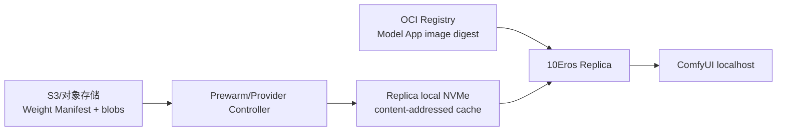
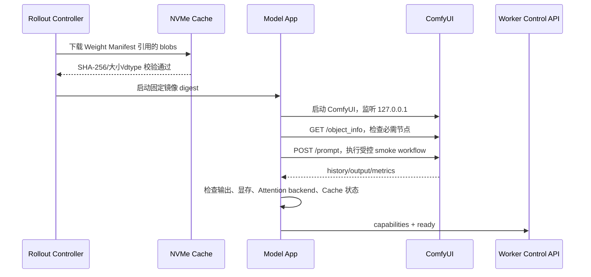

# 10Eros-Max V3 ComfyUI 部署与标准 API

## 1. 结论与术语

本文将“标准 ATI”按“标准 API”理解。如果用户所说的 ATI 是其他接口或运行时规范，需要另行确认。

10Eros 的生产部署由四类不可变身份组成：

```text
Model App 镜像 digest
  = ComfyUI + Python/CUDA/PyTorch + 自定义节点 + 启动脚本

Weight Manifest digest
  = UNET/CLIP/VAE 等权重名称、SHA-256、大小、dtype、许可证

Workflow Manifest digest
  = API-format workflow、允许覆盖字段、节点版本和输出合同

Runtime Profile
  = GPU SKU、显存余量、Attention backend、Cache 参数、20 步质量基线
```

业务方不直接调用 ComfyUI。Worker Agent 调用本地 Model App Contract；Model App 内部再调用 ComfyUI API。这样 ComfyUI 可以升级或替换，而平台任务、租约、S3 和审计合同不变。

## 2. 10Eros 资产清单

各权重的来源、公开地址、基础模型溯源和“是否为当前实际底模”判断见 [12-10eros-asset-sources.md](./12-10eros-asset-sources.md)。

当前工作流实际使用的资产如下。文件名不是身份，Release 必须补齐 SHA-256、字节数、safetensors header、实际 tensor dtype、来源和许可证。

| 角色 | 文件 | 工作流节点 | 当前状态 |
| --- | --- | --- | --- |
| UNET | `10Eros_Max_h3_fl2va_bf16_test3_pruned.safetensors` | `UNETLoader` | 实际底模；约 40.2 GB，固定来源见资产登记 |
| CLIP | `qwen3vl_32b_minimax_h3_nvfp4_awq.safetensors` | `CLIPLoader` | MiniMax H3 Qwen3-VL 编码器；哈希待测 |
| Video VAE | `minimax_h3_video_vae_fp16.safetensors` | `VAELoader` | 视频解码；哈希待测 |
| Audio VAE | `minimax_h3_audio_vae_fp32.safetensors` | `VAELoader` | 音频解码；哈希待测 |
| 工作流 | `(10Eros-Max V3)Minimax参考生视频BF16高质量加速版V3.json` | API 导出资料 | SHA-256 已记录在 `docs/workflows/README.md` |

需要额外固定的代码组件：

- ComfyUI 核心 `MiniMaxH3ReferenceToVideo`、`VAEDecode`、`VAEDecodeAudio` 和 `SamplerCustomAdvanced`。
- `MiniMaxH3BlockCacheT8` 自定义节点及其 commit、依赖和运行参数。
- `PathchSageAttentionKJ` 自定义节点、SageAttention 版本、CUDA capability 和最终 backend。

当前 `docs/third-party/ComfyUI` 只是上游源码快照，不包含全部外部自定义节点和 10Eros 权重，不能直接作为生产镜像。

自定义节点和 Python/CUDA 依赖必须在构建阶段写入 Model App 镜像并锁定 commit/版本；禁止 Replica 启动时通过 ComfyUI Manager、`pip install` 或公网脚本临时安装。这样才能保证每台机器使用同一节点代码、同一 ABI 和同一工作流行为。

## 3. 权重和存储方案

### 3.1 推荐分层

推荐“镜像存代码，Weight Artifact 存权重，Replica 本地 NVMe 做热缓存”：



- **OCI 镜像**：ComfyUI 源码、Python 依赖、自定义节点、启动脚本、只读 workflow 模板和 API adapter。不要把几十 GB 的权重反复复制进每一层普通镜像。
- **Weight Artifact**：S3 兼容对象存储或 OCI artifact 保存权重 blob 和签名 Manifest。每个 blob 使用内容地址和 SHA-256，禁止按 mutable tag 下载。
- **本地 NVMe**：每个 GPU Replica 独享的高速缓存，按 `sha256` 目录存放。下载到 `.partial`，校验通过后原子 rename；缓存丢失可以从对象存储重建。
- **PostgreSQL**：只保存 Manifest、Release、下载状态、哈希、大小、许可证、审计和成本，不保存权重二进制。
- **共享网络盘**：不作为推理热路径。NFS/共享 PVC 的吞吐和锁延迟会放大 15 秒视频的采样时间。

### 3.2 镜像内置权重与外置权重

允许两种发布模式，但 10Eros 首选外置 Weight Artifact：

| 模式 | 适用 | 风险 |
| --- | --- | --- |
| 镜像内置权重 | 权重较小、启动简单、网络隔离要求高 | 镜像巨大、层复制和回滚成本高 |
| 外置 Weight Artifact + 本地 NVMe | 10Eros 这类大权重、多 GPU 扩容、滚动发布 | 首次预热需要网络和本地磁盘 |

无论模式如何，`Release Manifest` 必须引用固定 digest。一个 Replica 只有在所有必需权重的哈希、大小和 dtype 与 Manifest 一致后才能 `ready`。不能在 ComfyUI 启动后发现缺文件再从公网临时下载。

### 3.3 Hugging Face 镜像只用于导入阶段

受控的 Weight Import Job 可以设置 `HF_ENDPOINT=https://hf-mirror.com`，使用 `huggingface_hub`/`huggingface-cli` 下载公开权重；下载结果必须先写入临时目录，再执行固定 revision、大小、SHA-256、safetensors header 和许可证校验，最后上传到内部 S3/OCI Weight Artifact。镜像只是一条可替换的传输路径，不能成为 Release 的永久权重 URL。

Import Job 完成后，Provider 预热、Replica NVMe 缓存和 ComfyUI 只读取内部 Artifact。Model App 和 Worker Agent 的 NetworkPolicy 不应允许访问 `hf-mirror.com` 或 Hugging Face。完整的镜像策略、重试、官方回退和凭证边界见 [14-huggingface-mirror-and-weight-supply-chain.md](./14-huggingface-mirror-and-weight-supply-chain.md)。

### 3.3 建议目录

```text
/opt/astra/
  app/                         # Model App adapter，镜像只读
  comfyui/                     # ComfyUI，镜像只读
  workflows/10eros-v3.json     # 固定 API-format workflow
  manifests/release.json       # Release Manifest
  weights/
    sha256/<digest>/           # 本地 NVMe 权重缓存，只读挂载给 ComfyUI
  work/<attempt_id>/            # 输入、输出和临时文件
```

权重缓存按 digest 加锁，允许同一 Replica 上的多个启动检查复用文件，但首期 `max_concurrency=1`。回收只删除没有 Lease、没有正在预热引用且不属于当前/回滚 Release 的 digest。

### 3.4 磁盘、显存和内存不是同一个指标

权重文件大小不能直接等同于 GPU 显存需求：

```text
磁盘占用 = 权重 blob + ComfyUI/节点镜像 + 工作流 + 缓存
显存占用 = 已加载模型 + CLIP/VAE + 视频/音频 latent + attention workspace
             + Block Cache + CUDA/PyTorch allocator 保留空间
主机内存 = CPU cache/offload + Block Cache（cache_device=cpu）+ 解码缓冲
```

当前 10Eros 的 `cache_device=cpu` 可能降低显存峰值，但会增加主机内存和 CPU-GPU 数据搬运；如果改成 GPU cache，则必须重新验证显存安全余量。`--lowvram`、CPU VAE 或动态 offload 只能作为独立 Runtime Profile 验收，不能在生产任务中自动触发，因为它们会改变单步耗时和调度容量模型。

在实际 test3 权重和目标 GPU 测量完成前，不能从文件名或相邻 checkpoint 推算显存。每个 Profile 至少记录：模型加载峰值、采样峰值、VAE 解码峰值、Block Cache 峰值、最低可用显存、主机内存峰值、PCIe/CPU 等待和 OOM/Xid 次数。当前建议从 48GB GPU 开始验收，并把 `max_concurrency=1` 固定为首期上限。

## 4. 预热和启动顺序



预热必须完成：

1. 权重下载、哈希和 safetensors header 校验。
2. ComfyUI、核心节点、自定义节点和依赖导入。
3. `GET /object_info/MiniMaxH3ReferenceToVideo` 等节点能力检查。
4. 确定实际 Attention backend，不接受未记录的 `auto` fallback。
5. 加载 UNET、CLIP、Video VAE、Audio VAE，记录显存峰值和最低余量。
6. 完成至少一条固定输入的 smoke generation，并验证原始输出 manifest。

预热完成前 Replica 是 `rollout_reserved`，不领取公共 Task。平台指标必须拆分：`time_to_ready`、`warm_sampling_duration`、`warm_attempt_duration` 和 `total_attempt_duration`。

## 5. ComfyUI 标准 API

ComfyUI 自带的是内部队列 API，当前源码在 `server.py` 注册以下核心端点：

| 方法 | 路径 | 用途 | 生产边界 |
| --- | --- | --- | --- |
| `GET` | `/system_stats` | GPU、Python、Torch 和设备信息 | 只供本地 adapter 采集 |
| `GET` | `/object_info` | 节点 schema、输入、输出和版本信息 | 启动能力检查 |
| `GET` | `/object_info/{node_class}` | 单节点 schema | 启动能力检查 |
| `POST` | `/prompt` | 提交 API-format workflow 到 ComfyUI 队列 | 仅 localhost |
| `GET` | `/history/{prompt_id}` | 查询内部执行历史和输出 | 仅 adapter |
| `GET` | `/view` | 读取 ComfyUI 输出文件 | 不对外暴露 |
| `GET` | `/ws` | 接收进度和执行事件 | 仅 localhost |
| `POST` | `/interrupt` | 中断当前或指定 `prompt_id` | 由 Model App cancel 映射 |
| `POST` | `/queue` | 删除或清空内部排队项 | 不允许业务方直接调用 |
| `POST` | `/free` | 请求卸载模型/释放显存 | 只在 drain/recovery 使用 |

### 5.1 `/prompt` 的标准请求形态

ComfyUI 的 `/prompt` 接收的是 **API-format workflow**，不是你保存的带 `nodes`/`links` 的 UI 图 JSON。Model App 在镜像内保存一个只读 API-format 模板，每次执行深拷贝后只替换 allowlist 字段：prompt、参考素材路径/节点输入、width、height、length、seed 和 output prefix。

```json
{
  "prompt": {
    "127": {
      "class_type": "UNETLoader",
      "inputs": {
        "unet_name": "10Eros_Max_h3_fl2va_bf16_test3_pruned.safetensors",
        "weight_dtype": "default"
      }
    },
    "145": {
      "class_type": "MiniMaxH3ReferenceToVideo",
      "inputs": {
        "clip": ["128", 0],
        "vae": ["119", 0],
        "audio_vae": ["120", 0],
        "prompt": "以 <Picture 1> 为参考，生成一镜到底的视频",
        "width": 1344,
        "height": 768,
        "length": 362,
        "ref_image_size": "match",
        "ref_images.ref_image_0": ["137", 0]
      }
    }
  },
  "client_id": "worker-local-client",
  "prompt_id": "attempt_019b0..."
}
```

上例仅说明合同结构；真实 API-format workflow 必须从当前固定模板生成，节点 ID 和连线不能凭手工示例猜测。`prompt_id` 是 ComfyUI 内部执行 ID，平台仍以自己的 `attempt_id`、Lease 和 PostgreSQL 状态为真源。

### 5.2 进度、完成和取消

- Adapter 可以通过 `/ws` 接收执行节点进度，并以 `attempt_id` 上报 Worker Control API；WebSocket 断开不等于 Task 失败。
- Adapter 在 `/history/{prompt_id}` 读到完成后，必须定位 manifest/output 文件、做路径和完整性校验，再交给 Agent 上传 S3。
- 取消先调用 `/interrupt` 指定 `prompt_id`，等待 ComfyUI 队列确认，再由 Model App 返回 `canceled`；超时仍由 Agent 的取消宽限和租约机制收敛。
- `/queue` 和 `/history` 是 ComfyUI 的易失运行状态，不能替代 PostgreSQL Task/Attempt/Lease。

## 6. 平台 Model App API 与 ComfyUI 的边界

生产接口不是把 `/prompt` 暴露给业务方，而是实现已有的语言无关 Worker Contract：

```text
Worker Agent -> POST http://127.0.0.1:<model-app>/v1/inferences
Model App    -> POST http://127.0.0.1:<comfyui>/prompt
Model App    -> GET  http://127.0.0.1:<comfyui>/history/{prompt_id}
Model App    -> output manifest
Worker Agent -> 校验并原样上传 S3
```

Model App 必须实现：

- `GET /health/live`
- `GET /health/ready`
- `GET /v1/capabilities`
- `POST /v1/inferences`
- `GET /v1/inferences/{execution_id}` 或等价的进度查询
- `POST /v1/inferences/{execution_id}/cancel`

ComfyUI 不得连接 PostgreSQL、Redis、Kafka、Provider 或 S3，也不持有平台长期凭证。输入文件由 Agent 下载到任务目录，Model App 只接收本地路径或受限的执行参数。

## 7. 部署验收门

10Eros Replica 进入 `ready` 前必须通过：

- 镜像 digest、Workflow Manifest digest、Weight Manifest digest 三者一致。
- 所有权重 SHA-256、大小、dtype、模型目录和许可证校验通过。
- `/object_info` 包含 `MiniMaxH3ReferenceToVideo`、`SamplerCustomAdvanced`、`VAEDecode`、`VAEDecodeAudio` 和 Block Cache/SageAttention 节点。
- API-format workflow 能通过 `/prompt` 校验；不存在未知节点、断链、未允许的外部路径或未批准参数。
- 15 秒标准 smoke 通过，当前 20 步质量基线和输出 manifest 校验通过。
- 记录实际 Attention backend、Block Cache 命中/完整 forward、显存峰值和 `time_to_ready`。
- Model App 不监听公网；ComfyUI 仅监听 loopback；Worker Agent 通过平台出站连接领取任务。

未通过时 Replica 保持 `loading_failed` 或 `draining`，不接受公共任务。权重下载失败可重试；哈希不匹配、节点版本不一致或输出合同失败必须阻断发布，不能自动使用另一个模型文件补救。
