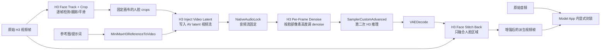

# ComfyUI-H3-FaceRefine 研究与 10Eros 接入边界

## 1. 结论

本研究固定 [Carasibana/ComfyUI-H3-FaceRefine](https://github.com/Carasibana/ComfyUI-H3-FaceRefine) 到提交 `79a97ce5ee4b393ce26313bd1280b706fe8b4f2c`（仓库版本 `1.0.0`）。该仓库不是普通的锐化或视频编码节点，而是一条**二次 H3 推理**流水线：

1. 对输入视频逐帧做人脸检测和轨迹平滑。
2. 按每帧人脸大小裁剪并放大到固定 H3 画布。
3. 将真实裁剪帧编码到 H3 联合音画 latent 的视频流，使用低 denoise 重新生成。
4. 把生成裁剪中的人脸区域仿射变换回原视频位置并融合。

因此它有明确的质量改善目标，但会再次占用 H3 GPU 推理时间、显存和模型权重。当前不能直接并入唯一的 10Eros 生产 Alias，也不能接在 `CreateVideo` 后由平台隐式处理。建议作为独立的 `face_refine` 派生 workflow profile，保留原始 10Eros 文件为父产物，增强结果作为带 provenance 的新 Artifact。

## 2. 研究边界和来源

| 项目 | 记录 |
| --- | --- |
| 上游仓库 | <https://github.com/Carasibana/ComfyUI-H3-FaceRefine> |
| 固定提交 | `79a97ce5ee4b393ce26313bd1280b706fe8b4f2c` |
| 本地快照 | [`docs/third-party/ComfyUI-H3-FaceRefine`](./third-party/ComfyUI-H3-FaceRefine) |
| 许可证 | 仓库 `LICENSE` 声明 MIT；其依赖、检测器和 H3 权重仍需分别核对许可证 |
| 节点注册 | [`__init__.py`](./third-party/ComfyUI-H3-FaceRefine/__init__.py)、[`nodes.py`](./third-party/ComfyUI-H3-FaceRefine/nodes.py) |
| 示例工作流 | [`H3_Face_Refine.json`](./third-party/ComfyUI-H3-FaceRefine/example_workflows/H3_Face_Refine.json)、[`H3_Face_Refine_SAM.json`](./third-party/ComfyUI-H3-FaceRefine/example_workflows/H3_Face_Refine_SAM.json) |

本地快照约 34 MB，包含源码、示例 JSON 和截图，不包含模型权重。快照用于研究和供应链审计，不是生产镜像运行时依赖。

## 3. 算法和节点图



核心节点及合同如下：

| 节点 | 输入 | 输出 | 作用和限制 |
| --- | --- | --- | --- |
| `H3FaceTrackCrop` | `IMAGE` 视频帧、Ultralytics 检测器、跟踪参数 | `crops`、`H3FACEXFORM`、预览、报告、画布宽高 | 每帧检测；补齐漏检；中心和尺寸平滑；`per_frame` 让人脸在每个 crop 中保持相近比例。`canvas_w/canvas_h` 必须连接到 H3 节点的 `width/height`。 |
| `H3InjectVideoLatent` | H3 `LATENT`、crop `IMAGE`、视频 VAE | 修改后的联合 AV `LATENT` | 只替换 NestedTensor 的视频流，保留音频流；空间 latent 不匹配时报错，时间不匹配会 trim/pad 并输出警告。 |
| `H3PerFrameDenoise` | AV `LATENT`、`H3FACEXFORM` | AV `LATENT` | 根据源视频人脸高度在 `strength_small_face` 和 `strength_large_face` 间插值，写入视频 `noise_mask`；保留音频侧锁定。 |
| `H3FaceMaskSAM` | 输入 crop、SAM、transform | `MASK` | 可选；逐帧 SAM，失败时退回人脸矩形，并做时间平滑。示例 SAM 工作流额外依赖 Impact Pack。 |
| `H3FaceStitch` | 原始帧、解码 crop、transform，可选 mask | `IMAGE` | 用 `grid_sample` 回贴，默认只融合 `face_only`，可做颜色匹配、羽化、blend 和漏检淡出；不会返回视频容器或音频。 |
| `H3FaceTransformInfo` | transform | 文本 | 调试跟踪框，不是生产输出。 |

该仓库的 `NODE_CLASS_MAPPINGS` 注册以上六个节点；没有独立 HTTP 服务，也没有 Worker/Provider 接口。平台必须把它作为模型镜像内的 ComfyUI 节点，通过 Model App 的 workflow compiler 调用。

## 4. 与当前 10Eros 工作流的关系

### 4.1 不能直接串在视频保存节点之后

当前 10Eros 图是“参考媒体 -> H3 采样 -> VAE 解码 -> VideoCombine”。FaceRefine 的 `H3InjectVideoLatent` 需要一个**新的 H3 条件 latent**和一批真实 `IMAGE` crop，它不是 `VIDEO -> VIDEO` 的后处理滤镜。正确的结构是：

```text
10Eros 原始生成（保留原始字节）
  -> 解码为帧（Model App 内部临时数据）
  -> FaceTrackCrop
  -> 新的 H3 ReferenceToVideo + InjectVideoLatent
  -> 低 denoise 的第二次采样
  -> FaceStitchBack
  -> 使用原始音频显式封装为派生 Artifact
```

不能让平台 Worker 在上传后把 MP4 解码、重编码并覆盖原文件。模型镜像内部若使用 FFmpeg/VideoHelperSuite 生成派生文件，必须在该 profile 的 `output_schema` 中声明编码和容器；原始 10Eros Artifact 的 `sha256`、`byte_length` 和内容类型保持不变。

### 4.2 10Eros 兼容性尚未证明

示例工作流实际使用的是：

- `UnetLoaderGGUF`: `minimaxH3GGUFFl2vaRef2va_v10.gguf`。
- `CLIPLoaderGGUF`: `qwen3vl_32b_minimax_h3-Q4_K_M.gguf`。
- 可选 4 步 Turbo LoRA：`minimax_h3_fl2v_lightx2v_turbo_4step_v0.1_comfy.safetensors`，示例强度 `0.75`。
- `minimax_h3_video_vae_fp16.safetensors`、`minimax_h3_audio_vae_fp32.safetensors`。

当前生产候选是 `10Eros_Max_h3_fl2va_bf16_test3_pruned.safetensors`，20 步 BF16 工作流。两者都使用 H3 的联合 AV latent 类型，源码层面没有按文件名拒绝，但这只能说明**接口形状可能兼容**，不能证明 10Eros 权重在二次 img2img、低 denoise、人脸参考和回贴后仍保持质量。必须用 10Eros 自己的镜像、节点 commit、VAE、CLIP、工作流 hash 做独立验收。

首个实验 profile 应固定：单一参考图、原生音频、24 FPS、4-15 秒、`max_concurrency=1`、矩形 mask、无 SAM、无 Turbo LoRA。只有通过质量和资源矩阵后，才能单独批准多参考图、SAM 或 Turbo 变体。

## 5. 依赖和权重登记

### 5.1 节点运行依赖

仓库 `requirements.txt`/`pyproject.toml` 声明：`ultralytics`、`scipy`、`insightface`。版本未锁定，生产镜像必须自行生成 Python lock 和 SBOM。`onnxruntime` 没有固定实现，CPU 与 GPU 变体不可同时安装；否则 InsightFace 可能静默退回 CPU。

| 资产 | 默认位置 | 来源/用途 | 当前策略 |
| --- | --- | --- | --- |
| `face_yolov8m.pt` | `models/ultralytics/bbox/` | [Bingsu/adetailer](https://huggingface.co/Bingsu/adetailer/blob/main/face_yolov8m.pt) | 首个 profile 必需；下载后固定 revision、SHA-256 和许可证。 |
| `person_yolov8m-seg.pt` | `models/ultralytics/segm/` | [Bingsu/adetailer](https://huggingface.co/Bingsu/adetailer/blob/main/person_yolov8m-seg.pt) | 可选漏检 fallback；不启用时不打入镜像。 |
| InsightFace `buffalo_l` | `models/insightface/` | [InsightFace](https://github.com/deepinsight/insightface) | 仅在多人或 identity tracking 时需要；源码会在缺失时首次联网下载，生产必须预下载并禁止运行时联网。 |
| `sam_vit_b_01ec64.pth` | `models/sams/` | [Meta Segment Anything](https://github.com/facebookresearch/segment-anything#model-checkpoints) | 仅 SAM profile；首期不启用。 |

FaceRefine README 还列出 H3、VAE、CLIP 和 Turbo LoRA 地址。这些是示例工作流资产，不应覆盖 10Eros 的权重登记；当前 10Eros 资产以 [`12-10eros-asset-sources.md`](./12-10eros-asset-sources.md) 为准。

### 5.2 运行时下载和外网边界

源码中的 `_face_recogniser()` 会把 InsightFace 根目录设为 `models/insightface`，并允许 InsightFace 在缺失时自动下载。生产镜像不得依赖此行为：构建阶段下载、核验、写入 Weight Manifest，运行时通过 NetworkPolicy 禁止 Model App 外网。任何下载失败应在 readiness 阶段暴露，不得等到任务中途才失败。

## 6. 性能、显存和成本

FaceRefine 的成本不是一个常数放大倍数，至少由以下量决定：

```text
face_pass_cost ~= detector_cost * frames
                 + h3_cost(canvas_width * canvas_height, frames, steps)
                 + VAE_encode/decode
                 + stitch_cost(source_width * source_height, frames)
```

其中第二项是一次新的 H3 采样。README 明确指出成本近似为 `canvas² × frames`，`768` 边长相对 `512` 的 token/面积成本约为 `2.25x`；示例工作流还建议 4 步 Turbo，但该 LoRA 与当前 10Eros BF16 test3 尚未验证，不能把它当作免费加速。

对当前 15 秒、24 FPS、约 362 帧的标准任务，应把 FaceRefine 视为额外的一次生成作业，而不是几毫秒的后处理。首期应：

- `max_concurrency=1`，不和主 10Eros 推理共享同一 GPU 槽位。
- 记录检测、crop/VAE、二次采样、stitch、封装的分段耗时和显存峰值。
- 以 `512x512`、`640x640`、`768x768` 和 4/8/20 steps 做离线矩阵；没有真实 GPU 数据前不写固定 ETA 或成本倍数。
- 把 FaceRefine 作为独立 Model Pool 或至少独立 capacity class，调度器使用实际 GPU 秒预测，不使用输出视频秒数代替服务时间。
- SAM 逐帧推理默认排除生产热池；如果启用，必须记录其 GPU/CPU 占用、取消响应和每帧耗时。

`H3FaceStitch` 自身按最多 32 帧分块，尝试控制回贴显存；这不等于整个 pipeline 支持大并发。`H3FaceMaskSAM` 明确逐帧调用 SAM，并在源码中主动检查取消，但长视频仍可能产生分钟级额外耗时。

## 7. 输出、保真与故障语义

1. **原始产物不可变**：10Eros 第一遍生成的文件原样上传并登记为 `source_artifact_id`。
2. **派生产物独立登记**：FaceRefine 输出记录 `parent_artifact_id`、FaceRefine commit、检测器/InsightFace/SAM 权重 hash、工作流 hash、参数、二次采样 steps/denoise、mask 策略和 `output_schema`。
3. **不做隐式转码**：Worker Agent 只下载、校验、上传和登记。任何帧解码、音频复用或视频封装都必须在 Model App 内显式完成并由 Release 声明。
4. **默认音频策略**：示例把原始音频单独接到保存节点；不得把 `NativeAudioLock` 生成的辅助音频误当成最终音轨。profile 必须声明音频来源、采样率、声道和 A/V 时差门槛。
5. **漏检策略**：默认 `fade_out` 只在回贴阶段减小融合权重；所有帧仍会进入 H3。若跟踪全程失败，任务应在 preprocessing 失败，不应生成“无脸增强”的假成功。
6. **取消和超时**：取消发生在二次采样或封装阶段时，保留原始 Artifact，派生 Artifact 标记为失败/取消，不覆盖成功的父任务。

## 8. 安全、供应链和合规风险

- `ultralytics`、`insightface`、SAM、Impact Pack、ComfyUI 和 H3 权重各自有许可证和版本边界；MIT 只覆盖本仓库代码，不能推导模型或依赖可再分发。
- 检测器和 InsightFace 处理用户视频帧，日志不得记录原始帧、完整路径、提示词或人脸 embedding；临时帧必须按任务 TTL 清理。
- 运行时自动联网下载权重是供应链和可复现性风险，必须在镜像构建阶段完成并记录 SHA-256。
- 10Eros 与示例 GGUF/LoRA 不可混装；每一个组合都是新的 Release，必须固定镜像 digest、节点 commit、工作流 hash、权重 hash 和资源门。
- SAM 需要额外的第三方节点；先用矩形 mask，避免将 Impact Pack 引入稳定镜像的攻击面和依赖面。

## 9. 实验验收矩阵

| 类别 | 最低样本/检查 | 通过条件 |
| --- | --- | --- |
| 检测 | 单人、侧脸、遮挡、出入画、多人 | 跟踪报告无未解释跳人；漏检帧按策略处理；取消可响应。 |
| 几何 | 4/8/15 秒、远景到近景、不同宽高比 | crop 与 H3 `width/height` 一致；transform 回贴无漂移、无闪烁。 |
| 10Eros 兼容 | test3 BF16、20 步、已批准 VAE/CLIP、单参考图 | H3 latent 注入无类型/尺寸错误；二次推理完整结束；参考主体和原视频动作通过人工盲审。 |
| 质量 | FaceRefine off/on、相同 seed 和输入 | 小脸细节改善；无明显身份漂移、头部漂移、边缘矩形、闪烁或音画错位。 |
| 音频 | 原始音频、NativeAudioLock、无 vocals | 输出音轨来源明确；采样率、声道、时长和 A/V 偏差符合 profile。 |
| 资源 | 512/640/768、4/8/20 steps、连续任务 | 显存余量、GPU 秒、失败率、磁盘和温度在策略阈值内；`max_concurrency=1` 无 OOM。 |
| 故障 | 检测器缺失、InsightFace 缺失、SAM 失败、上传失败、取消 | readiness 或任务错误可解释；父 Artifact 保留；不产生隐式 fallback 或静默转码。 |

通过后只能把 `face_refine` 标记为 `candidate`，并按项目 allowlist 灰度。未通过前，10Eros 稳定 Alias 只返回原始生成 profile。

## 10. 推荐 Release Manifest 片段

```json
{
  "profile": "minimax-h3-10eros-ref2va-v3-face-refine",
  "parent_profile": "minimax-h3-10eros-ref2va-v3",
  "maturity": "experimental",
  "source_artifact_policy": "preserve_raw_and_create_derived",
  "max_concurrency": 1,
  "inputs": {"reference_images": {"min": 1, "max": 1}, "fps": [24], "duration_seconds": [4, 15]},
  "face_refine": {
    "repository_commit": "79a97ce5ee4b393ce26313bd1280b706fe8b4f2c",
    "detector": "face_yolov8m.pt",
    "mask": "rect",
    "sam_enabled": false,
    "identity_tracking": false,
    "canvas": [512, 512],
    "steps": 20,
    "denoise": "release-defined"
  },
  "network": {"runtime_model_download": false, "model_app_egress": false}
}
```

`denoise`、canvas、采样器、VAE、CLIP、输出编码和预算必须在实际 10Eros 镜像验收后填写确定值。这个片段不能替代完整 Release Manifest，也不能授权公共调用方自由上传工作流。

## 11. 最终决策

FaceRefine 值得作为 10Eros 的**可选质量增强 profile**继续研究，尤其适合远景或小脸占比很低的镜头；它不适合作为所有视频的默认后处理。当前决策为：

- 保留源码快照和示例工作流在 `docs/third-party`，供构建和审计使用。
- 不修改现有 10Eros 主工作流 JSON，不把节点接入稳定 Alias。
- 先构建隔离的合同参考实现与测试路径，再在有 GPU 的候选 Provider 上做真实矩阵。
- 只有质量、资源、许可证和输出保真门全部通过，才允许单独发布、灰度和回滚。
