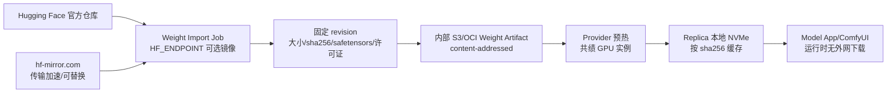

# Hugging Face 镜像下载与权重供应链设计

## 1. 结论

[hf-mirror.com](https://hf-mirror.com/) 是 Hugging Face Hub 的访问加速入口，不是新的模型权威来源，也不是权重存储真源。它通过 Hugging Face Hub 兼容的网页、API、`huggingface_hub` CLI 和 `HF_ENDPOINT` 环境变量提供下载；文件请求可能继续重定向到带签名的 CDN/Xet 地址。

Astra 应采用以下边界：

- **允许**在开发机、CI 构建机和受控的 Weight Import Job 中作为可选下载源，加速公开模型导入。
- **不允许** Model App、Worker Agent 或 ComfyUI Replica 在生产运行时通过它下载模型、节点、Python 依赖或 InsightFace 资产。
- 镜像只负责传输；权重身份仍由 `repo_id + revision/commit + path + byte_length + SHA-256 + safetensors header` 确定。
- 导入后把通过校验的 blob 写入内部 S3/OCI Weight Artifact。共绩预热和滚动发布只访问内部 Artifact，不访问镜像站。

当前 10Eros 是公开仓库，适合先用镜像完成导入测试，但在完整 40.2 GB 文件下载前不能声称权重已入库。

## 2. 研究证据

### 2.1 官方镜像页面声明的用法

镜像首页说明了四种方式：网页下载、`huggingface-cli`、`hfd.sh`/aria2 和设置 `HF_ENDPOINT`。典型配置为：

```bash
export HF_ENDPOINT=https://hf-mirror.com
huggingface-cli download \
  --repo-type model \
  --revision <fixed-commit> \
  --include '<path-or-file>' \
  --local-dir <staging-dir> \
  --local-dir-use-symlinks False \
  <org>/<repo>
```

`HF_ENDPOINT` 只改变 Hugging Face Hub 客户端访问的 Hub 地址，不改变模型 API 合同，也不会自动把任意自定义下载脚本中的 `huggingface.co` URL 全部替换。使用 `wget`、`curl` 或仓库内置下载脚本时，必须显式指定固定 revision 的下载 URL。

镜像页面还说明部分 gated repo 需要先在 Hugging Face 官方站点申请权限，再通过 CLI 携带 token 下载。Astra 首期只允许公开资产走镜像；私有/gated 资产默认走官方端点或公司批准的内部代理，不把生产 HF Token 交给公共镜像站。

### 2.2 10Eros 端点探测

未下载 40.2 GB 文件，只进行了 API 和响应头探测：

```text
GET /api/models/TenStrip/10Eros-Max
  repo sha: 7766d5d6b99b6fc5ba7a37b74fe9a2f2068360f3

GET /TenStrip/10Eros-Max/resolve/
    d04ab4ce5ad0b104965d7f76fbe2223be87cae0d/
    10Eros_Max_h3_fl2va_bf16_test3_pruned.safetensors
  X-Repo-Commit: d04ab4ce5ad0b104965d7f76fbe2223be87cae0d
  X-Linked-Size: 40225724096 bytes
  X-Linked-ETag: 663336d33bf6c223e304a0d5b45de30b281b3a2046e14e0546de0d24ed97f3d8
  response: 302 -> signed CDN/Xet URL
```

这证明镜像能解析固定提交并返回文件大小，但不证明文件 SHA-256，也不证明镜像长期可用。`ETag`/`X-Linked-ETag` 是传输或后端对象标识，不能当作本项目要求的 SHA-256。完整下载后仍必须自行计算哈希和校验 safetensors。

## 3. 在 Astra 中的位置



`hf-mirror.com` 不应出现在生产 Replica 的默认 NetworkPolicy、Worker 出站白名单或 Model App 的配置中。它属于 Import Job 的临时 egress；Import Job 完成后，生产链路只使用内部 Artifact。

## 4. 导入流程和不变量

### 4.1 固定身份

后台或导入任务必须记录：

```json
{
  "source": {
    "provider": "huggingface",
    "repo_id": "TenStrip/10Eros-Max",
    "revision": "d04ab4ce5ad0b104965d7f76fbe2223be87cae0d",
    "path": "10Eros_Max_h3_fl2va_bf16_test3_pruned.safetensors",
    "endpoint": "https://hf-mirror.com",
    "endpoint_policy": "mirror_preferred"
  },
  "artifact": {
    "sha256": "<computed-after-download>",
    "byte_length": 40225724096,
    "safetensors_header_sha256": "<computed>",
    "license": "<verified-from-model-card>"
  }
}
```

同一仓库的 `main`、tag 或 API 返回的 repo SHA 不能替代文件固定 revision。若输入是 mutable tag，Import Job 必须先解析为 commit，并把 commit 写入 Manifest；下载中不能重新解析。

### 4.2 校验和入库

```text
预创建 staging 目录和磁盘配额
  -> 使用镜像 endpoint 下载到 .partial（可断点续传）
  -> 检查 HTTP 响应、X-Repo-Commit、Content-Range/文件大小
  -> 下载完成后计算 SHA-256
  -> 解析 safetensors header，检查 tensor 名、dtype 和元数据白名单
  -> 核对许可证、来源说明和目标 Model Release
  -> 上传到内部 S3/OCI content-addressed key
  -> PostgreSQL 事务写入 Weight Manifest、Outbox 和审计
  -> 清理 .partial；失败文件不可被 Replica 复用
```

任何大小、commit、SHA-256、header 或许可证不匹配都阻断入库。不得因为镜像下载成功、HTTP 200、ETag 相同或文件名相同而放行。

### 4.3 失败和回退

镜像是可替换的加速源，不应成为无限重试的故障黑洞：

- 镜像超时/限流：按 Import Job 的有限指数退避重试，并记录 endpoint、HTTP 状态、重试次数和耗时。
- 镜像不可用：只有在任务策略显式允许时，才能使用官方 `huggingface.co` 同一固定 commit 重试；不能静默改用 `main` 或相似文件。
- 哈希不匹配：立即 quarantine，禁止切换官方源继续覆盖同一个 staging 文件；需要新 Attempt 和审计原因。
- 内部 Artifact 已存在：按 SHA-256 幂等复用，不重新下载，不覆盖已验证对象。
- Import Job 失败：不影响已经运行的 Release；旧 Release 和回滚 Artifact 继续可用。

## 5. 安全与合规

| 风险 | 约束 |
| --- | --- |
| 镜像不是权威来源 | 只把官方仓库的固定 commit/path 作为身份；镜像响应必须再做本地哈希校验。 |
| 公共服务无 SLA | 只用于可重试的导入阶段；发布、预热和推理读取内部 Artifact。 |
| 请求路径和下载行为可被第三方观察 | 默认仅导入公开权重；不发送生产 token、用户素材、提示词或预签名内部 URL。 |
| gated/private repo 权限 | 首期走官方端点或批准的内部代理；必须使用短期最小权限凭证并写入审计。 |
| CDN/Xet 重定向 | Import Job 允许 HTTPS 重定向到经批准的 CDN；不记录完整带签名 URL，不把它作为永久 source URL。 |
| 运行时自动下载 | Model App 无外网；readiness 只检查本地 Manifest 和文件，不执行 `from_pretrained` 下载。 |
| 许可证变化 | 镜像不改变原始许可证；每次导入保存模型卡、许可证快照和核验时间。 |
| 恶意或损坏文件 | SHA-256、safetensors header、严格资源门和沙箱扫描全部通过后才能进入 Weight Artifact。 |

Import Job 的镜像访问凭证（如未来确需）只能来自 Secret Manager/外部 Secret，不能写入仓库、Release Manifest 或日志。下载日志只记录 repo、revision、path、状态和耗时，不记录 token 和完整预签名 URL。

## 6. 10Eros 推荐配置

首期公开权重导入建议：

```yaml
weight_import:
  source: huggingface
  endpoint_policy: mirror_preferred
  mirror_endpoint: https://hf-mirror.com
  official_endpoint: https://huggingface.co
  allow_official_fallback: true
  require_fixed_revision: true
  require_sha256: true
  require_safetensors_header: true
  runtime_download: false
  max_attempts_per_endpoint: 3
  staging_disk_quota_bytes: 50000000000
  internal_artifact_store: s3://astra-weight-artifacts
```

10Eros 这一个文件约 40.2 GB，实际 staging 配额还必须覆盖临时 `.partial`、校验副本和其他 CLIP/VAE 文件，不能只按单文件大小设置。下载完成后应尽快转成内部 content-addressed Artifact，再由共绩预热使用。

## 7. 与已有文档和流程的关系

- [`12-10eros-asset-sources.md`](./12-10eros-asset-sources.md) 继续记录官方仓库、固定 revision、权重 SHA-256 和许可证；本文件补充下载传输策略。
- [`11-10eros-comfyui-deployment.md`](./11-10eros-comfyui-deployment.md) 的 Weight Artifact、NVMe 和预热设计不变；镜像只加入导入阶段，不进入 ComfyUI 运行时。
- [`08-model-release-and-roadmap.md`](./08-model-release-and-roadmap.md) 的 Release Manifest 必须保存实际导入 endpoint 和验证报告，但 Release 的唯一权重身份仍是 SHA-256。
- 本地 Docker Compose 不应依赖 hf-mirror；本地测试使用 Provider Adapter 与 Model App 合同参考实现，真实权重导入是显式、隔离的可选 Job。

## 8. 决策

采用 `mirror_preferred` 作为**构建/导入阶段**的默认策略，保留 `official_only` 和 `mirror_disabled` 两个开关。生产推理、共绩预热和回滚只依赖内部 Weight Artifact。任何未经哈希和许可证核验的镜像下载结果不得进入 Model Release。
