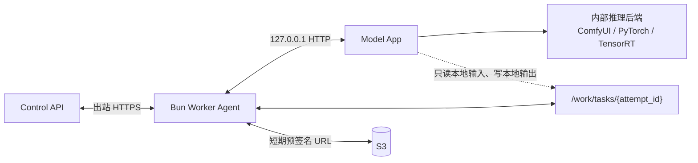
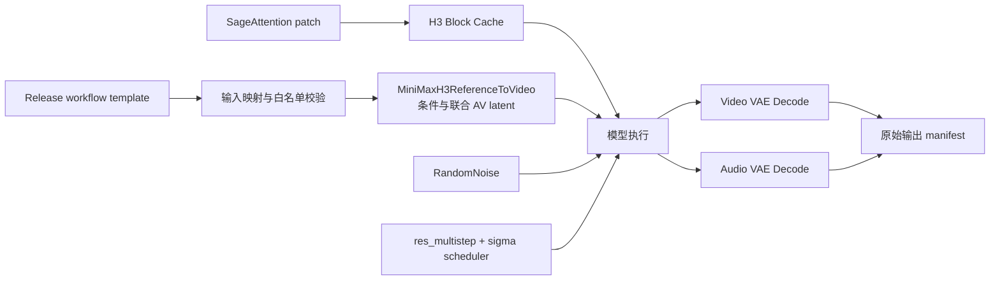
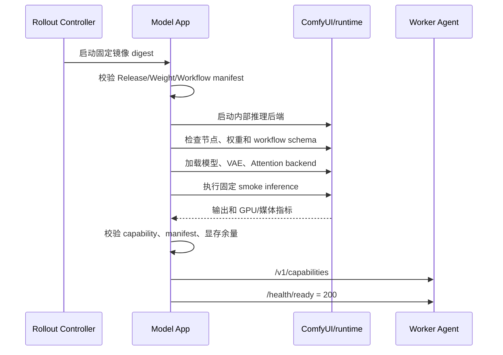

# Model App 编写与生产实现规范

## 1. 文档目标

本文规定如何把 ComfyUI 工作流或其他推理程序编写为 Astra 的生产级 Model App。Model App 是与 Bun Worker Agent 同 Pod 或同容器组运行的模型进程，通过 localhost HTTP Worker Contract 接受一次执行请求。

本文以 10Eros-Max V3 / MiniMax H3 Ref2VA 为首个参考实现，但接口、生命周期和文件合同不绑定 Python、ComfyUI 或任何特定模型。图片模型、其他视频模型以及 Python、C++、Rust 等语言的应用均应遵循同一边界。

本文不把 ComfyUI 的 `/prompt` 暴露给业务调用方，也不把 ComfyUI 的内部队列当作 Astra 的任务队列。ComfyUI 只是 Model App 内部的可替换推理后端。

关联文档：

- [05-model-worker-contract.md](./05-model-worker-contract.md)：Agent 与 Model App 的 HTTP 合同。
- [08-model-release-and-roadmap.md](./08-model-release-and-roadmap.md)：镜像发布、预热、灰度和回滚。
- [10-h3-ref2va-workflow-research.md](./10-h3-ref2va-workflow-research.md)：H3 Ref2VA 工作流和加速实验边界。
- [11-10eros-comfyui-deployment.md](./11-10eros-comfyui-deployment.md)：10Eros 权重、ComfyUI API 和部署细节。
- [09-development-standards.md](./09-development-standards.md)：本地 Model App 合同参考实现和生产质量门。

## 2. 设计原则

1. **Model App 只负责推理**：不连接 PostgreSQL、Redis、Kafka、Provider 或管理 API，不持有平台长期凭证。
2. **Agent 负责平台事务**：租约、任务状态、素材下载、结果上传、取消宽限、清理和审计由 Agent 完成。
3. **模型应用主动提供合同**：Agent 通过 `/health` 和 `/v1/capabilities` 判断应用是否可接收任务；不能依赖猜测的端口、节点或模型文件名。
4. **Release 不可变**：镜像地址在发布时解析为 OCI digest；工作流、节点 commit、权重 hash、运行时参数和输出 Schema 一起形成 Release 身份。
5. **固定工作流，有限覆盖**：业务请求只能覆盖 Release manifest 明确允许的输入字段，不能提交任意 ComfyUI 图、Python 代码、外部 URL 或节点参数。
6. **至少一次执行、确定性收敛**：`execution_id` 是幂等执行键；重复请求必须返回同一执行，不得产生不可控的重复模型副作用。
7. **产物原始字节保真**：Model App 产生的文件是交付事实。Agent 只校验、复制和上传，不在平台路径中转码、裁切、重采样或重新封装。
8. **本地不运行真实模型**：没有 GPU 的开发机使用 Model App 合同参考实现验证同一 HTTP 合同和媒体 manifest；真实 H3 profile 必须显式启用。

## 3. 运行时边界



必须满足：

- Model App 默认只监听 `127.0.0.1`；不得监听公网网卡。
- Agent 和 Model App 共享受限工作目录，每个 Attempt 一个目录。
- Model App 只能读 `inputs` 中列出的文件、Release 自带的模型文件和工作流模板，只能写 `output_dir`。
- Model App 不访问 S3；所有下载和上传由 Agent 通过短期 URL 完成。
- Model App 不能自行创建或删除 Provider 实例，也不能绕过 Agent 领取任务。
- Model App 不应在一个 HTTP 请求中同步等待几十分钟；`POST /v1/inferences` 只接受执行，状态通过查询接口获取。

## 4. 从 ComfyUI 工作流到 Model App

### 4.1 四阶段路线

| 阶段 | 目标 | 是否接收生产流量 |
| --- | --- | --- |
| 1. 等价基线 | 使用固定 API-format workflow 复现 ComfyUI 结果 | 否，仅实验 |
| 2. 合同适配 | 加入 Model App HTTP、能力发现、manifest 和取消 | 仅内部 smoke |
| 3. 运行时优化 | 模型常驻、预热、SageAttention、Block Cache、缓存和编译 | 通过质量门后灰度 |
| 4. 自定义推理 | 摘出 ComfyUI 执行链，替换为专用 Python/C++/Rust runtime | 新 Release 验收后灰度 |

第一阶段不能直接复制 UI 图 JSON。UI 图包含布局、链接和前端状态；Model App 应使用 ComfyUI 的 API-format workflow 作为只读模板。工作流模板必须记录：

- `workflow_hash` 和来源文件。
- 节点 class、输入 Schema 和自定义节点 commit。
- 固定模型节点及其相对路径。
- 允许调用方覆盖的字段 allowlist。
- 采样器、scheduler、步数、参考媒体限制和输出合同。

### 4.2 H3/10Eros 的固定执行链



首个 H3 Model App 至少需要能解释以下节点职责：

- `MiniMaxH3ReferenceToVideo`：编码 prompt、参考媒体并创建联合音视频 latent。
- `Patch Sage Attention KJ`：运行时替换 Attention backend，不改变工作流语义。
- `MiniMax H3 Block Cache`：在批准的采样窗口中复用稳定 residual，属于近似优化。
- `RandomNoise`：按 `seed` 创建初始噪声。
- `BasicGuider`：绑定模型与 positive conditioning。
- `KSamplerSelect`：选择 `res_multistep` 等采样更新算法。
- `BasicScheduler`：根据模型 sampling 配置生成 sigma 序列。
- `SamplerCustomAdvanced`：执行真正的多步 H3 去噪。
- `VAEDecode` / `VAEDecodeAudio`：分别从联合 latent 解码视频帧和音频波形。

H3 Release 必须在 manifest 中固定实际步数。截图或历史 workflow 中出现 20 与 25 步差异时，不得用默认值掩盖，必须选定一个质量基线并重新做性能和质量验收。

## 5. Model App 内部组件

推荐按以下模块编写，不要求使用相同语言或目录名：

```text
model-app/
  http_server          # health、capabilities、inference、cancel
  contract             # JSON Schema、字段校验、错误 Envelope
  release_manifest     # digest、workflow、weights、capabilities
  execution_store      # execution.json 原子状态和幂等键
  input_materializer   # 本地输入路径、角色和 hash 校验
  workflow_runner      # 固定 workflow 的安全深拷贝和字段注入
  inference_runtime    # ComfyUI adapter 或自定义 PyTorch/CUDA runtime
  progress_reporter    # stage、progress、metrics
  output_validator     # MIME、hash、完整解码和 Release Schema
  lifecycle            # preload、ready、draining、shutdown、recovery
```

模块之间的方向应保持单向：HTTP 层调用 execution service，execution service 调用 runtime；runtime 不应反向调用 HTTP server 或平台服务。

### 5.1 启动顺序



`/health/ready` 返回 200 前必须完成：

1. 镜像、权重、工作流和节点 hash 校验。
2. 必需节点注册检查；不允许未知或缺失节点 silently fallback。
3. 模型、CLIP、Video VAE、Audio VAE 加载和显存峰值记录。
4. SageAttention 的实际 backend、版本和 GPU capability 记录。
5. Block Cache 参数解析和关闭/开启状态检查。
6. 固定输入 smoke 的完整媒体解码、尺寸、FPS、时长、音频声道和 manifest 校验。

预热期间不领取公共 Task，指标必须区分 `time_to_ready` 和 `warm_attempt_duration`。

## 6. HTTP 合同实现

完整字段以 [05-model-worker-contract.md](./05-model-worker-contract.md) 为准。Model App 至少实现以下接口：

| 方法 | 路径 | 语义 |
| --- | --- | --- |
| `GET` | `/health/live` | 进程存活，不检查 GPU |
| `GET` | `/health/ready` | 模型和 Release 可接收任务 |
| `GET` | `/v1/capabilities` | 版本、能力、并发和输出合同 |
| `POST` | `/v1/inferences` | 幂等接受一次 Attempt 执行 |
| `GET` | `/v1/inferences/{execution_id}` | 查询本地执行状态和进度 |
| `POST` | `/v1/inferences/{execution_id}/cancel` | 幂等取消执行 |

### 6.1 能力发现

```json
{
  "contract_version": "1.0",
  "app": {
    "name": "minimax-h3-10eros",
    "version": "2026.08.21",
    "build": "sha256:..."
  },
  "model_release": "release_019af...",
  "modalities": ["video"],
  "operations": ["generation"],
  "max_concurrency": 1,
  "capabilities": {
    "aspect_ratios": ["16:9", "9:16"],
    "resolutions": ["0.7mp", "0.98mp"],
    "resolution_matrix": {
      "16:9/0.7mp": {"width": 1152, "height": 640},
      "16:9/0.98mp": {"width": 1344, "height": 768}
    },
    "durations": [15],
    "fps": [24],
    "input_types": ["image", "video", "audio"],
    "input_roles": ["reference_image", "reference_video", "reference_audio"],
    "audio_modes": ["native", "none", "reference"],
    "supports_cancel": true,
    "supports_progress": true,
    "supports_resume": false
  },
  "runtime": {
    "attention_backend": "sageattention2_cuda",
    "block_cache": {
      "enabled": true,
      "threshold": 0.08,
      "start_percent": 0.2,
      "end_percent": 0.85
    }
  }
}
```

Agent 必须将响应与 Release Manifest 比较。Release ID、合同主版本、能力、输出 Schema 或并发上限不一致时，Replica 保持 `loading_failed`，不得接收任务。

### 6.2 启动执行

```http
POST /v1/inferences
Content-Type: application/json
Idempotency-Key: attempt_019b0...
```

```json
{
  "execution_id": "attempt_019b0...",
  "task_id": "task_019b0...",
  "type": "video",
  "operation": "generation",
  "model_release": "release_019af...",
  "request": {
    "prompt": "以 <Picture 1> 为参考，生成一镜到底的雨夜街道视频",
    "aspect_ratio": "16:9",
    "resolution": "0.7mp",
    "width": 1152,
    "height": 640,
    "duration": 15,
    "fps": 24,
    "seed": 6238411753901234,
    "audio": {"mode": "native"},
    "model_options": {
      "workflow_profile": "10eros-ref2va-bf16",
      "ref_image_size": "match"
    }
  },
  "inputs": [
    {
      "file_id": "file_019b1...",
      "type": "image",
      "role": "reference_image",
      "path": "/work/tasks/attempt_019b0/inputs/000-reference.png",
      "content_type": "image/png",
      "size_bytes": 1843200,
      "sha256": "8b9b..."
    }
  ],
  "output_dir": "/work/tasks/attempt_019b0/outputs",
  "deadline_at": 1787151000
}
```

响应 `202` 只代表 Model App 接受了一个真实执行槽位：

```json
{
  "execution_id": "attempt_019b0...",
  "status": "accepted",
  "accepted_at": 1787147402
}
```

实现要求：

- 相同 `execution_id` 和相同请求返回当前执行；请求 hash 不同返回 `409 execution_conflict`。
- 返回 202 前使用临时文件加锁并原子写入 `execution.json`，记录请求 hash、Release、状态和创建时间。
- `max_concurrency=1` 的 H3 App 在运行或 post-processing 时必须返回 `429 worker_busy`，不得在 ComfyUI 内部无限排队。
- `deadline_at` 是硬截止时间；到期应停止执行并返回 `failed` + `deadline_exceeded`，不能继续占用槽位。
- Model App 只接受已校验的本地路径，不接受任意 URL、Shell 参数或 workflow JSON。
- `seed`、`fps`、`width` 和 `height` 是控制面解析后的内部执行参数：seed 由系统随机生成，其他值由固定 Release 将 `aspect_ratio + resolution` 映射得到；公共调用方不能直接指定。

### 6.3 状态查询和进度

```json
{
  "execution_id": "attempt_019b0...",
  "status": "running",
  "stage": "sampling",
  "progress": 37,
  "message": "sampling step 8/20",
  "metrics": {
    "elapsed_ms": 72450,
    "gpu_memory_used_mb": 21680,
    "gpu_memory_peak_mb": 22840,
    "cache_hit_rate": 0.31
  },
  "started_at": 1787147403,
  "updated_at": 1787147475
}
```

推荐阶段：

```text
accepted
  -> materializing_inputs
  -> conditioning
  -> sampling
  -> decoding_video
  -> decoding_audio
  -> validating_outputs
  -> completed
```

对外状态仍使用 Worker Contract 定义的 `accepted | running | post_processing | completed | failed | canceling | canceled`。`stage` 是可观测细节，不得成为控制面状态机的新状态。

进度规则：

- `progress` 可以为 null，但一旦提供不能倒退；范围为 0-100。
- 采样阶段按实际 sigma/step 报告，不得用视频帧数伪造 GPU 进度。
- ComfyUI WebSocket 断开不等于执行失败；Model App 应通过 `/history/{prompt_id}` reconcile。
- Agent 查询本地进度并向控制面心跳；控制面不直接访问 ComfyUI。

### 6.4 取消、超时和 drain

取消顺序：

1. Agent 将 Attempt 标记为 `canceling`，调用 Model App cancel。
2. Model App 记录该 execution 的取消请求，阻止同一 execution 被重复启动，并调用内部 runtime 的 interrupt。
3. ComfyUI adapter 使用 `/interrupt` 指定 `prompt_id`，等待内部执行结束。
4. Model App 终止自己启动的 FFmpeg/编码子进程，清理未完成输出并返回 `canceled`。
5. Agent 释放 Lease；超过宽限期才发送 SIGTERM/SIGKILL。

`drain` 和取消不是一回事。Agent 进入 `draining` 后停止向 Model App 提交新 execution；Model App 允许已接受的 execution 继续完成。

- `drain`：停止领取新任务，当前 execution 继续完成。
- `cancel`：停止当前 execution，结果不作为成功产物。
- Model App 不需要新增 `/drain` 公共接口；若需要优雅停止，可使用进程信号或受限的本地生命周期钩子。
- `drained` 是 Agent 向控制面确认没有有效 Lease/Reservation 后的生命周期回报，不是模型输出状态。
- Model App 不得自行删除 Provider 实例；回收由控制面和 Provider Controller 完成。

H3 首期 `supports_resume=false`，采样中断后不能从中间 latent 恢复。完成或失败状态的 cancel 请求必须幂等返回原状态。

## 7. ComfyUI Adapter 编写方法

### 7.1 内部 API 边界

Model App 可以在 loopback 调用 ComfyUI：

| 方法 | 路径 | 用途 |
| --- | --- | --- |
| `GET` | `/system_stats` | 采集设备和运行时信息 |
| `GET` | `/object_info` | 检查节点 schema |
| `POST` | `/prompt` | 提交固定 API-format workflow |
| `GET` | `/history/{prompt_id}` | 查询执行完成和输出 |
| `GET` | `/view` | 读取内部输出文件 |
| `GET` | `/ws` | 获取进度事件 |
| `POST` | `/interrupt` | 取消指定执行 |
| `POST` | `/free` | 仅在 drain/recovery 释放显存 |

这些接口不能从业务 API、Worker Control API 或外部网络暴露。ComfyUI 的 queue/history 是易失状态，PostgreSQL 的 Task/Attempt/Lease 才是平台真源。

### 7.2 安全的 workflow 映射

每次执行都应：

1. 深拷贝只读 workflow 模板。
2. 校验请求字段和输入角色。
3. 将本地输入路径映射到固定的 LoadImage/LoadVideo/Audio 节点。
4. 只替换 allowlist 中的 prompt、解析后的宽高、长度、系统 seed 和参考媒体。
5. 固定模型、VAE、采样器、scheduler、步数、节点参数和输出目录。
6. 使用 `execution_id` 作为 ComfyUI `prompt_id` 或可追踪的 `client_id`。
7. 提交前拒绝未知 class、断链、外部路径、表达式和任意自定义参数。

示例映射（仅示意，实际 node id 由 Release workflow 固定）：

```json
{
  "MiniMaxH3ReferenceToVideo.inputs.prompt": "request.prompt",
  "MiniMaxH3ReferenceToVideo.inputs.width": "request.width",
  "MiniMaxH3ReferenceToVideo.inputs.height": "request.height",
  "MiniMaxH3ReferenceToVideo.inputs.length": "derived.frame_length",
  "MiniMaxH3ReferenceToVideo.inputs.ref_image_size": "request.model_options.ref_image_size",
  "RandomNoise.inputs.noise_seed": "request.seed"
}
```

公共请求的 `input_files` 是有序的 `file_id + type + role` 数组，只允许 `image | video | audio`。Agent 校验 File 元数据并下载后，Model App 才能收到相同顺序的本地路径；ComfyUI adapter 不得下载调用方 URL。

模型特有字段必须由 Release 注册 Schema 校验，不能把 `residual_diff_threshold`、`sigma_shift` 或节点私有输入直接开放为公共 API 字段。

### 7.3 ComfyUI adapter 伪代码

```text
accept(request):
  assert release_id == manifest.release_id
  request_hash = hash(canonical_json(request))
  existing = execution_store.get(execution_id)
  if existing:
    return same_execution_or_409(existing, request_hash)

  validate_request(request, manifest.input_schema)
  validate_local_inputs(request.inputs, task_directory)
  atomically_create_execution(execution_id, request_hash, "accepted")
  return 202

run(execution_id):
  set_stage(execution_id, "conditioning")
  workflow = deep_copy(manifest.api_workflow)
  inject_allowlisted_inputs(workflow, execution)
  prompt_id = comfyui.submit_prompt(workflow, client_id=execution_id)
  persist_prompt_mapping(execution_id, prompt_id)

  set_stage(execution_id, "sampling")
  while not comfyui.history_completed(prompt_id):
    emit_progress_from_ws_or_poll(prompt_id)
    if cancel_requested(execution_id):
      comfyui.interrupt(prompt_id)
      return canceled()
    if deadline_expired(execution_id):
      comfyui.interrupt(prompt_id)
      return failed("deadline_exceeded")

  set_stage(execution_id, "validating_outputs")
  outputs = collect_only_declared_outputs(prompt_id, output_dir)
  manifest = validate_and_hash_outputs(outputs, release.output_schema)
  atomically_write_result(execution_id, manifest)
  return completed(manifest)
```

### 7.4 自定义 runtime 替换 ComfyUI

完成等价基线后，可以把固定 DAG 直接编写为 Python/C++/Rust runtime：

```text
load_release()
load_clip_and_vaes()
load_h3_dit()
prepare_reference_conditioning()
create_joint_av_latent()
create_noise(seed)
create_sigmas(scheduler, steps)
for sigma in sigmas:
    run_h3_block_with_attention_backend()
    apply_optional_block_cache()
    update_latent_with_sampler()
decode_video_latent()
decode_audio_latent()
validate_and_manifest_outputs()
```

自定义 runtime 只有在以下条件同时满足后才能替换 ComfyUI baseline：

- 固定 seed、输入、尺寸、时长和 Release 下通过参考遵循和画质盲审。
- 通过严格视频解码、FPS、时长、音频采样率和声道检查。
- 输出字节可以不同，但媒体语义和质量不劣于基线。
- 取消、超时、重复 `execution_id` 和进程重启行为通过合同测试。
- 运行时实际使用的 attention、精度、编译选项和缓存策略已记录在 manifest。

## 8. 资源、并发和缓存

首期 H3 Model App 固定：

```yaml
max_concurrency: 1
accept_new_tasks: false_until_ready
supports_resume: false
model_residency: gpu_or_approved_offload_profile
```

原因是 H3 联合音画 latent、ComfyUI state、VAE、缓存和显存 workspace 不能未经测试地并发共享。并发槽位不是 HTTP 连接数；一个运行中的 Attempt 占用一个真实 GPU 槽位。

允许的缓存：

- 权重和 VAE 的只读本地缓存，按 digest 标识。
- 参考输入按 SHA-256 缓存的编码结果，必须绑定 Release、节点版本和编码参数。
- SageAttention 编译产物和 CUDA kernel cache。
- Block Cache residual，仅限当前 execution，不得跨 Task 复用。

禁止的缓存：

- 以 prompt 文本作为唯一身份的跨项目结果缓存。
- 未绑定 Release/seed/输入 hash 的 latent。
- 把 ComfyUI history、queue 或本地日志当作永久任务事实。

## 9. 输出 Manifest 和字节保真

Model App 必须先写临时文件，再完成校验后原子重命名为最终输出。示例：

```json
{
  "execution_id": "attempt_019b0...",
  "status": "completed",
  "outputs": [
    {
      "role": "result",
      "path": "/work/tasks/attempt_019b0/outputs/result.mp4",
      "content_type": "video/mp4",
      "size_bytes": 12582912,
      "sha256": "f82d9c...",
      "media": {
        "container": "mp4",
        "width": 1344,
        "height": 768,
        "fps": 24,
        "duration": 15.0,
        "video_codec": "...",
        "audio_codec": "...",
        "audio_sample_rate": 44100,
        "audio_channels": 2
      },
      "provenance": {
        "producer": "model_app",
        "workflow_hash": "sha256:...",
        "transformations": []
      }
    }
  ]
}
```

要求：

- `sha256` 和 `size_bytes` 必须在最终文件关闭后计算。
- 视频使用严格 FFmpeg 解码检查完整性、帧数、FPS、时长和音频轨道。
- 图片使用完整解码检查 MIME、尺寸、色彩和格式。
- Agent 上传的字节必须与 manifest hash 一致。
- 需要缩略图、转码或预览时，由 Model App 在镜像内部显式生成独立 output role；平台不隐式转码。

## 10. 错误处理

错误响应必须使用安全的统一 Envelope，不返回堆栈、权重路径、预签名 URL 或敏感 prompt。Model App 内部至少区分：

| code | retryable | 说明 |
| --- | --- | --- |
| `worker_busy` | 是 | 并发槽位已满 |
| `execution_conflict` | 否 | 相同 execution id 请求内容不同 |
| `invalid_release` | 否 | Release 与能力不匹配 |
| `input_not_found` | 否 | Agent 未准备本地输入 |
| `input_checksum_mismatch` | 否 | 输入 hash 不一致 |
| `workflow_validation_failed` | 否 | 固定 workflow 注入失败 |
| `model_runtime_error` | 视情况 | CUDA、节点或模型运行时错误 |
| `out_of_memory` | 视情况 | 显存安全门或 OOM |
| `deadline_exceeded` | 否 | 到达硬截止时间 |
| `canceled` | 否 | 已按请求取消 |
| `output_validation_failed` | 否 | 媒体或 manifest 不符合 Release Schema |
| `internal_unavailable` | 是 | 应用正在启动、drain 或恢复 |

无限重试、吞异常和自动切换到未经验收的权重均禁止。可重试错误由 Agent/控制面按 Attempt 策略重试，不能复用已污染的 execution 状态。

## 11. 本地开发与 Model App 合同参考实现

Mac 本地默认不加载真实 H3、GPU 或共绩 API。Model App 合同参考实现必须提供与 GPU 应用相同的：

- `/health/live`、`/health/ready`、`/v1/capabilities`。
- `POST /v1/inferences` 的幂等和 `429 worker_busy`。
- 进度、取消、超时、drain 后拒绝新任务。
- 确定性图片/视频测试产物和输出 manifest。
- 可控的模型错误、输出校验失败和延迟。

合同参考实现应通过同一个 Agent、S3/MinIO、PostgreSQL 和 Task 状态机验证：

```text
创建 Task -> 下载输入 -> Model App accepted -> running
-> progress -> output manifest -> Agent 校验 -> S3 上传
-> completed -> GET /v1/tasks/{id}
```

合同参考实现不得为了测试而绕过真实文件路径、manifest、幂等或取消合同。Compose 使用 `astra-local` project name、隔离网络和专用 volume，具体规则见 [09-development-standards.md](./09-development-standards.md)。

## 12. 测试与验收清单

### 12.1 合同测试

- 能力版本、Release ID 和并发能力不匹配时拒绝 ready。
- 相同 execution id 同请求重复提交返回原状态。
- 相同 execution id 不同请求返回 `409`。
- 不存在的本地输入、hash 不匹配和未知角色被拒绝。
- progress 不倒退，完成后不会回到 running。
- 运行中取消、已完成取消、重复取消均幂等。
- deadline 到达后中断内部推理并释放槽位。
- Agent drain 后不提交新任务，已有 execution 可以完成；Agent 在没有有效 Lease/Reservation 后向控制面回报 `drained`。

### 12.2 ComfyUI/H3 回归

- API-format workflow 经过 `/object_info` 校验，无未知节点或断链。
- H3 Ref2VA 的图片、视频、视频音轨和独立音频角色映射正确。
- prompt 中 `<Picture n>`、`<Video n>`、`<Audio n>` 与连接顺序一致。
- 20/25 步选择、scheduler、sampler、sigma shift 和 seed 被 manifest 固定。
- SageAttention backend 和 Block Cache 命中率被记录。
- cache on/off 对人物一致性、动作、音频和参考遵循通过盲审。
- 产物通过严格解码、时长/FPS/音频声道和 hash 校验。

### 12.3 故障测试

- ComfyUI WebSocket 断开后通过 history reconcile。
- Model App 进程重启时 execution 状态不覆盖控制面租约事实。
- Agent 超时重试不会重复产生不可控输出。
- GPU OOM、节点缺失、权重 hash 错误和 smoke 失败阻断 ready。
- 取消宽限后子进程被回收，临时文件不会泄漏。
- S3 上传失败可以重试，不能重复转码或改变原始输出。

## 13. 生产 Release 门

Model App 只有在以下资料齐全后才能进入灰度：

```text
镜像 OCI digest
ComfyUI commit / runtime 版本
自定义节点 commit
Workflow Manifest hash
Weight Manifest hash
输入能力 Schema
输出媒体 Schema
GPU/显存/并发 Profile
Attention backend
Block Cache 参数
time_to_ready / warm_attempt_duration
质量和媒体验收报告
回滚 Release ID
```

发布流程：
\ 
1. 运维填写模型镜像地址。
2. 控制面解析并固定 digest，生成 Release 草稿。
3. Provider Controller 使用共绩临时算力启动预热 Replica。
4. Model App 完成 readiness、capabilities、smoke 和资源门。
5. 以项目或流量比例灰度，持续比较错误率、P95、GPU 成本和质量指标。
6. 发现问题时先停止候选版本接收新任务，再切回稳定 Alias；运行中任务按发布策略排空或审计取消。

候选版本不得在未通过质量门时直接接收稳定流量。回滚依赖固定 digest，不能重新解析原 mutable tag。

## 14. 实施顺序

首个 H3 Model App 建议按以下顺序实施：

1. 固定当前 10Eros API-format workflow、权重和节点 commit。
2. 编写 Release manifest、输入 allowlist 和输出 Schema。
3. 实现 Model App 合同参考实现和 Worker Contract 黑盒测试。
4. 编写 ComfyUI Adapter，完成 `/prompt`、`/history`、`/ws`、`/interrupt` 闭环。
5. 在 GPU 环境实现权重校验、预热、smoke、capabilities 和 readiness。
6. 固定单并发，完成 15 秒标准任务和 20/25 步基线确认。
7. 分别测试 SageAttention、Block Cache、常驻显存和缓存，不同时改变多个变量。
8. 通过质量和容量门后，再实现不依赖 ComfyUI UI 的自定义 runtime。
9. 将 Model App 镜像接入滚动发布、排空、回收和回滚流程。

这条路线保留 ComfyUI 作为可复现基线，同时允许后续把最耗时的 `SamplerCustomAdvanced` 执行部分替换为专用推理实现，而不改变平台 API、Worker 合同、任务状态和产物存储合同。
