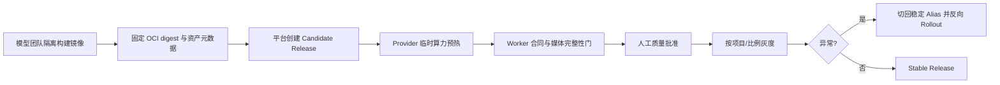

# 无模型权重的模型团队交接合同

本文档定义平台完成后的最后交接边界。平台团队交付协议、控制面、Worker Agent、发布和容量闭环；模型团队在隔离的 GPU 环境中交付真实 H3/10Eros 推理。平台仓库、默认 Compose、CI 和开发机不得下载、缓存或运行模型权重。

## 平台已交付内容

- `Model App Worker Contract v1`：能力发现、执行、进度、取消、健康、幂等 `execution_key` 和输出 manifest。
- 原始产物路径：Agent 只校验 MIME、hash、完整媒体解码和 Release Schema，再把模型生成的原始字节上传到 S3；平台不转码。
- Release Manifest：记录 OCI digest、工作流 hash、组件 commit、权重逻辑名/大小/SHA-256 元数据、资源要求、能力和输出合同。
- 发布闭环：预热、readiness/capabilities/smoke/显存门、滚动替换、旧版本排空、回收、暂停和回滚。
- 无权重参考实现：使用确定性的图片/视频产物验证协议和数据库状态机，不声称模型质量或 GPU 性能。

## 模型团队必须交付

1. 真实镜像的 OCI digest，以及可审计的镜像 Manifest/签名。
2. ComfyUI、节点、工作流和运行时的固定 commit/hash。
3. 每个权重、VAE、LoRA、文本编码器等资产的逻辑名、来源、许可证、大小和 SHA-256；权重只在模型团队受控 Artifact 存储和 GPU 环境出现。
4. `capabilities`、`parameter_schema`、`output_contract` 与平台 Release Schema 的逐字段对应关系。
5. 5090 单卡资源报告：峰值显存、预热时间、稳定服务时间、P50/P75/P95、失败率、取消语义和可接受并发。
6. H3 验收样本与人工签署：T2VA、I2VA、首尾帧、参考图片/视频/音频、联合音画；平台只接收验收结果和产物 hash，不接收权重文件。

## 交接流程

任何“镜像拉取成功”只能证明 OCI 传输完成，不能代替质量批准。Candidate 在所有机械门通过前保持 `accept_new_tasks=false`；平台不尝试补下载缺失资产，也不从公共地址解析可变权重。

## 无权重验收清单

| 检查 | 平台证据 | 真实模型责任 |
| --- | --- | --- |
| Contract/OpenAPI | Worker 黑盒测试、Schema 差异检查 | 提供语言无关 HTTP 服务 |
| 幂等/取消/超时 | 重复 `execution_key`、控制面取消和租约测试 | 模型进程可安全停止当前执行 |
| 产物保真 | manifest、SHA-256、FFmpeg 严格解码、S3 字节比对 | 产出声明 MIME/尺寸/时长/FPS/音轨 |
| 发布/回滚 | reference Provider 的预热、排空、回收和反向 Rollout | 提供可启动、可探活的固定 digest |
| 性能/质量 | 只验证流程，不填 GPU 性能结论 | 交付 5090 实测与人工质量报告 |

## 明确禁止

- 在 Astra 仓库提交或下载任何模型文件。
- 在默认 Compose 或 CI 中启动真实 GPU/ComfyUI 推理。
- 让 Model App 访问 PostgreSQL、Redis、Kafka、Provider 或管理 API。
- 将供应商缓存、镜像 tag 或外部 URL 当作权重真源。
- 以参考实现的确定性媒体产物冒充 H3/10Eros 质量、速度或成本结果。
