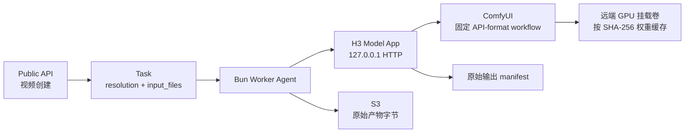
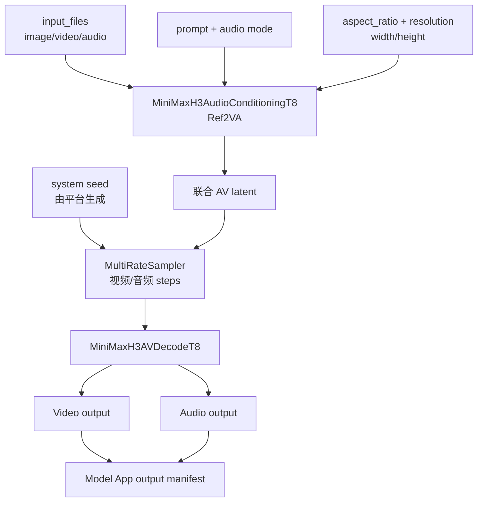
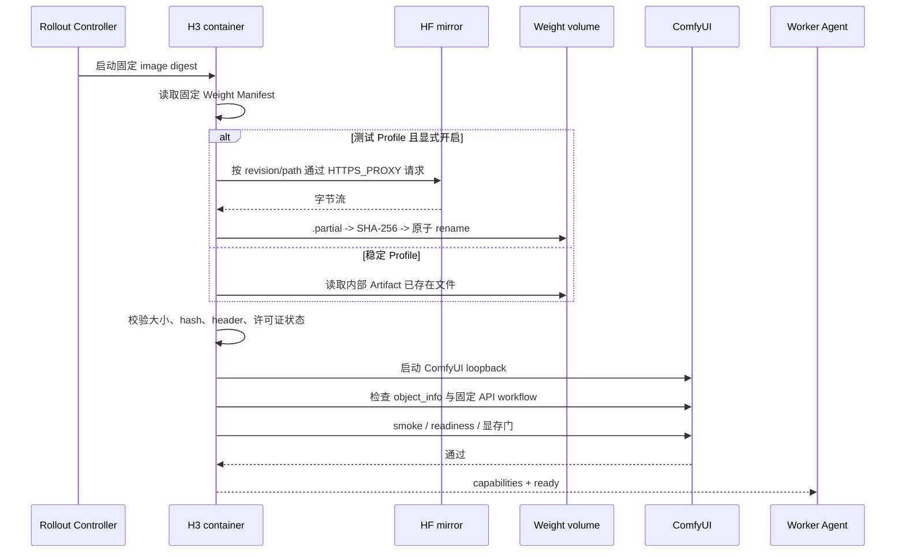

# Work-Fisher MiniMax H3 Model App 准备方案

## 1. 目标与边界

Work-Fisher 合集作为当前 MiniMax H3 参考媒体生成视频的主力研究输入。平台先把它转换为一个固定的 Model App Release，再由 Bun Worker Agent 通过 localhost Worker Contract 调用。业务调用方不接触 ComfyUI `/prompt`，也不能提交任意工作流图。

本阶段交付的是工作流登记、协议映射、镜像启动契约和远端 GPU 测试方案。真实 H3/10Eros 推理、权重来源最终确认、质量批准和性能结论仍由模型团队在隔离算力环境完成。



关键边界：

- OCI 镜像只包含 ComfyUI、Python/CUDA 运行时、自定义节点、Model App 适配器、工作流模板和 Release Manifest，不包含几十 GB 权重。
- 测试镜像可以在远端 GPU 容器首次启动时下载权重，但文件写入 Provider 提供的独立持久卷或本地 NVMe，不是写入 OCI 镜像层。
- `H3_RUNTIME_WEIGHT_DOWNLOAD_ENABLED` 默认必须为 `false`；只有隔离测试 Provider Profile 显式设置为 `true` 才允许下载。
- 本地 Bun/Compose、CI、默认 Helm 和平台控制面不下载权重，不访问 Hugging Face 或 `hf-mirror.com`。
- Model App 的网络出口只为测试启动阶段的固定权重源开放；推理就绪后应收紧为无模型外网访问。平台 API、数据库、Redis、Kafka、Provider 和 S3 仍由 Agent/控制面负责。

## 2. Work-Fisher 结构与主路径

源文件及哈希登记在 [工作流索引](./workflows/README.md)。它是 UI workflow collection，不是 API-format workflow，包含三组示例：

| 分组 | 用途 | 当前决定 |
| --- | --- | --- |
| `文生图1` / Group 64 | T2VA 示例与提示词模板 | 保留为对照，不作为当前主路径 |
| `单图参考1` / Group 62 | 单图片参考生成视频 | 作为首个最小输入 smoke |
| `多图参考1` / Group 63 | 多图片、视频、视频音频和参考音频 | 作为主力 Ref2VA 候选 |

参考媒体主链的逻辑顺序为：



合集中的 `RandomNoise` 示例使用固定 `123456789`，平台不能沿用这个值：公共 API 不暴露 seed，控制面生成系统随机 seed 并写入 Task 快照，重试沿用同一值。合集中的 `VHS_VideoCombine` 是 ComfyUI 示例输出节点；平台不接受它隐含的 RunningHub URL 或本地路径，Model App 必须将生成的原始文件和 manifest 放到 Attempt 输出目录。

## 3. 三档分辨率能力

Work-Fisher Release 使用三个像素面积档位，不把它们命名为行业视频标准。最终宽高必须由 Release 的 `resolution_matrix` 声明，不能由调用方任意传入：

| 公共档位 | 16:9 目标 | ComfyUI 32 倍数候选 | 说明 |
| --- | ---: | ---: | --- |
| `0.7mp` | 约 0.7 megapixels | `1152x640` | 低成本 smoke 和在线低延迟档 |
| `0.9mp` | 约 0.9 megapixels | `1280x736` | 默认生产质量档，需重新测显存 |
| `2.0mp` | 约 2.0 megapixels | `1920x1088` | 高成本档，首期不承诺所有 GPU 可用 |

这些是当前合集 `ResolutionSelector` 的 16:9 候选，不是已验收结论。`9:16`、`1:1` 和其他比例必须分别登记实际尺寸；如果某档位的显存安全门或输出合同未通过，Release 不得在 `/v1/models` 暴露该组合。

建议 H3 Release Manifest 片段：

```json
{
  "modalities": ["video"],
  "operations": ["generation"],
  "max_concurrency": 1,
  "capabilities": {
    "aspect_ratios": ["16:9", "9:16"],
    "resolutions": ["0.7mp", "0.9mp", "2.0mp"],
    "resolution_matrix": {
      "16:9/0.7mp": {"width": 1152, "height": 640},
      "16:9/0.9mp": {"width": 1280, "height": 736},
      "16:9/2.0mp": {"width": 1920, "height": 1088}
    },
    "durations": [4, 5, 6, 7, 8, 9, 10, 11, 12, 13, 14, 15],
    "fps": [24],
    "input_types": ["image", "video", "audio"],
    "input_roles": ["reference_image", "reference_video", "reference_video_audio", "reference_audio"],
    "audio_modes": ["native", "none", "reference"]
  }
}
```

平台调度用每个档位独立的 GPU 秒基线和 P75/P95/EWMA 服务时间。不能用“15 秒输出”或像素面积倍率直接推导耗时；必须在目标 GPU 上测量预热、采样、AV 解码、输出写入和失败率。

## 4. 测试镜像的运行时下载

### 4.1 配置契约

权重清单必须由模型团队提供，至少包含 `repo_id`、固定 `revision`、文件路径、期望字节数、SHA-256、safetensors header 摘要和许可证确认。容器下载器使用 [`model-workers/h3/weight-manifest.schema.json`](../model-workers/h3/weight-manifest.schema.json) 的最小机器校验格式；完整来源、header 和许可证审计保存在平台 Release Manifest。没有完整清单时，启动应失败在 `loading_failed`，不能按文件名猜测或下载最新版本。

测试 Provider 的环境变量建议如下：

```text
H3_RUNTIME_WEIGHT_DOWNLOAD_ENABLED=true
H3_WEIGHT_MANIFEST=/etc/astra/h3/weight-manifest.json
H3_WEIGHT_ROOT=/var/lib/astra/h3/weights
HF_ENDPOINT=https://hf-mirror.com
HTTPS_PROXY=http://<approved-proxy>
HTTP_PROXY=http://<approved-proxy>
NO_PROXY=127.0.0.1,localhost,worker-control-api
```

生产稳定 Profile 应改为：

```text
H3_RUNTIME_WEIGHT_DOWNLOAD_ENABLED=false
H3_WEIGHT_ROOT=/var/lib/astra/h3/weights
```

此时 Provider 预热先把内部 Weight Artifact 挂载或下载到同一 `H3_WEIGHT_ROOT`，Model App 只做本地哈希校验。`HF_ENDPOINT` 和代理配置不得进入稳定 Replica 的 NetworkPolicy、Secret 或日志。

### 4.2 启动序列



下载器必须具备：文件锁、有限重试、断点续传、临时文件清理、磁盘配额、TLS 校验、重定向白名单和不记录完整签名 URL。哈希或大小不匹配直接 quarantine 并阻止就绪；不得在失败后自动换成 `main`、相似权重或官方 Ref2VA UNET。

### 4.3 网络和持久化注意

- 运行时下载发生在远端 Provider 实例，不发生在本机 Mac，也不发生在 OCI build 阶段。
- 权重卷必须独立于容器 writable layer，并按 digest 分目录；滚动发布可复用已验证缓存。
- 旧 Release 的权重缓存保留到回滚窗口结束；正在执行的 Attempt 和预热引用未释放前不得删除。
- 下载完成后可以将权重卷设置为只读挂载给 ComfyUI；Model App 不得在推理期间联网。
- 代理只服务权重下载，`NO_PROXY` 必须覆盖 Worker Agent、ComfyUI 和本地控制端点，避免内部请求绕出代理。

## 5. Model App 映射实现

Model App 只允许从固定模板深拷贝并修改以下字段：

| 平台字段 | 工作流输入 | 规则 |
| --- | --- | --- |
| `prompt` | `MiniMaxH3AudioConditioningT8.prompt` | 正向提示词，按 `input_files` 顺序引用媒体标签 |
| `input_files[].type/role` | `ref_images.*`、`ref_videos.*`、`ref_video_audios.*`、`ref_audios.*` | 由 Agent 提供本地路径；严格按类型/角色映射 |
| `aspect_ratio + resolution` | `width`、`height` | 只使用 Release matrix 中的解析值 |
| `duration` | `length` | 通过固定 24fps 对齐公式转换为合法帧数 |
| 系统 `seed` | `RandomNoise.seed` | 平台生成并固定，模板中的常量只作示例替换 |
| `audio.mode` | `audio_mode` / 参考音频端口 | 能力不支持则拒绝，不静默退化 |
| Release profile | `MultiRateSampler`、SageAttention、LoRA、Block Cache | 只能切换已验收 Profile，不能由调用方直接提交节点参数 |

固定工作流中存在 `LoraLoaderBypassModelOnly`、`MiniMaxH3MemoryEfficientSageAttentionPatch` 和 `MiniMaxH3MultiRateSamplerEXPT8`，应分别登记为 `runtime_profile`：

- `quality-baseline`：不启用未经验收的 4-step LoRA/Block Cache；保持当前 20 步或模型团队签署的基线。
- `turbo-candidate`：只在候选 Release 开启 4 步 LoRA、MultiRateSampler 或 Block Cache，并记录质量、显存和耗时差异。
- `sageattention-candidate`：记录实际 CUDA backend 和版本；backend fallback 或编译失败直接阻断 readiness。

## 6. 发布和回滚

1. 运维填写模型镜像地址；控制面解析并固定 OCI digest。
2. 模型团队提交 Work-Fisher API-format 子图、节点 commit、Weight Manifest 和三档能力矩阵。
3. Provider Controller 为候选 Release 创建临时 GPU 实例，测试 Profile 才注入代理和 runtime download 开关。
4. 容器完成下载/本地校验、ComfyUI 节点发现、固定输入 smoke、媒体解码、显存余量和 Worker Contract 检查。
5. 通过后再把 `0.7mp/0.9mp/2.0mp` 的已验收组合加入 Release 能力；旧 Release 关闭新任务并排空后回收。
6. 任一下载、节点、输出、错误率或成本门失败，候选保持 `accept_new_tasks=false`；回滚先切 Alias，再按稳定 digest 预热。

运行中任务默认完成，不因为镜像替换而杀掉正在采样的 Worker。新镜像下载失败不会影响旧版本和旧权重缓存。

## 7. 当前待交付与阻断项

| 项目 | 当前状态 | 责任 |
| --- | --- | --- |
| Work-Fisher 原始 JSON | 已纳入仓库，SHA-256 已登记 | 平台 |
| API-format 子图 | 尚未从 UI 合集冻结 | 模型工程 |
| 10Eros UNET/CLIP/VAE SHA-256 | 地址已登记，完整文件未下载 | 模型工程/供应链 |
| ComfyUI 与自定义节点 commit | 研究版本已有，运行环境仍需核对 | 模型工程 |
| 0.7mp/0.9mp/2.0mp 显存与耗时 | 未在目标 GPU 实测 | 模型工程/SRE |
| 测试镜像 OCI digest | 尚未构建 | 发布工程 |
| 人工质量批准 | 未开始 | 模型团队 |

在这些阻断项完成前，平台只能演示合同参考实现和控制面流程，不能把 H3 结果标记为 stable，也不能声称已完成模型推理闭环。
